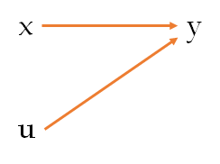
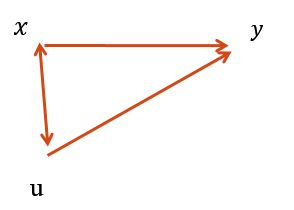
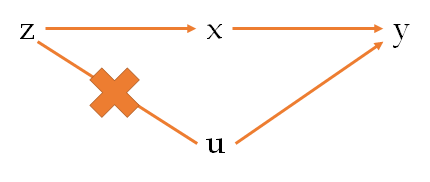

# 截面数据

## 数据类型

**（横）截面数据**：多个经济个体的变量在同一时间点上的取值

**时间序列数据**：某个经济个体的变量在不同时间点上的取值

**面板数据**：多个经济个体的变量在不同时间点上的取值


## 协方差与相关系数

**协方差（covariance）**：$Cov(X, Y) = E(XY) - E(X)E(Y)$

缺点：协方差受 X 与 Y 计量单位的影响，为将其标准化，引入**相关系数**

**相关系数（correlation）**：$\rho=Corr(X,Y)=\frac{Cov(X,Y)}{\sqrt{Var(X)·Var(Y)}}=\frac{\sigma_{XY}}{\sigma_{X}\sigma_Y}$


## 方差-协方差矩阵

1. 同方差且不同个体间不存在相关性的方差-协方差矩阵：斜对角线上都为 $\sigma^2$，其它都为 0
2. 同方差但不同个体间存在相关性的方差-协方差矩阵：斜对角线上都为 $\sigma^2$，其它为 $\sigma_i\sigma_j$

2. 异方差但不同个体间不存在相关性的方差-协方差矩阵：斜对角线上为不同的 $\sigma_i^2$，其它都为 0

3. 异方差且不同个体间存在相关性的方差-协方差矩阵：斜对角线上为不同的 $\sigma_i^2$，其它为 $\sigma_i\sigma_j$

将残差应用到以上 3 种情形，就是如下常见问题：

1. 截面数据：异方差问题（对应上面的 3）
   $$
   Var(\boldsymbol{\varepsilon})=\boldsymbol{\sigma}^{2} \boldsymbol{\Sigma}=\left[\begin{array}{cccc}\sigma_{1}^{2} & 0 & \cdots & 0 \\ 0 & \sigma_{2}^{2} & \cdots & 0 \\ \vdots & \vdots & \ddots & \vdots \\ 0 & 0 & \cdots & \sigma_{n}^{2}\end{array}\right]
   $$

2. 时间序列：自相关问题（对应上面的 2）
   $$
   Var(\varepsilon)=\sigma^{2} \Sigma=\sigma^{2}\left[\begin{array}{ccccc}1 & \rho & \rho^2 & \cdots & \rho^{T-1} \\ \rho & 1 & \rho & \cdots & \rho^{T-2} \\ \rho^{2} & \rho_{1} & 1 & \cdots & \rho^{T-3} \\ \vdots & \vdots & \vdots & \ddots & \vdots \\ \rho^{T-1} & \rho^{T-2} & \rho^{T-3} & \cdots & 1\end{array}\right]
   $$
   


## 矩

**一阶原点矩**：$E(X)$ 期望：随机变量的平均值
**二阶中心矩**：$E[X - E(X)]^2$ 方差：随机变量的波动程度
**三阶中心矩**：$E[X-E(X)]^3$  $E[(X - \mu)/\sigma]^3$ 偏度（Skewness）：随机变量密度函数的不对称性，正态分布的偏度为 0
**四阶中心矩**：$E[X - E(X)]^4$  $E[(X - \mu)/\sigma]^4$ 峰度（Kurtosis）：随机变量密度函数的最高处有多尖，尾部有多厚，正态分布的峰度为 3
**超额峰度**（excess kurtosis）：$E[(X - \mu)/\sigma]^4 - 3$


## 标准差与标准误*

**一句话：标准误就是样本统计量的标准差**

**标准误**针对**样本统计量**而言，**是某个样本统计量（如：样本均值）的标准差**

如果已知**总体的标准差**（$\sigma$），那么抽取**无限多份**大小为 N 的样本，每份样本各有一个平均值，所有这个大小的**样本平均值的标准差**可证明为：
$$
\mu=\frac{1}{N}\sum_{i=1}^NX_i\\
Var(\mu)=Var(\frac{1}{N}\sum_{i=1}^NX_i)=\frac{1}{N^2}Var(\sum_{i=1}^NX_i)=\frac{1}{N^2}\sum_{i=1}^NVar(X_i)=\frac{1}{N}Var(X_i)=\frac{1}{N}\sigma^2\\
SD_{\bar{x}}=\frac{\sigma}{\sqrt{N}}
$$
但由于通常 $\sigma$ 为未知，此时可以用研究中取得**样本的标准差（$s$）**来估计，此时估计结果为**样本平均值的标准误**：
$$
\bar{x}=\frac{1}{n}\sum_{i=1}^nX_i\\
Var(\bar{x})=Var(\frac{1}{n}\sum_{i=1}^nX_i)=\frac{1}{n^2}Var(\sum_{i=1}^nX_i)=\frac{1}{n^2}\sum_{i=1}^nVar(X_i)=\frac{1}{n}Var(X_i)=\frac{1}{n}s^2\\
SE_{\bar{x}}=\frac{s}{\sqrt{n}}
$$

- $SD_{\bar{x}}$ 为**样本平均值的标准差**
- $SE_{\bar{x}}$ 为**样本平均值的标准误**
- $\sigma$ 为**总体的标准差**
- $s$ 为**样本的标准差**


#### 总体标准差 $\sigma$ 

$$
SD=\sigma=\sqrt{\frac{1}{N}\sum_{i=1}^N(x_i-\mu)^2}
$$

##### 随机变量的标准差

$$
\sigma= \sqrt{E((X-E(X))^2)}=\sqrt{E(X^2)-(E(X))^2}
$$

##### 离散随机变量的标准差

若每个 $x_i$ 的概率相等：
$$
\sigma=\sqrt{\frac{1}{N}\sum_{i=1}^N(x_i-\mu)^2} \quad\quad,\quad\mu=\frac{1}{N}\sum_{i=1}^Nx_i
$$
若每个 $x_i$ 的概率 $p_i$ 不相等：
$$
\sigma=\sqrt{\sum_{i=1}^Np_i(x_i-\mu)^2}\quad\quad,\quad\mu=\sum_{i=1}^Np_ix_i
$$

##### 连续随机变量的标准差

$$
\sigma= \sqrt{\int(x-\mu)^2f(x)dx}\quad\quad,\quad\mu=\int xf(x)dx
$$

#### 样本标准差 $s$ 

在真实世界中，找到一个总体真实的标准差并不实际，大多数情况下，总体标准差是通过随机抽取一定量的样本并计算样本标准差估计的

从一大组数值 $X_1,\dots,X_N$ 当中取出一样本数值组合 $x_{1},\cdots ,x_{n}:n<N$
$$
s=\sqrt{\frac{1}{n-1}\sum_{i=1}^{n}(x_i-\bar{x})^2}
$$
样本方差 $s^2$ 是对总体方差 $\sigma^2$ 的无偏估计

$s$ 中的分母为 $n-1$ 是因为 $(x_i-\bar{x})$ 的自由度为 $n-1$，这是由于存在 1 个约束条件 $\sum_{i=1}^{n}(x_i-\bar{x})^2=0$


## t 统计*

比如我有一堆山东地区男性身高的样本，我想检验山东男性平均身高是否为 175

1. 通过样本计算出均值 $\bar{x}=\frac{1}{n}\sum_{i=1}^nx_i$
2. 通过样本计算出样本均值的标准差 $s=\sqrt{\frac{1}{n-1}\sum_{i=1}^{n}(x_i-\bar{x})^2}$
3. 通过样本标准差和样本个数计算出样本均值标准误 $SE_{\bar{x}}=\frac{s}{\sqrt{n}}$
4. 通过样本均值和样本标准误计算 t 统计量 $t=\frac{\bar{x}-\mu_0}{SE_{\bar{x}}}$ ，其中 $\mu_0$ 为要检验的目标值
5. 根据 t 值（自由度为 n-1）查表得到 p 值
6. 根据 p 值得到 $\bar{x}$ 是否显著等于 $\mu_0$


通过以上过程不难理解，一元回归时，检验解释变量是否显著，也就是在检验解释变量的系数是否显著异于 0

1. 通过 OLS 得到系数 $\hat{\beta}$
2. 通过 OLS 得到系数的标准差 $SE_{\bar{\beta}}$ （OLS 过程中，系数 $\bar{\beta}$ 是 y 的线性组合）
3. 通过系数和标准误计算 t 统计量 $t=\frac{\hat{\beta}-\beta_0}{SE_{\bar{\beta}}}$ ，其中 $\beta_0$ 为 0，即解释变量的系数是否显著异于 0
4. 根据 t 值（自由度为 n-1）查表得到 p 值
5. 根据 p 值得到 $\hat{\beta}$ 是否显著异于 0，若 p 很小，即 $\hat{\beta}=0$ 发生的概率很小，可以拒绝原假设，即系数显著异于 0


同理，多元回归时，由于有 k 个解释变量，因而计算 t 统计量时，自由度相应地变为 $n-k$ 即可


## p 值*

p 值：在 t 分布曲线里，t 值之后曲线下面积和（t 值及其更极端的情况的概率和）就是 p 值（以单侧为例，双侧面积乘 2 即可）

若 p 值很小，表明出现的概率很小，根据小概率事件在一次试验中不可能发生，我们有理由判断，原假设不可能出现，即拒绝原假设，在参数估计中也即参数显著异于 0


## 置信区间*

因为 $t=\frac{\bar{x}-\mu_0}{SE_{\bar{x}}}$ ，t 为双边检验含有正负，移项可得：
$$
\mu_0=\bar{x}\pm tSE_{\bar{x}}
$$


## 方差分析*

（TSS) Total Sum of Square = (MSS) Model sum of square + (RSS) Residual sum of square

> 与勾股定理 $a^2+b^2=c^2$ 有联系

y 的总波动 = 模型能够解释的波动 + 残差的波动
$$
TSS=\sum_{i=1}^n(y_i-\bar{y})^2\\
MSS=\sum_{i=1}^n(\hat{y}_i-\bar{y})^2\\
RSS=\sum _{i=1}^{n}\left(y_{i}-{\hat  {y}}_{i}\right)^{2}
$$
**均方误**根据标准差与残差那部分知识，可知：
$$
TMS=TSS/(n-1)\\
MMS=MSS/(k-1)\\
RMS=RSS/(n-k)
$$


## $R^2$

$R^2$ 就是模型可解释的部分占总波动的比重
$$
R^2 = MSS / TSS=1 -  RSS/TSS
$$
$R^2$ 也是模型预测值和真实值的相关系数的平方（可解释的关系）
$$
R^2 = [Cov(\hat{y},y)]^2
$$


## 调整后的 $R^2$

调整后的 $R^2$ 是为了惩罚解释变量过多
$$
adjusted\_R^2=1-\frac{n-1}{n-p-1}(1-R^2)
$$
p：模型中解释变量的总数（不包括常数项），n：样本大小
$$
adjusted\_R^2=1-\frac{RSS/df_e}{TSS/df_t}
$$
$df_e$ ：对基础总体误差方差估计的自由度 $n-p-1$ ，$df_t$ ：对因变量的总体方差估计的自由度 $n - 1$


## $\chi^2$

若 k 个随机变量 $Z_{1}\ Z_{1}\ \dots \ Z_{k}$是相互独立且符合标准正态分布的随机变量（数学期望为 0、方差为 1），则随机变量 $Z$ 的平方和服从自由度为 $k$ 的卡方分布
$$
X=\sum _{i=1}^{k}Z_{i}^{2}\sim \chi ^{2}(k)\ \ or\ \ \chi _{k}^{2}
$$
假设线性回归 $y=Xb+\epsilon$ 的误差 $\epsilon\sim \mathcal{N}(0,1)$ ，且 $Cov(X,\epsilon)=0$ ，则 $y\sim\mathcal{N}(\bar{y},1)$ ，以残差 $e_i$ 代替误差，于是：
$$
\sum_{i=1}^n(y_i-\bar{y})^2\sim\chi^2(n-1)
\tag{TSS 总波动}\\
$$

$$
\sum_{i=1}^n(y_i-\hat{y}_i)^2=\sum_{i=1}^ne_i^2\sim\chi^2(n-k)\\
\tag{RSS 源于残差}
$$

$$
\sum_{i=1}^n(\hat{y}_i-\bar{y})^2\sim\chi^2(k-1)
\tag{ESS 源于回归}\\
$$

$k$ ：解释变量/回归元（含常数项/截距项）

$y_i$ ：n 个自由变动的变量，自由度为 n

$\bar{y}$ ：1 个约束

$\hat{y}_i$ ：由 $k$ 个解释变量（含常数项）构成，求偏导为 0 时有 $k$ 个约束
$$
TSS=ESS+RSS
$$
证明方法：TSS 减一个加一个 $\hat{y}_i$ 后展开，利用 OLS 一阶条件（偏导等于 0）得到残差平方和等于 0，得证


### 卡方检验

> 卡方检验就是检验两个变量之间有没有关系，主要使用样本数据检验总体分布形态或比例

##### 1. Pearson 卡方检验（拟合度的卡方检验，卡方拟合优度检验，最佳拟合度卡方检验）

> 用于检验**单一变量**在多项分类中实际观察次数分布与某理论次数是否有显著差异

$$
\sum_{i=1}^k\frac{\left( f_{obs_i} -f_{exp_i}\right)^{2}}{f_{exp_i}}\sim \chi^{2}(k-1)
$$

$f_{obs}$ ：实际频数

$f_{exp}$ ：期望频数

$k$：分类变量的类别数目

> 除以 $f_{exp}$ 是因为 $f_{obs}$ 与 $f_{exp}$ 差距的**相对**大小取决于期望频数 $f_{exp}$ 的大小


##### 2. 卡方独立性检验

> 检验是用于**两个或两个以上因素多项分类**的**计数资料**分析

$$
\sum_{i=1}^k\frac{\left( f_{obs_i} -f_{exp_i}\right)^{2}}{f_{exp_i}}\sim \chi^{2}((R-1)\cdot(C-1))
$$

$f_{obs}$ ：实际频数

$f_{exp}$ ：期望频数

$R$：列联表 (Contingency table) 的行数

$R$：列联表 (Contingency table) 的列数数


##### 3. 连续性修正

- 当 $n\ge40$，且 $f_{exp}\ge5$ 时，看皮尔逊卡方值即可
- 当 $n\ge40$，且 $1\le f_{exp}\lt5$1 时，选择连续性修正值

$$
\sum_{i=1}^k\frac{\mid\left( f_{obs_i} -f_{exp_i}\mid-0.5\right)^{2}}{f_{exp_i}}\sim \chi^{2}((R-1)\cdot(C-1))
$$


## F 统计

### $F$ 统计量

$$
F(d_1,d_2)\triangleq{\frac  {U_{1}/d_{1}}{U_{2}/d_{2}}}={\frac  {U_{1}/U_{2}}{d_{1}/d_{2}}}
$$

$U_1$ ：卡方分布，自由度是 $d_1$ 

$U_2$ ：卡方分布，自由度是 $d_2$ 

$U_1$ 和 $U_2$ 相互独立


### $F$ 检验

在线性回归中，模型能够解释的波动差异为 ESS，模型无法解释的波动差异为 RSS，而 $ESS\sim\chi^2(k-1)$ ，$RSS\sim\chi^2(n-k)$ ，于是有：
$$
\frac{ESS/(k-1)}{RSS/(n-k)}=\frac{\sum_{i=1}^n(\hat{y}_i-\bar{y})^2/(k-1)}{\sum_{i=1}^n(y_i-\hat{y}_i)^2/(n-k)}\sim F(k-1,n-k)
$$
$k$ ：解释变量/回归元（含常数项/截距项）

> F 检验比较了模型能够解释的波动与模型无法解释的波动的比率，F 值越大，说明模型越有解释力

#### $F$ 检验的变形

根据：
$$
TSS=ESS+RSS\\
R^2=\frac{ESS}{TSS}=1-\frac{RSS}{TSS}
$$
$F$ 检验可变形为：
$$
F(k-1,n-k)=\frac{ESS/(k-1)}{RSS/(n-k)}=\frac{n-k}{k-1}\cdot\frac{ESS}{TSS-ESS}=\frac{n-k}{k-1}\cdot \frac{ESS/TSS}{1-ESS/TSS}=\frac{n-k}{k-1}\cdot \frac{R^2}{1-R^2}
$$


## 误差、残差、随机扰动项*

#### 误差

由于测量方案（**系统误差**）和人眼观看结果的不确定性（**随机误差**）所引起的**测量数据与真实数据不一致**的情况

#### 残差

用算法对测量得到的数据进行拟合，算法得到的**拟合值和测量数据之间的差异**就是残差

- 误差：**测量值与真实值之间的差异**
- 残差：**拟合值与测量值之间的差异**

#### 随机扰动项

数据本身的不确定性带来的误差，通常我们假设随机扰动项独立且服从均值为 0，方差相同的正态分布

OLS 回归中，**残差是干扰项的无偏估计**


## 常数项

**如果回归模型包含常数项，会强制残差项均值为 0**

假设 $E(\epsilon)=c\ne0$ ，由于有常数项，就会将 $c$ 吸收到常数项中，从而使 $E(\epsilon)=0$ 


### 不含常数项的问题

如果回归模型中不包含常数项，则无法保证 $E(\epsilon)=0$ ，从而导致：

1.  $\beta$ 的估计有偏，如果 $c$ 为不为 0 的常数，则 $\beta$ 统一增大了一个跟 $c$ 有关的量
2.  $R^2$ 失去了意义，因为 $R^2$ 可能大于 1，也可能小于 0


### 不含常数项的情形

1. n 个类别变量使用 n 个虚拟变量时，此时不加常数项（或者 n 个类别变量使用 n-1 个虚拟变量，加常数项）

2. 所有值减去均值后再回归
   $$
   y^*=y_i-\bar{y},\ \ x^*=x_i-\bar{x}\\
   E(y^*)=0,\ \ E(x^*)=0\\
   for \ \ \ y^*=\beta x^*+\epsilon\\
   E(\epsilon)=E(y^*)-\beta E(x^*)=0
   $$


## 特异值

### 离群点

残差值较大的样本点

#### 1. 箱线图（Box-plot）

$$
上四分位数 + k * 四分位间距 < 离群值 < 下四分位数 - k * 四分位间距
$$

> k 通常取 1.5 或 1.8

#### 2. 学生化残差（Studentized Residual）

学生化残差是一种标准化的残差，它可以告诉我们哪些数据点的残差较大，超过 ±3 的学生化残差可以被看作可能的离群值

```stata
reg y x
predict e, res
gen e2 = e^2
gsort -e2
	# 对残差的平方值降序排序
list 要显示的变量1 要显示的变量2 e2 in 1/10
	# 显示残差平方值最大的前十个
```


### 高杠杆点

与样本整体 $X^TX)$ 很不相同的少数样本点

**杠杆值（Leverage）**，英文符号为 H
$$
H_i=\frac{1}{n}+\frac{(x_i-\bar{x})^2}{\sum_{除 i 外}(x_i-\bar{x})^2}\\
\ \\
H_i=x_i(X^TX)^{-1}x_i^T
$$
杠杆值可以被看作是一组自变量的数值距离整个数据集平均值的偏差，偏差越大，杠杆值越大，而当某些数据点远远偏离其他点时，我们称之为“**高杠杆点**”

只要杠杆值大于 3 倍平均杠杆值，就应该引起重视

```stata
reg y x
predict lev, leverage
gsort -lev
	# 对杠杆值降序排序
list 要显示的变量1 要显示的变量2 lev in 1/10
	# 显示杠杆值最大的前十个
```

将残差与杠杆值相结合

```stata
lvr2plot, mlabel(变量) mlabsize(vsmall)
	# 横轴是标准化后的残差，纵轴是杠杆值
	# mlabel(变量)：显示每个点该变量的内容
```


### 强影响点

离群值和高杠杆点都可能对回归分析造成的影响，相比于离群值和高杠杆值本身，其实他们对分析造成的影响更值得我们关注，这些**对回归分析造成很大影响的数据点**，被称为**强影响点**

#### 分析强影响点的方法

1. ##### DFITS 统计量 （Difference in fits）

   DFFITS 值反映去掉了某一个数据值之后，新建立的模型对于其他点的拟合残差的大小变化情况
   $$
   1.\ s(j)=\sqrt{\sum_{除\ j\ 外}e_j^2}\\
   2.\ h_j=x_j(X^TX)^{-1}x_j^T\quad（杠杆值）\\
   3.\ r_j=\frac{e_j}{s(j)\sqrt{1-h_j}}\quad(标准化残差)\\
   4.\ DFITS_j = r_j\sqrt{h_j/(1-h_j)}$$
   $e_j$ ：残差

一般来说，当DFFITS大于／小于某个阈值的时候，则可以认为这是一个强影响点

实际应用中，对于阈值的设定是相对主观的，不同的研究可能使用不同的阈值，只要特异值的DFFITS明显不同于其他数据点，就有可能被当作一个强影响点分析

```stata
   predict dfits, dfits
   dis 2*sqrt(解释变量个数/样本总数)
   	# 计算 DFITS 的经验临界值
   list 要显示的变量1 要显示的变量2 dfits if abs(dfits)>上一步计算出的临界值
```


2. ##### DFBETA 统计量

   与 DFITS 统计量类似

   ```stata
   reg y x1 x2 x3
   dfbeta x2
   dis 2/sqrt(e(样本总数))
   	# 计算 DFBETA 的经验临界值
   list 要显示的变量1  要显示的变量2  DFweight if abs(DFweight)>2/sqrt(e(N))
   ```

   

3. ##### Cook 距离（Cook’s Distance）

$$
   H=X(X^TX)^{−1}X^T , h_i=x^T_i(X^TX)^{−1}x_i
$$

   $H$ 是线性回归的投影矩阵；$h_i$ 是矩阵 $H$ 对角线上的第 $i$ 个元素；$p$ 为自变量的数量；$\epsilon$ 为误差向量；$s^2$ 是模型的均方误差 MSE

   第 $i$ 个元素的 Cook 距离为：
$$
   D_i=\frac{\epsilon^2h_i}{s^2p(1-h_i)^2}
$$
   Cook 距离描述了**单个样本对整个回归模型的影响程度**，相当于综合了残差和杠杆值的信息

   一个数据点的 Cook 距离越大，它对于整个回归模型的影响就越大，常用的判断标准如下：

   - 如果 Cook 距离大于 0.5， 那么这个点就有可能是强影响点
   - 如果 Cook 距离大于 1，那么这个点就非常有可能是强影响点，必须得到关注

   


## 特异值的处理

1. #### 删除

2. #### Tobit 模型


## 离群值与异方差

如果一个数据点为**离群值**，同时也意味着它对应的残差具有较大的方差，因此数据中的离群值数量较多的话，残差一般也会出现明显的异方差性


## 同方差性

当残差方差为常数时，称残差具有同方差性（Homoscedasticity）


## 异方差性

当残差方差不是常数时，称残差具有异方差性（Heteroscedasticity）

> 异方差性的存在意味着违反了线性回归模型的白噪声假设
>
> 对于异方差性的分析有助于我们理解数据的问题或特征，而对于异方差性的修正则有助于提高模型参数估计的准确度


### 异方差的原因

1. 遗漏变量：残差中包含和因变量 X 线性相关、但未被模型考虑的变量，导致残差对 y 有影响
2. Y 和 X 本身存在非线性关系
3. Y 本身存在显著的自相关性
4. 受数据采样精度或流程所限，数据抽样时不独立，或环境发生显著变化，残差不满足独立同分布的假设


## 残差分析*

应用线性回归对数据进行建模的时候，我们实际上假设了因变量 Y 的取值由线性部分 $\beta_0+\beta_1X$ 和随机部分（服从正态分布的 $\epsilon$ ）决定，对于残差项的分析（**残差是否符合正态分布**），是分析模型合理性的重要指标

在线性回归模型中，残差应满足**白噪声假设（White Noise Condition）**:

1. 残差**独立同分布**（independent and identical distribution，iid），且无自相关性

2. 残差和自变量 X 不相关

3. 残差的均值为0，方差为常数

   > 理论上，白噪声假设不要求随机变量服从正态分布，而可以是任意分布
   >
   > 但基于**中心极限定理**，假设残差服从正态分布是一个合理的近似


### 残差的正态性分析

当残差分布不是正态分布时，先考虑有无**特异值**

#### 1. 绘制残差分布曲线与正态分布曲线图

```stata
reg y x1 x2 x3
predict e, res
kdensity e, normal
	# 绘制残差的概率密度曲线，同时绘制正态分布的概率密度曲线
```

#### 2. 绘制 P-P 图

P-P 图是根据变量的**累积比例与指定分布的累积比例之间的关系**所绘制的图形，将实际数据累积比例作为X轴，将对应分布累积比例作为Y轴，作散点图。 通过 P-P 图可以检验数据是否符合指定的分布。当数据符合指定分布时，P-P 图中各点近似呈一条直线

```stata
pnorm e
	# P-P 图对中间部位敏感
```

#### 3. 绘制 Q-Q 图

如果数据正态，那么其假定的**正态分位数**会与实际数据基本一致。计算出假定正态时的数据分位数，并且将实际数据作为 X 轴，将假定正态时的数据分位数作为 Y 轴，作散点图

```stata
qnorm  e
	# Q-Q 图对尾部敏感
```

#### 4. 偏度峰度检验

标准正态分布的偏度为 0，峰度为 3

```stata
sktest e
	# p 值越小，越拒绝是正态分布的假设
```

#### 5. Shapiro-Wilk 检验

检验的原假设为变量服从正态分布，p 值越小，越倾向于拒绝原假设

```stata
swilk e
```


## 异方差的检验*

在计量经济学中，一些情况下会出现异方差问题，严重的异方差问题会影响模型估计和模型检验等，因而在 OLS 回归时需要对其进行检验，如果出现异方差问题需要进行对应处理

异方差下：

1. OLS 依然是无偏、一致且渐进正态
2. 通常的 t 检验、F 检验失效
3. 高斯-马尔可夫定理不再成立，OLS 不再是BLUE（最佳线性无偏估计），在异方差的情况下，可以找到更
   优秀的估计量，即**加权最小二乘法** （Weighted Least Square，WLS）


### 残差图*

残差与拟合值的图

残差图：将残差项 $e_i$ 分别与模型的某个解释变量 $x_i$ 或者拟合值 $\hat{y}_i$ 作散点图，查看散点是否有明显的规律性

通过残差图观察是否存在异方差

```stata
reg y x1 x2 x3
	# 回归
	
rvfplot, yline(0)
	# 画残差与拟合值的散点图
	# yline(0)：在 y=0 的位置画一条水平线
	
rvpplot 解释变量
	# 画残差与某个解释变量的散点图
```


> 残差图 来自：https://zhuanlan.zhihu.com/p/80357361

通常存在异方差时，散点图会呈现出自变量 X 值越大，残差项越大/越小的分布规律。如上图中散点图呈现出这样的规律性，说明模型具有异方差性


### BP 检验（Breusch-Pagan Test）*

基本思路：BP检验原始方法认为 $\sigma_i^2 = \sigma^2\cdot(\delta_1+\delta_2 x_{2}+\dots+\delta_kx_{k}) $  ，$\sigma_i^2$ 用 $e_i^2$ 代替，$\sigma^2$ 用 $\frac{1}{n}\sum_{i=1}^ne_i^2$ 代替，$\frac{e_i^2}{\frac{1}{n}\sum_{i=1}^ne_i^2}$ 对一系列可能导致异方差的变量作回归，该方法需要同方差假设；改进后的方法无需同方差假设，认为 $\sigma_i^2=\delta_1+\delta_2 x_{i2}+\dots+\delta_kx_{ik}+u_i$，$\sigma_i^2$ 用 $e_i^2$ 代替，用 $e_i^2$ 对一系列可能导致异方差的变量作回归，二者假设不同，统计量不同

> 前者假设标准正态分布，统计量为 $LM=0.5\cdot MSS\sim \chi^2(k)$，后者假设 iid（无需同方差），统计量为$N\cdot R^2\sim\chi^2(k-1)$

假设回归模型为：
$$
y_i = \beta_1+\beta_2 x_{i2}+\dots+\beta_kx_{ik}+\epsilon_i
$$

1. 如果认为异方差主要依赖于解释变量，检验原假设：

$$
H_0: E(\epsilon_i^2|x_2,\dots,x_k)=\sigma^2
$$

​	如果 $H_0$ 不成立，则条件方差 $E(\epsilon_i^2|x_2,\dots,x_k)$ 是 $(x_2,\dots,x_k)$ 的函数，称为“**条件方差函数**”

​	BP 检验假设此条件方差函数为**线性函数**：
$$
\epsilon_i^2=\delta_1+\delta_2 x_{i2}+\dots+\delta_kx_{ik}+u_i
$$
​	原假设简化为：
$$
\delta_2=\dots=\delta_k=0
$$
​	由于 $\epsilon_i$ 不可观测，故使用 $e_i^2$ 进行**辅助回归**：
$$
e_i^2=\delta_1+\delta_2 x_{i2}+\dots+\delta_kx_{ik}+error_i
$$
​	记此辅助回归的拟合优度为 $R^2$， $R^2$ 越高，则此辅助回归方程越显著，越可以拒绝原假设，即认为存在异方差

​	严格的检验可以用 F 统计量检验

2. 如果认为异方差主要依赖于被解释变量的拟合值，可将辅助回归改为：
   $$
   e_i^2=\delta_1+\delta_2 \hat{y}_{i}+error_i
   $$
   然后检验：
   $$
   H_0:\delta_2=0
   $$

Breusch and Pagan(1979) 最初的检验假设扰动项服从正态分布，有一定局限性

Koenker(1981) 将此假定减弱为独立同分布（iid），在实际中较多采用


1. 使用**拟合值**

   ```stata
   estat hettest, iid
   	# estat：完成估计后计算后续的统计量
   	# hettest：异方差检验
   	# iid：仅假定数据为 iid，而无须正态假定
   	# normal：假定数据为正态分布（不常用 normal，更常用 iid）
   ```

2. 使用**所有解释变量**

   ```stata
   estat hettest, iid rhs
   	# estat：完成估计后计算后续的统计量
   	# hettest：异方差检验
   	# iid：仅假定数据为 iid，而无须正态假定
   	# rhs：使用方程右边的全部解释变量进行辅助回归（默认使用拟合值进行辅助回归）
   ```

3. 使用指定解释变量

   ```stata
   estat hettest x1, iid
   	# 使用指定变量进行辅助回归
   ```

若 “Prob > chi2 =” 的结果小于 0.05，则可在 5% 的水平上拒绝“同方差”的原假设，即模型存在异方差问题


### 秩检验（Szreter）

$$
D = \frac{\sum h\cdot e^2}{\sum e^2}
$$

h：顺序（秩）

如果没有异方差的话，上下应该是没有显著差异的

```stata
reg y x1 x2 x3 x4
estat szroeter, rhs
	# 分别看每个变量是否引起了异方差，p 值越小，越存在异方差
```


### G-Q 检验（Goldfeld-Quandt）

基本思想：1. 根据某一变量对样本排序；2. 去掉中间的 r 个观察值；3. 分别对前后 n1 和 n2 个样本进行回归；4. 计算 $R = (S_2/n_1-k)/(S_1/n_2-k)$ ；5. 在原假设下, $R\sim F(N_1-k, N_2-k)$

> S 为残差平方和

$n_i-k$ 实际上是自由度的调整，也就是说，$R$ 比较的是前一部分样板与后一部分样本的波动程度，如果不存在异方差，二者应该相同或接近

```stata
qghet y x1 x2 x3 x4, sort(排序的变量) drop(数字)
	# drop：中的数字是要去掉总体的 1/数字 比例的样本量
	# p 值越小，越存在异方差
```


### 怀特检验（White Test）*

怀特检验是最常用于检验异方差的方法

**基本思想**：真实的 $Var(\beta)=\sigma^2(X^TX)^{-1}X^T\Sigma X(X^TX)^{-1}$ ，如果同方差，$\Sigma=I$ ，于是中间的 $X^T\Sigma X$ 实际上构成了 x 的平方项和交叉项，因而用残差平方对所有解释变量和他们的交叉项（平方项）做回归，$W = N\cdot R^2\sim\chi^2(K-1)$ 

> K ：解释变量个数，包含常数项

**BP 检验**假设**条件方差函数是自变量的线性函数**，只是对条件方差函数的一阶近似，可能忽略了高次项

**怀特检验**在 BP 检验的辅助回归中加入所有的二次项（含平方项与交叉项），故检验的是**方差与自变量的线性和非线性关系**
$$
e_i^2=\delta_1+\delta_2 x_{i2}+\delta_3x_{i3}+\delta_4x_{i2}^2+\delta_5x_{i3}^2+\delta_6x_{i2}x_{i3}+error_i
$$
如果 BP 检验结果与 White 检验结果出现矛盾，建议**以怀特检验结果为准**

>BP 不显著，White 显著：说明方差与自变量的线性关系不显著，非线性（高阶）关系显著

```stata
estat imtest, white
	# estat：完成估计后计算后续的统计量
	# imtest：information matrix test 信息矩阵检验
```

若 “Prob > chi2 =” 的结果小于 0.05，则可在 5% 的水平上拒绝“同方差”的原假设，即模型存在异方差问题


### Glesjer's Test *

**基本思想**：三种可能的异方差有 3 种形式：

1. $Var(e_i) = \sigma^2\cdot (\beta_0 + \beta_1\cdot x_1 +\dots \beta_k\cdot x_k)$
2. $Var(e_i) = \sigma^2\cdot (\beta_0 + \beta_1\cdot x_1 +\dots \beta_k\cdot x_k)^2$
3. $Var(e_i) = \sigma^2\cdot e^{\beta_0 + \beta_1\cdot x_1 +\dots \beta_k\cdot x_k}$

 $Var(e_i)=e_i^2$ ，$\sigma^2$ 用 $\frac{1}{n}\sum_{i=1}^ne_i^2$ 代替，还需要 $\sqrt{\frac{1}{n}\sum_{i=1}^ne_i^2}$ 和  $ln(\frac{1}{n}\sum_{i=1}^ne_i^2)$ 对于 2 和 3 进行计算

```stata
qui reg y x1 x2 x3 x4
predict ei, res
gen ei2 = ei^2
qui sum ei2
gen e2 = ei2/r(mean)
gen abs_ei = sqrt(e2)
gen ln_ei = ln(e2)
local Z "x1 x2 x3 x4"
	# 填入解释变量的名称
local k = 4 + 1
	# k：解释变量个数 + 1
local n = e(N)

* 针对第 1 种情况：
qui reg e2 `Z'
dis "F = " e(F)   " p_value = "  Ftail(`= `k'-1', `=`n'-`k'' , `e(F)')

* 针对第 2 种情况：
qui reg abs_ei `Z'
dis "F = " e(F)   " p_value = "  Ftail(`= `k'-1', `=`n'-`k'' , `e(F)')

* 针对第 3 种情况：
qui reg ln_ei `Z'
dis "F = " e(F)   " p_value = "  Ftail(`= `k'-1', `=`n'-`k'' , `e(F)')
```


### 组间异方差检验

```stata
reg y x1 x2 x3 x4
predict e, res
robvar e, by(分组变量)
```

p 值越小，越拒绝没有异方差的原假设，即存在组间异方差


## 异方差的处理*

### 1. 稳健回归（Robust Regression）*

**基本思想**：异方差情况下，OLS 估计仍然是无偏且一致的，但 OLS 估计不是最有效的，因此**估计系数时用 OLS 公式估计**，**估计方差-协方差矩阵时用正确的方式去估计**，只需估计出 $X^T\Sigma X$ 即可，用 $e_i^2$ 代替 $\sigma_i^2$ 
$$
\beta=(X^TX)^{-1}X^TY\\
Var(\beta)=(X^TX)^{-1}(X^T\Sigma X)(X^TX)^{-1}\\
其中,\Sigma=Var(\mu)
$$
为了降低残差异方差性对参数估计的影响，稳健回归选择最小化以下的**目标函数**：
$$
minS=min|Y-F(X)|
$$
一种方式是选择 $F(X) = aX^2 + bX + c$，用二次多项式来拟合 Y 和 X 的非线性相关部分

```stata
reg 因变量 自变量1 自变量2 自变量3, r
	# r：robust 稳健标准误
```


### 2. 广义最小二乘法 (GLS, Generalized Least Square，又称加权最小二乘法，WLS) *

**基本思想**：由于方差较小的观测值包含的信息量较大，故对于异方差的另一处理方法是，给予方差较小的观测值较大的权重，然后进行加权最小二乘法估计

假设回归模型为：
$$
y_i = \beta_1+\beta_2 x_{i2}+\dots+\beta_kx_{ik}+\epsilon_i
$$
其中，假设 $Var(\epsilon_i|x_i)\equiv\sigma_i^2=\sigma^2v_i$ ，而且 $\{v_i\}_{i=1}^n$ 已知，在上式两边同时乘以权重 $\frac{1}{\sqrt{v_i}}$ （标准差的倒数）可得：
$$
\frac{y_i}{\sqrt{v_i}} = \frac{\beta_1}{\sqrt{v_i}}+\frac{\beta_2}{\sqrt{v_i}} x_{i1}+\dots+\frac{\beta_k}{\sqrt{v_i}}x_{ik}+\frac{\epsilon_i}{\sqrt{v_i}}
$$
新的扰动项不存在异方差，因为：
$$
Var(\frac{\epsilon_i}{\sqrt{v_i}})=\frac{1}{v_i}Var(\epsilon_i)=\frac{\sigma^2v_i}{v_i}=\sigma^2
$$
使用 OLS 对此方程进行回归，即为 WLS

WLS 也可视为最小化“加权的残差平方和”，权重为 $1/v_i$，即：
$$
minSSR=\sum_{i=1}^n(e_i/\sqrt{v_i})^2=\sum_{i=1}^n\frac{e_i^2}{v_i}
$$
用矩阵的方法表示为：
$$
y=X\beta+\epsilon\\Var(\epsilon)=\sigma^2\Sigma\\\Sigma^{-1}=G^TG\ \ \quad\  \ G\Sigma G^T=I_n\\Gy=GX\beta+G\epsilon\\y^*=X^*\beta+\epsilon^*\\
$$
其中 $y^*=Gy,\ \ X^*=GX,\ \ \epsilon^*=G\epsilon$ ，变换后的随机干扰项具有相同的方差：
$$
Var(\epsilon^*)=GVar(\epsilon)G^T=\sigma^2I_n
$$

另一种解释方法：

广义最小二乘法对最小二乘法的**目标函数**（最小化残差平方和）进行以下调整：
$$
minf=min(Y-\beta X)^T\Omega^{-1}(Y-\beta X)
$$
其中，$\Omega^{-1}$ 为残差-协方差矩阵的逆矩阵，因为协方差矩阵为半正定矩阵，因此可对其进行特征分解：
$$
\Omega=U^T\Sigma U \\
\Omega^{-1}=U^T\Sigma^{-1}U
$$
**广义最小二乘法的表达式**可写为：
$$
minf=min(Y-\beta X)^TU^T\Sigma^{-1}U(Y-\beta X)
$$
>$\Sigma^{-1}$ 可理解为赋予残差不同的权重（权重和残差的方差成反比），从而降低了残差异方差性的影响


### 3. 可行广义最小二乘法（FGLS，又称 FWLS）*

**基本思想**：如果干扰项的方差-协方差矩阵未知，可以利用 OLS 估计得到的残差估计方差-协方差矩阵中的未知参数，利用估计出的方差-协方差矩阵进行 GLS 估计

必须先用样本数据估计 $\{v_i\}_{i=1}^n$ ，然后才能用 WLS，称为“可行加权最小二乘法（FWLS）”

在作 BP 检验时，通过辅助回归：
$$
e_i^2=\delta_1+\delta_2 x_{i2}+\dots+\delta_kx_{ik}+error_i
$$
就可以获得 $\sigma_i^2$ 的估计值：
$$
\hat{\sigma}_i^2=\hat{\delta}_1+\hat{\delta}_2 x_{i2}+\dots+\hat{\delta}_kx_{ik}
$$
但在上式中可能出现 $\hat{\sigma}_i^2\lt0$ 的情况，由于方差不能为负，为保证 $\hat{\sigma}_i^2\gt0$ ，假设条件方差函数为对数形式，将辅助回归写成：
$$
lne_i^2=\delta_1+\delta_2 x_{i2}+\dots+\delta_kx_{ik}+error_i
$$
对此方程进行 OLS 回归，得到对 $lne_i^2$ 的预测值，记为 $ln\hat{\sigma}_i^2$，进而得到拟合值 $\hat{\sigma}_i^2=e^{ln\hat{\sigma}_i^2}$ （保证为正），然后以 $1/\hat{\sigma}_i^2$ 为权重进行 WLS 估计


```stata
qui reg y x1 x2 x3
est sto OLS
	# 将此回归结果存储，并记为 OLS，方便以后调用
	
predict e1, r
	# 计算残差并记为 e1
	
# 针对 Glesjer's Test 的形式 1：
gen e2=e1^2
	# 生成残差的平方
reg e2 x1 x2 x3, noc
	# 进行辅助回归（不含截距项）
reg e2 x2, noc
	# 根据回归结果的，保留解释力强的自变量，再次对这些自变量进行回归
predict p1
	# 将残差拟合值保存
reg y x1 x2 x3 x4 [aw=1/p1]

# 针对 Glesjer's Test 的形式 2：
gen x1_2 = x1^2
gen x2_2 = x2^2
gen x3_2 = x3^2
gen x1_x2 = x1*x2
gen x1_x3 = x1*x3
gen x2_x3 = x2* x3
	# 生成解释变量的交互项
reg e2 x1 x2 x3 x1_2 x2_2 x3_2 x1_x2 x1_x3 x2_x3, noc
reg e2 x2 x2_2 x2_x3, noc
	# 根据回归结果的，保留解释力强的自变量，再次对这些自变量进行回归
predict p2
reg y x1 x2 x3 [aw=1/p2]

# 针对 Glesjer's Test 的形式 3：
gen lne2 = ln(e2)
	# 将残差平方取对数
reg lne2 x1 x2 x3, noc
	# 进行辅助回归（不含截距项）
reg lne2 x2, noc
	# 根据回归结果的，保留解释力强的自变量，再次对这些自变量进行回归
predict p3
	# 计算辅助回归的拟合值，并记为 p3
replace p3 = exp(p3)
	# 去掉对数后即得到方差的估计值，并记为 p3
reg y x1 x2 x3 [aw=1/p3]
	使用方差估计值的倒数作为权重进行 WLS 回归
	# aw：analysis weight 扰动项方差
	# p3：存储所有的残差平方

est sto WLS1
	# 将此回归结果存储，并记为 WLS1，方便以后调用

reg y x1 x2 x3 [aw=1/e2f], r
	使用稳健标准误进行 WLS 回归

est sto WLS2
	# 将此回归结果存储，并记为 WLS2，方便以后调用
	
est table OLS WLS1 WLS2, b se stats(N r2 r2_a)
	# est table：将估计结果列表
	# b：显示回归系数
	# se：显示标准误
	# stats(N r2 r2_a)：显示样本容量（N）、拟合优度（r2）、校正拟合优度（r2_a）等统计量
	# star(0.1 0.05 0.01)：以星号表示系数的显著性水平，但 star 与 se 不能共存
```

若想 se 与 star 同时显示，可下载非官方命令

```stata
ssc install estout
	# 下载 estout
	
esttab OLS WLS1 WLS2, se r2 mtitles star(* 0.1 ** 0.05 *** 0.01)
```


### 4. 组间异方差的处理

```stata
reg y x1 x2 x3 x4
predict e, res
egen sd_e = sd(e), by(分组变量)
gen gw_wt = 1/sd_e^2
tabstat sd_e gw_wt, by(分组变量)
reg y x1 x2 x3 x4 [aw=gw_wt]
```


**大部分时候还是用稳健回归的方式处理异方差**


## 结构突变

结构突变最初是针对时间序列模型的，但其实它有很广泛的应用

### 基本思想

检验**分为两组分别做回归**与**混合在一起做回归**得到的**截距和系数**有没有显著区别


### 邹检验（Chow Test）

步骤：

1. 将分组标准生成虚拟变量
2. 将虚拟变量分别与其他解释变量生成交互项
3. 将虚拟变量和虚拟变量的交互项全部加入回归方程中做回归
4. 使用 F 统计量检验虚拟变量和虚拟变量的交互项系数是否显著异于 0

```stata
gen dum = 分组变量==1
	# 步骤 1
gen dum_x1 = dum * x1
	# 步骤 2
gen dum_x2 = dum * x2
	# 步骤 2
reg y x1 x2 dum dum_x1 dum_x2
	# 步骤 3
test dum dum_x1 dum_x2
	# 步骤 4
```

如果 p 值很小，拒绝原假设，即系数显著异于 0，有结构突变，不能混在一起


## 变量个数

使用逐步回归法确定需不需要添加变量

### 逐步回归法

1. 逐个剔除：全加入回归，剔除不显著的

   ```stata
   stepwise, pr(0.05): reg y x1 x2 x3 x4 x5 x6 x7
   	# pr(0.05)：指定显著性水平，系统自动剔除掉显著性水平不达标的项
   ```

2. 逐个加入：显著保留，不显著剔除

   ```stata
   stepwise, pe(.1): reg y x1 x2 x3 x4 x5 x6 x7
   ```

3. 逐个分层剔除：从后往前，如果首次遇到显著，则该项前面的均保留（即跟变量顺序有关，把不确定的往后放）

   ```stata
   stepwise, pr(0.1) hier: reg y x1 x2 x3 x4 x5 x6 x7
   ```

4. 逐个分层加入

   ```stata
   stepwise, pe(.2) hier: reg y x1 x2 x3 x4 x5 x6 x7
   ```

   


## 多重共线性*

### 完全共线性

Stata 会自动去掉完全共线性的变量


### 严重多重共线性

#### 1. VIF 膨胀因子*

基本思想：如果某个变量有严重多重共线性，用该变量对其他变量做回归，会有较大的 $R^2$ 
$$
VIF_j = \frac{1}{1-R^2_j}
$$
```stata
reg y x1 x2 x3 x4
estat vif
```

结果会呈现出所有变量的 VIF 值

存在严重多重共线性的经验准则：**(1) 所有 VIF 的均值 > 2； (2) 某个 VIF 的最大值 >10** 


#### 2. 特征值检验

基本思想：若变量存在完全多重共线性，则 $X$ 不可逆，$X^TX$ 不可逆，即 $|X^TX|=0$ ；若变量存在严重多重共线性，则 $|X^TX|\approx0$ ，于是 $|X^TX|=\lambda_1\cdot\lambda_2\cdot\cdot\cdot\lambda_n\approx0$，表明特征值中至少有一个近似等于 0，因此可以利用 $X^TX$ 的特征值来判断模型的多重共线性


#### 3. 条件指数 CN（或病态数，Condition Number）和病态指数 CI（Condition Index）

基本思想：CN=最大特征值/最小特征值，如特征值检验所说，当存在严重多重共线性时，会有特征值接近 0，则 CN 值就会非常大，通常 CN>20 时，共线性比较严重，$CI=\sqrt{CN}$

```stata
findit coldiag2
findit collin
coldiag2 x1 x2 x3 x4
collin x1 x2 x3 x4
```


#### 4. 相关系数矩阵

可以通过变量的相关系数矩阵来寻找高度相关的变量

```stata
pwcorr x1 x2 x3 x4, star(0.01)
```


#### 5. 绘图

绘制两两变量的散点图

```stata
graph matrix y x1 x2 x3 x4, half
	# half：只绘制下三角区域的图
```


### 多重共线性的征兆

1. 虽然模型的 $R^2$ 非常高，但多数解释变量都不显著，甚至系数符号都与预期相反
2. 观察值的微小变动都会导致估计结果的大幅变动


## 多重共线性的处理

1. 去掉其中一个变量
2. 生成一个跟相关变量有关的新变量（如：生成身高体重比，代替身高和体重 2 个变量）


## 嵌套模型

一个模型包含另一个模型，检测多出来的项是否联合显著

```stata
reg y x1 x2 x3
reg y x1 x2 x3 x4 x5 x6
test x4 x5 x6
```

p 值越小，越拒绝原假设，即认为大模型好一些


## 非嵌套模型

即两个模型因变量相同，解释变量可能有相同的部分，但没有谁包含谁的关系

### 非嵌套模型的选择

基本思想：$H_0=模型1；H_1=模型2$，将模型2的拟合值代入模型1，若果显著，即拒绝模型1好，说明模型2好

```stata
reg y x1 x2 x3
reg y x1 x4 x5
local X "x1 x2 x3"
local Z "x1 x4 x5"
nnest y `X' (`Z')
```


### 若相互拒绝

相互拒绝说明两个模型内的解释变量都有助于解释因变量，稳妥的做法是把两个模型里的变量融合到一起，做一个更大的模型


## 遗漏变量

若遗漏变量，会导致所有参数的估计都是有偏的

### Link 检验

基本思想：如果模型的设定是正确的，那么 y 的拟合值的平方项将不应具有解释能力

```Stata
reg y x1 x3 x3 x4
linktest
```

**若 _hatsq 显著，则说明：（1）可能遗漏了变量；（2）被解释变量设置的不合理**（如：应该取倒数或对数形式）


### Ramsey 检验

基本思想：如果模型设定无误，那么拟合值和解释变量的高阶项都不应再有解释能力

```stata
reg y x1 x3 x3 x4
estat ovtest
	# 只加入被解释变量的拟合值的高次项
estat ovtest, rhs
	# 把拟合值和解释变量的高阶项都加入
```

若 $prob>F$ 的值小于设定的显著性水平，则拒绝原假设，即认为模型设定有误


## 外生性

解释变量 x 和误差项 u 独立地影响被解释变量 y



#### 严格外生性

$E(u_t|X)=0$ 即 $u_t$ 的期望和解释变量的所有观测值（过去、现在、未来）都无关


## 内生性

#### 内生性 Endogeneity

某些解释变量（X）与扰动项相关，当模型存在内生性时，OLS 估计是有偏的 



#### 内生变量

与扰动项相关的解释变量被称为内生变量

#### 内生性来源

- **遗漏变量偏误**：如果遗漏的变量与其他解释变量不相关，一般不会造成问题。否则，就会造成解释变量与残差项相关，从而引起内生性问题。x 在变，其他影响 y 的因素也在变，但这些因素没有被纳入模型的解释变量中，归入了误差项，此时 x 与回归模型的误差项也表现为相关

  > 这种情况的产生需要两个条件：
  >
  > 一：x 变化，其他因素也同时变化（即，x 与其他因素相关）；
  >
  > 二：其他因素要能影响 y（即，其他因素要与 y 相关）

- **联立性偏误**（Simultaneity Bias）：互为因果，即 x 与 y 是同时变动的，x 与回归模型的误差项相关

  > 如：收入影响消费，消费反过来也会影响收入

- **测量误差偏误**：由于关键变量的度量上存在误差，使其与真实值之间存在偏差，这种偏差可能会成为回归误差的一部分，从而导致内生性问题


## 内生性的检验

自变量若是内生，OLS 估计会不一致；自变量若是外生，盲目用工具变量会降低有效性

豪斯曼检验的结果越大（差别越大），越倾向于认为存在内生性问题；结果越小，越倾向于认为不存在内生性问题

#### 注意：

1. **即使豪斯曼检验的结果表明内生性问题不显著，一般情况下也还是需要讨论内生性问题，或者从理论机制、经济学常识说明为什么不会产生内生性问题**
2. 传统的豪斯曼检验不适用于**异方差**的情形


### 豪斯曼检验（DWH 检验，Durbin-Wu-Hausman Test）

**基本思想**：如果模型不存在内生性问题，则 $b_{OLS}$ 和 $b_{GMM}$ 得到的估计值都是一致的，但 $b_{OLS}$ 更加有效；如果模型存在内生性问题，则 $b_{GMM}$ 仍然是一致的，但 $b_{OLS}$ 是有偏的，即**比较 OLS 和 GMM 估计值是否有显著差别**

**原假设：模型不存在内生性问题**

统计量：
$$
H = (b_{GMM} - b_{OLS})^TD(b_{GMM} - b_{OLS})\\
D = (Var(b_{GMM})-Var(b_{OLS})^{-1}\\
H\sim\chi^2(k)
$$
k：内生变量的个数

```stata
* 方法 1：
ivregress gmm y x1 (x2 = x3 x4 x5)
est store gmm
reg y x1 x2
est store ols
hausman gmm ols
hausman gmm ols, sigmamore
	# sigmamore：计算 H 统计量时，用比较有效的方差-协方差矩阵
hausman gmm ols, sigmaless
	# sigmaless：计算 H 统计量时，用比较没有效的方差-协方差矩阵
	
* 方法 2：
ivreg y x1 (x2 = x3 x4 x5)
ivendog
```


1. 首先把疑似内生变量 $x_3$ 作为因变量对所有外生变量和工具变量做回归，得到残差 $\hat{v}$
$$
   x_3=\alpha_0+\alpha_1x_1+\alpha_2x_2+\alpha_3z_1+\alpha_4z_2+v
$$
2. 在原始方程（可能存在内生性问题的方程）中加入 $\hat{v}$，因为我们假设 $Cov(x_3,u)\neq0$，显然外生变量和工具变量都不和 $u$ 相关，因此只能是 $Cov(v,u)\neq0$，假设 $u=\rho v+e$ ，带入原始回归方程：
$$
   y=\beta_0+\beta_1x_1+\beta_2x_2+\beta_3x_3+\rho\hat{v}+e
$$
3. 检验 $H_0: \rho=0$，如果拒绝原假设，则 $x_3$ 是内生变量，因为它和 $u$ 相关


## 内生性的处理

### 1. 自然实验法

自然实验法即发生了某些外部突发事件，使得研究对象仿佛被随机分成了实验组或控制组


### 2. 双重差分法 Difference-in-Difference (DID)

倘若出现了一次外部冲击，这次冲击影响了一部分样本，对另一部分样本则无影响，将受冲击的样本视作实验组，再按照一定标准在未受冲击的样本中寻求与实验组匹配的对照组，实验组与对照组分别做差（各自前后的差别），而后对该差再做差，做差剩下来的便是这次冲击的净效应


### 3. 动态面板回归法

将解释变量和被解释变量的滞后项作为工具变量（IV）


### 4. 工具变量法（Instrumental Variable，IV）*

**基本思想**：找到一个**变量 Z 和内生解释变量 X 相关，但是和随机扰动项 u 不相关**，用该变量代替 X 进行回归
$$
y = Xb + e\\\
Z^ty = Z^TXb + Z^Te\\\
\ =>\ Z^ty = Z^TXb_{IV}\\\
\ =>\ b_{IV} = (Z^TX)^{-1}Z^Ty
$$


#### 有效的工具变量 Z 应满足

- 相关性（Relevance）：与 X 相关：$Cove（Z,X)\neq0$，工具变量与内生解释变量相关（相关系数接近于 1）
- 外生性（Exogeneity） ： 与 u 不相关：$Cov(Z,u)=0$，工具变量与扰动项不相关




#### 工具变量的使用情况

1. 简单回归：一个内生解释变量，一个工具变量，无其他解释变量：直接计算协方差即可

2. 多元回归：一个内生解释变量，一个工具变量，多个外生解释变量：结构方程联立求解，即联立方程组求解

3. 一个内生解释变量，但是该内生变量有多个工具变量，无法取舍，并且也想充分利用多个工具变量包含的信息：两阶段最小二乘法（2SLS）

4. 多个内生解释变量：两阶段最小二乘法（2SLS）


## 两阶段最小二乘法（2SLS 或 TSLS）*

**基本思想**：找到一个**变量 Z 和内生解释变量 X 相关，但是和随机扰动项 u 不相关**，用该变量连同其他已有的外生变量一起回归，得到**内生变量的估计值**，以此作为 IV，再放到原来的回归方程中进行回归

2SLS 估计的**必要条件**是：工具变量个数不少于内生解释变量的个数

#### 第一阶段：判断工具变量是否有效

即工具变量和内生解释变量之间有强相关性才行，如果弱相关就会出现问题

方法：用**内生解释变量**作为因变量对**工具变量和模型中的其他变量**做回归
$$
x_3=\alpha_0+\alpha_1x_1+\alpha_2x_2+\alpha_3 z_1+\alpha_4z_2+v \\
x_4=\rho_0+\rho_1x_1+\rho_2x_2+\rho_3 z_1+\rho_4z_2+\epsilon
$$
> 注：$x_3$ 和 $x_4$ 为内生解释变量；$z_i$ 为工具变量

工具变量的强弱可以用第一阶段的 **F 统计量**来衡量，一般认为 F 值大于 10 时，工具变量与内生解释变量充分相关，工具变量有效


#### 第二阶段：将第一步中拟合出的结果代入到原来的模型中

内生变量的拟合值是由工具变量和其他外生变量决定的，工具变量和其他外生变量和 u 都不相关，所以内生变量的拟合值也和 u 不相关

方法：用**被解释变量**作为因变量对**第一阶段回归的拟合值和其他便令**做回归
$$
Y=\beta_0+\beta_1x_1+\beta_2x_2+\beta_3 \hat{x}_3+\beta_4\hat{x}_4+u
$$

```stata
ivregress 2sls y x1 x2 (x3 x4 = z1 z2)
	# ivregress：工具变量法总的命令
	# 2sls：子命令
	# y：被解释变量
	# x1 x2：外生解释变量
	# x3 x4：内生解释变量
	# z1 z2：方程外的工具变量
	# robust：使用异方差稳健的标准误(默认为普通标准误)
	# first：显示第一阶段的回归结果
```

> 1. 不可能单独为每个内生变量指定一组特定的工具变量
> 2. 所有外生变变量都作为自己的工具变量


#### 处理测量误差偏误

由于解释变量测量误差问题引起的内生性问题，如果我们有**两次测量**，就可以解决该内生性问题，但是如果我们只有一次测量，则无法解决该内生性问题


## 识别问题

### 识别

如果选用的工具变量与内生变量不相关，工具变量无法提供任何帮助解决内生变量的信息，此时称该模型“**无法识别**”，通常是在有多个内生变量，而工具变量过少，使得一些参数无法唯一地确定下来

当有足够的工具变量使得模型的 2SLS 估计量唯一时，称为可以“**识别**”


- **识别不足**：$rank(Z^TX) < K$ ，可理解为：工具变量的个数“**少于**”内生变量

- **恰好识别**：$rank(Z^TX) = K$ ，可理解为：工具变量的个数“**等于**”内生变量

- **过度识别**：$rank(Z^TX) > K$ ，可理解为：工具变量的个数“**大于**”内生变量

  >表面上看起来，过度识别似乎不好，但在大样本下，它比恰好识别更加有效


### 过度识别

当工具变量的个数大于内生变量的个数时，这时这个工具变量模型是过度识别的，此时我们可以得到两种不同的估计值：

1. 2SLS：当残差项服从独立同分布的时候是最好的估计方法
2. GMM：当存在异方差的时候 GMM 估计更优


### 过度约束检验

**基本思想**：由于加入的工具变量多于内生变量，需要检验这些**工具变量是否与干扰项相关**，即工具变量是否合理

原假设：所有的工具变量均与干扰项不相关，即 $Cor(Z,u)=0$
$$
LM = NR^2\sim \chi^2(r)
$$
r：多余的工具变量的个数

拒绝原假设的两层含义：
   *  工具变量与干扰项相关；
   *  模型设定不合理，部分外生变量事实上可能是内生变量

```stata
ivregress 2sls y x1 x2 (x3 = z1 z2 z3), robust
estat overid
```


## 弱工具变量

如果工具变量与干扰项不相关，但与内生变量相关性很小，可以证明方差会很大，这就会出问题


## 弱工具变量的检验

当多个工具变量对一个内生变量时，工具变量的强弱可以用第一阶段的 F 统计量来衡量，一**般认为 10 是安全值阀**，大于 10 才表明工具变量与内生变量有很强的相关性

```stata
ivregress 2sls y x1 x2 (x3 = z1 z2 z3), first
	# first：显示第一阶段的回归结果
estat firststage
	# 得到的 F 值是剔除了外生变量后，工具变量的联合显著性
```

**结果解释**：

- $R^2$ 越高表明内生变量与工具变量之间的相关性越高，IV 估计的偏误就越小

- 只看 $R^2$ 和 $adj\_R^2$ 并不合理，因为第一阶段回归不仅包含我们设定的工具变量，还包含模型中的外生变量，此时应该看 $partial\_R^2$ 

  > $partial\_R^2$ ：在控制外生变量影响的前提下，看工具变量对内生变量的解释力
  >
  > $partial\_R^2$ 的计算方式：
  >
  > 1. 内生变量对外生变量做回归，得到残差 e，目的是从内生变量中剔除外生变量的影响
  > 2. 工具变量分别对外生变量做回归，得到残差 e_i，目的是从所有工具变量中剔除外生变量的影响
  > 3. 用 e 对所有 e_i 做回归，得到的 $R^2$ 就是 $partial\_R^2$


## 弱工具变量的处理

1. 寻找更好的工具变量
2. 使用有限信息极大似然估计法（LIML）


## 广义矩估计（GMM）

GMM 是数理统计“矩估计” (Method of Moments，MM) 的推广

**基本思想**：

假设模型为：
$$
y_i = x_ib + u_i
$$
矩条件为（针对每个观察值）：
$$
E(zu) = 0\\
g_i(b) = z_i^Tu_i = z_i^T(y_i - x_ib)
$$
对应的样本矩条件为：
$$
g(b) = \frac{1}{N}\sum_{i=1}^N g_i(b) =\frac{1}{N}\sum_{i=1}^N z_i^T(y_i-x_ib)
$$
求解 $g(b)=0$ ，就得到 $b_{GMM}$ 估计量

若模型是恰好识别的，可直接求解上述矩条件，此时 $b_{GMM}$ 唯一，但多数情况下都是过度识别，此时可寻找  $b_{GMM}$ 使得 $g(b_{GMM})$ 尽量接近于零，使如下的目标函数最小化：
$$
J(b_{GMM}) = N\cdot g(b_{GMM})^TWg(b_{GMM})
$$
W 为权重矩阵

由一阶条件可得：
$$
b_{GMM} = (X^TZWZ^TX)^{-1}X^TZWZ^TY
$$
Hansen (1982) 提出如下最优权重矩阵：
$$
W = S^{-1}\\
S = E(Z^TBZ)\\
B = uu^T
$$
$u$ ：残差的方差-协方差矩阵

1. **同方差假设**：
   $$
   B = uu^T = \sigma^2 I_N
   $$
   此时，$b_{GMM} = b_{IV}$

   ```stata
   ivregress gmm y x1 (x2 = x3 x4 x5), wmatrix(unadjusted)
   	# unadjusted：同方差情形，不作任何调整
   ```

   

2. **异方差假设**：
   $$
   B = \frac{1}{N}\sum_{i=1}^N u_i^2Z_i^TZ_i
   $$
   类似于 White 估计量

   ```stata
   ivregress gmm y x1 (x2 = x3 x4 x5), wmatrix(robust)
   	# robust：异方差情形，稳健估计
   ```

3. **组内相关**：
   $$
   B = \sum_{i=1}^N u_j^Tu_j\\
   u_j = (y_i-x_ib)X^TZ(Z^TZ)^{-1}z_j
   $$
   j ：样本中的第 j 个小组

   ```stata
   ivregress gmm y x1 (x2 = x3 x4 x5), wmatrix(cluster 分组变量)
   ```

4. **同时考虑异方差和序列相关**：HAC 标准误


## GMM 的过度约束条件检验

**基本思想**：类似于 2SLS 中的过度识别检验，检验工具变量的设定是否合理

原假设：模型设定是正确的，过度约束是合理的

统计量：
$$
J(b_{GMM}) = N\cdot g(b_{GMM})^TS^{-1}g(b_{GMM})\sim\chi^2(r)\\
S = E(Z^TBZ)\\
B = uu^T
$$
r ：过度约束的个数（工具变量个数 - 内生变量个数）

```stata
ivregress gmm y x1 (x2 = x3 x4 x5), wmatrix(robust)
estat overid
```


## 部分工具变量的合理性检验

**基本思想**：工具变量中可能存在一个不合理的工具变量导致整个 GMM 的过度约束条件检验的原假设被拒绝，因此有必要进一步检验部分工具变量是否合理

### C Test 或 Difference-in-Sargan Test

$$
C_J = J(FULL) - J(SUB)
$$

J(FULL) ：使用所有工具变量时得到的 Hansen-J 统计量

J(SUB) ：剔除一部分可疑工具变量后得到的 Hansen-J 统计量

**原假设：被剔除的工具变量是合理的**
$$
C_J \sim \chi^2(s)
$$
s ：被剔除的工具变量的个数

```stata
ivreg2 y x1 (x2= x3 x4 x5), gmm2s robust orthog(x3 x4)
```

**结果解释**：

- C 统计量及 Hansen J 统计量的 p 值越小，越拒绝原假设，即表明选择剔除的工具变量不是一个合理的 IV

- Underidentification test：原假设：模型存在识别不足问题，p 越小，越说明模型没有识别不足的问题
- Weak identification test：原假设：内生变量与工具变量之间的相关性较低(此时GMM估计量可能存在严重的偏误)


---


## 最大似然估计

**基本思想**：求得使联合概率密度最大的参数


### 高斯分布（正态分布）的最大似然估计

##### 高斯分布的概率密度函数：

$$
f\left( x \right) =\frac{1}{\sqrt{2\pi}\sigma}e^{-\frac{\left( x-\mu \right) ^2}{2\sigma ^2}},\;x\in \left( -\infty ,\;+\infty \right)
$$

##### 将 $X_i$ 的样本值 $x_i$ 代入上式，得到高斯分布的似然函数：

$$
L\left( x \right) =\prod_{i=1}^n {\frac{1}{\sqrt{2\pi}\sigma}e^{-\frac{\left( x_i-\mu \right) ^2}{2\sigma ^2}}}
$$

##### 对数似然函数为：

$$
\begin{aligned}
l\left( x \right) &= log\prod_{i=1}^n {\frac{1}{\sqrt{2\pi}\sigma}e^{-\frac{\left( x_i-\mu \right) ^2}{2\sigma ^2}}}\\
&=\sum_{i=1}^n{log\frac{1}{\sqrt{2\pi}\sigma}e^{-\frac{\left( x_i-\mu \right) ^2}{2\sigma ^2}}} \\
&=\left( \sum_{i=1}^n{log\frac{1}{\sqrt{2\pi}\sigma}} \right)+\left( \sum_{i=1}^n{-\frac{\left( x_i-\mu \right) ^2}{2\sigma ^2}} \right)\\
&=-\frac{n}{2}log\left( 2\pi\sigma^2 \right)- \frac{1}{2\sigma^2}\sum_{i=1}^n\left( x_i-\mu \right)^2
\end{aligned}
$$

##### 求偏导，令偏导数为 0，得到均值与方差：

$$
\mu=\frac{1}{n}\sum_{i=1}^nx_i\\
\sigma^2=\frac{1}{n}\sum_{i=1}^n(x_i-\mu)^2
$$


### 多元正态分布参数的最大似然估计

已知对数似然函数为：
$$
LL\left( \theta _c \right) =\sum_{\boldsymbol{x}\in D_c}{\log P\left( x|\theta _c \right)}
$$
为了便于后续计算，令 $log$ 的底数为 $e$ ，则对数似然函数可化为：
$$
LL\left( \theta _c \right) =\sum_{\boldsymbol{x}\in D_c}{\ln P\left( x|\theta _c \right)}
$$
由于：$P\left(\boldsymbol{x} | \boldsymbol{\theta}_{c}\right)=P(\boldsymbol{x} | c) \sim \mathcal{N}\left(\boldsymbol{\mu}_{c}, \boldsymbol{\sigma}_{c}^{2}\right)$，那么：
$$
P\left(\boldsymbol{x} | \boldsymbol{\theta}_{c}\right)=\frac{1}{\sqrt{(2 \pi)^{d}\left|\mathbf{\Sigma}_{c}\right|}} \exp \left(-\frac{1}{2}\left(\boldsymbol{x}-\boldsymbol{\mu}_{c}\right)^{\mathrm{T}} \boldsymbol{\Sigma}_{c}^{-1}\left(\boldsymbol{x}-\boldsymbol{\mu}_{c}\right)\right)
$$
其中，d 表示 $\boldsymbol{x}$ 的维数，$\boldsymbol{\Sigma}_{c}=\boldsymbol{\sigma}_{c}^{2}$ 为对称正定协方差矩阵，$\left|\boldsymbol{\Sigma}_{c}\right|$ 表示 $\boldsymbol{\Sigma}_{c}$ 的行列式

将上式代入对数似然函数可得：
$$
L L\left(\boldsymbol{\theta}_{c}\right)=\sum_{\boldsymbol{x} \in D_{e}} \ln \left[\frac{1}{\sqrt{(2 \pi)^{d}\left|\mathbf{\Sigma}_{c}\right|}} \exp \left(-\frac{1}{2}\left(\boldsymbol{x}-\boldsymbol{\mu}_{c}\right)^{\mathrm{T}} \boldsymbol{\Sigma}_{c}^{-1}\left(\boldsymbol{x}-\boldsymbol{\mu}_{c}\right)\right)\right]
$$
令 $
\left|D_{c}\right|=N
$  （集合的样本总数），则对数似然函数可化为：
$$
\begin{aligned}
LL\left( \boldsymbol{\theta }_c \right) &=\sum_{i=1}^N{\ln}\left[ \frac{1}{\sqrt{\left( 2\pi \right) ^d\left| \Sigma _c \right|}}\exp \left( -\frac{1}{2}\left( \boldsymbol{x}_i-\boldsymbol{\mu }_c \right) ^{\text{T}}\Sigma _{c}^{-1}\left( \boldsymbol{x}_i-\boldsymbol{\mu }_c \right) \right) \right]\\
&=\sum_{i=1}^N{\ln}\left[ \frac{1}{\sqrt{\left( 2\pi \right) ^d}}\cdot \frac{1}{\sqrt{\left| \Sigma _c \right|}}\cdot \exp \left( -\frac{1}{2}\left( \boldsymbol{x}_i-\boldsymbol{\mu }_c \right) ^{\text{T}}\Sigma _{c}^{-1}\left( \boldsymbol{x}_i-\boldsymbol{\mu }_c \right) \right) \right]\\
&=\sum_{i=1}^N{\left\{ \ln \frac{1}{\sqrt{\left( 2\pi \right) ^d}}+\ln \frac{1}{\sqrt{\left| \Sigma _c \right|}}+\ln \left[ \exp \left( -\frac{1}{2}\left( \boldsymbol{x}_i-\boldsymbol{\mu }_c \right) ^{\text{T}}\Sigma _{c}^{-1}\left( \boldsymbol{x}_i-\boldsymbol{\mu }_c \right) \right) \right] \right\}}\\
&=\sum_{i=1}^N{\left\{ -\frac{d}{2}\ln \left( 2\pi \right) -\frac{1}{2}\ln \left| \Sigma _c \right|-\frac{1}{2}\left( \boldsymbol{x}_i-\boldsymbol{\mu }_c \right) ^{\text{T}}\Sigma _{c}^{-1}\left( \boldsymbol{x}_i-\boldsymbol{\mu }_c \right) \right\}}\\
&=-\frac{Nd}{2}\ln \left( 2\pi \right) -\frac{N}{2}\ln \left| \Sigma _c \right|-\frac{1}{2}\sum_{i=1}^N{\left( x_i-\mu _c \right)}^{\text{T}}\Sigma _{c}^{-1}\left( x_i-\mu _c \right)\\
\end{aligned}
$$
由于参数 $\boldsymbol{\theta}_{c}$ 的极大似然估计 $\hat{\boldsymbol{\theta}}_{c}$ 为：
$$
\hat{\boldsymbol{\theta}}_{c}=\underset{\boldsymbol{\theta}_{c}}{\arg \max } L L\left(\boldsymbol{\theta}_{c}\right)
$$
所以，接下来只需求出使得对数似然函数 $L L\left(\boldsymbol{\theta}_{c}\right)$ 取到最大值的 $\hat{\boldsymbol{\mu}}_{c}$ 和 $\hat{\mathbf{\Sigma}}_{c}$ ，也就求出了 $\hat{\boldsymbol{\theta}}_{c}$


对  $L L\left(\boldsymbol{\theta}_{c}\right)$ 关于 $\hat{\boldsymbol{\mu}}_{c}$ 求偏导：
$$
\begin{aligned}
\frac{\partial L L\left(\boldsymbol{\theta}_{c}\right)}{\partial \boldsymbol{\mu}_{c}}&=\frac{\partial}{\partial \boldsymbol{\mu}_{c}}\left[-\frac{N d}{2} \ln (2 \pi)-\frac{N}{2} \ln \left|\mathbf{\Sigma}_{c}\right|-\frac{1}{2} \sum_{i=1}^{N}\left(\boldsymbol{x}_{i}-\boldsymbol{\mu}_{c}\right)^{\mathrm{T}} \boldsymbol{\Sigma}_{c}^{-1}\left(\boldsymbol{x}_{i}-\boldsymbol{\mu}_{c}\right)\right]\\
&=\frac{\partial}{\partial \boldsymbol{\mu}_{c}}\left[-\frac{1}{2} \sum_{i=1}^{N}\left(\boldsymbol{x}_{i}-\boldsymbol{\mu}_{c}\right)^{\mathrm{T}} \boldsymbol{\Sigma}_{c}^{-1}\left(\boldsymbol{x}_{i}-\boldsymbol{\mu}_{c}\right)\right]\\
&=-\frac{1}{2} \sum_{i=1}^{N} \frac{\partial}{\partial \boldsymbol{\mu}_{c}}\left[\left(\boldsymbol{x}_{i}-\boldsymbol{\mu}_{c}\right)^{\mathrm{T}} \boldsymbol{\Sigma}_{c}^{-1}\left(\boldsymbol{x}_{i}-\boldsymbol{\mu}_{c}\right)\right]\\
&=-\frac{1}{2} \sum_{i=1}^{N} \frac{\partial}{\partial \boldsymbol{\mu}_{c}}\left[\left(\boldsymbol{x}_{i}^{T}-\boldsymbol{\mu}_{c}^{T}\right) \boldsymbol{\Sigma}_{c}^{-1}\left(\boldsymbol{x}_{i}-\boldsymbol{\mu}_{c}\right)\right]\\
&=-\frac{1}{2} \sum_{i=1}^{N} \frac{\partial}{\partial \boldsymbol{\mu}_{c}}\left[\left(\boldsymbol{x}_{i}^{T}-\boldsymbol{\mu}_{c}^{T}\right)\left(\boldsymbol{\Sigma}_{c}^{-1} \boldsymbol{x}_{i}-\boldsymbol{\Sigma}_{c}^{-1} \boldsymbol{\mu}_{c}\right)\right]\\
&=-\frac{1}{2} \sum_{i=1}^{N} \frac{\partial}{\partial \boldsymbol{\mu}_{c}}\left[\boldsymbol{x}_{i}^{T} \boldsymbol{\Sigma}_{c}^{-1} \boldsymbol{x}_{i}-\boldsymbol{x}_{i}^{T} \boldsymbol{\Sigma}_{c}^{-1} \boldsymbol{\mu}_{c}-\boldsymbol{\mu}_{c}^{T} \boldsymbol{\Sigma}_{c}^{-1} \boldsymbol{x}_{i}+\boldsymbol{\mu}_{c}^{T} \boldsymbol{\Sigma}_{c}^{-1} \boldsymbol{\mu}_{c}\right]\\
\end{aligned}
$$
由于 $\boldsymbol{x}_{i}^{T} \boldsymbol{\Sigma}_{c}^{-1} \boldsymbol{\mu}_{c}$ 的计算结果为标量，所以：
$$
\boldsymbol{x}_{i}^{T} \boldsymbol{\Sigma}_{c}^{-1} \boldsymbol{\mu}_{c}=\left(\boldsymbol{x}_{i}^{T} \boldsymbol{\Sigma}_{c}^{-1} \boldsymbol{\mu}_{c}\right)^{T}=\boldsymbol{\mu}_{c}^{T}\left(\boldsymbol{\Sigma}_{c}^{-1}\right)^{T} \boldsymbol{x}_{i}=\boldsymbol{\mu}_{c}^{T}\left(\boldsymbol{\Sigma}_{c}^{T}\right)^{-1} \boldsymbol{x}_{i}=\boldsymbol{\mu}_{c}^{T} \boldsymbol{\Sigma}_{c}^{-1} \boldsymbol{x}_{i}
$$
于是，上式可以进一步化为：
$$
\begin{aligned}
\frac{\partial L L\left(\boldsymbol{\theta}_{c}\right)}{\partial \boldsymbol{\mu}_{c}}=-\frac{1}{2} \sum_{i=1}^{N} \frac{\partial}{\partial \boldsymbol{\mu}_{c}}\left[\boldsymbol{x}_{i}^{T} \mathbf{\Sigma}_{c}^{-1} \boldsymbol{x}_{i}-2 \boldsymbol{x}_{i}^{T} \boldsymbol{\Sigma}_{c}^{-1} \boldsymbol{\mu}_{c}+\boldsymbol{\mu}_{c}^{T} \mathbf{\Sigma}_{c}^{-1} \boldsymbol{\mu}_{c}\right]
\end{aligned}
$$
由矩阵微分公式 $\frac{\partial \boldsymbol{a}^{T} \boldsymbol{x}}{\partial \boldsymbol{x}}=\boldsymbol{a}, \frac{\partial \boldsymbol{x}^{T} \boldsymbol{B} \boldsymbol{x}}{\partial \boldsymbol{x}}=\left(\boldsymbol{B}+\boldsymbol{B}^{T}\right) \boldsymbol{x}$ 可得：
$$
\begin{aligned}
\frac{\partial L L\left(\boldsymbol{\theta}_{c}\right)}{\partial \boldsymbol{\mu}_{c}}&=-\frac{1}{2} \sum_{i=1}^{N}\left[0-\left(2 \boldsymbol{x}_{i}^{T} \mathbf{\Sigma}_{c}^{-1}\right)^{T}+\left(\boldsymbol{\Sigma}_{c}^{-1}+\left(\boldsymbol{\Sigma}_{c}^{-1}\right)^{T}\right) \boldsymbol{\mu}_{c}\right]\\
&=-\frac{1}{2} \sum_{i=1}^{N}\left[-\left(2\left(\boldsymbol{\Sigma}_{c}^{-1}\right)^{T} \boldsymbol{x}_{i}\right)+\left(\boldsymbol{\Sigma}_{c}^{-1}+\left(\boldsymbol{\Sigma}_{c}^{-1}\right)^{T}\right) \boldsymbol{\mu}_{c}\right]\\
&=-\frac{1}{2} \sum_{i=1}^{N}\left[-\left(2 \boldsymbol{\Sigma}_{c}^{-1} \boldsymbol{x}_{i}\right)+2 \boldsymbol{\Sigma}_{c}^{-1} \boldsymbol{\mu}_{c}\right]\\
&=\sum_{i=1}^{N} \boldsymbol{\Sigma}_{c}^{-1} \boldsymbol{x}_{i}-N \boldsymbol{\Sigma}_{c}^{-1} \boldsymbol{\mu}_{c}
\end{aligned}
$$
令偏导数等于 0 可得：
$$
\frac{\partial L L\left(\boldsymbol{\theta}_{c}\right)}{\partial \boldsymbol{\mu}_{c}}=\sum_{i=1}^{N} \boldsymbol{\Sigma}_{c}^{-1} \boldsymbol{x}_{i}-N \boldsymbol{\Sigma}_{c}^{-1} \boldsymbol{\mu}_{c}=0\\
N \boldsymbol{\Sigma}_{c}^{-1} \boldsymbol{\mu}_{c}=\sum_{i=1}^{N} \boldsymbol{\Sigma}_{c}^{-1} \boldsymbol{x}_{i}\\
N \boldsymbol{\Sigma}_{c}^{-1} \boldsymbol{\mu}_{c}=\boldsymbol{\Sigma}_{c}^{-1} \sum_{i=1}^{N} \boldsymbol{x}_{i}\\
N \boldsymbol{\mu}_{c}=\sum_{i=1}^{N} \boldsymbol{x}_{i}\\
\boldsymbol{\mu}_{c}=\frac{1}{N} \sum_{i=1}^{N} \boldsymbol{x}_{i} \Rightarrow \hat{\boldsymbol{\mu}}_{c}=\frac{1}{N} \sum_{i=1}^{N} \boldsymbol{x}_{i}
$$


对 $L L\left(\boldsymbol{\theta}_{c}\right)$ 关于 $\hat{\mathbf{\Sigma}}_{c}$ 求偏导：
$$
\begin{aligned}
\frac{\partial L L\left(\boldsymbol{\theta}_{c}\right)}{\partial \boldsymbol{\Sigma}_{c}}&=\frac{\partial}{\partial \boldsymbol{\Sigma}_{c}}\left[-\frac{N d}{2} \ln (2 \pi)-\frac{N}{2} \ln \left|\mathbf{\Sigma}_{c}\right|-\frac{1}{2} \sum_{i=1}^{N}\left(\boldsymbol{x}_{i}-\boldsymbol{\mu}_{c}\right)^{\mathrm{T}} \boldsymbol{\Sigma}_{c}^{-1}\left(\boldsymbol{x}_{i}-\boldsymbol{\mu}_{c}\right)\right]\\
&=\frac{\partial}{\partial \boldsymbol{\Sigma}_{c}}\left[-\frac{N}{2} \ln \left|\mathbf{\Sigma}_{c}\right|-\frac{1}{2} \sum_{i=1}^{N}\left(\boldsymbol{x}_{i}-\boldsymbol{\mu}_{c}\right)^{\mathrm{T}} \mathbf{\Sigma}_{c}^{-1}\left(\boldsymbol{x}_{i}-\boldsymbol{\mu}_{c}\right)\right]\\
&=-\frac{N}{2} \cdot \frac{\partial}{\partial \boldsymbol{\Sigma}_{c}}\left[\ln \left|\boldsymbol{\Sigma}_{c}\right|\right]-\frac{1}{2} \sum_{i=1}^{N} \frac{\partial}{\partial \boldsymbol{\Sigma}_{c}}\left[\left(\boldsymbol{x}_{i}-\boldsymbol{\mu}_{c}\right)^{\mathrm{T}} \boldsymbol{\Sigma}_{c}^{-1}\left(\boldsymbol{x}_{i}-\boldsymbol{\mu}_{c}\right)\right]\\
\end{aligned}
$$
由矩阵微分公式 $\frac{\partial|\mathbf{X}|}{\partial \mathbf{X}}=|\mathbf{X}| \cdot\left(\mathbf{X}^{-1}\right)^{T}, \frac{\partial \boldsymbol{a}^{T} \mathbf{X}^{-1} \boldsymbol{b}}{\partial \mathbf{X}}=-\mathbf{X}^{-T} \boldsymbol{a} \boldsymbol{b}^{T} \mathbf{X}^{-T}$ 可得：
$$
\begin{aligned}
\frac{\partial L L\left(\boldsymbol{\theta}_{c}\right)}{\partial \boldsymbol{\Sigma}_{c}}&=-\frac{N}{2} \cdot \frac{1}{\left|\boldsymbol{\Sigma}_{c}\right|} \cdot\left|\boldsymbol{\Sigma}_{c}\right| \cdot\left(\boldsymbol{\Sigma}_{c}^{-1}\right)^{T}-\frac{1}{2} \sum_{i=1}^{N}\left[-\boldsymbol{\Sigma}_{c}^{-T}\left(\boldsymbol{x}_{i}-\boldsymbol{\mu}_{c}\right)\left(\boldsymbol{x}_{i}-\boldsymbol{\mu}_{c}\right)^{T} \boldsymbol{\Sigma}_{c}^{-T}\right]\\
&=-\frac{N}{2} \cdot\left(\boldsymbol{\Sigma}_{c}^{-1}\right)^{T}-\frac{1}{2} \sum_{i=1}^{N}\left[-\boldsymbol{\Sigma}_{c}^{-T}\left(\boldsymbol{x}_{i}-\boldsymbol{\mu}_{c}\right)\left(\boldsymbol{x}_{i}-\boldsymbol{\mu}_{c}\right)^{T} \boldsymbol{\Sigma}_{c}^{-T}\right]\\
&=-\frac{N}{2} \boldsymbol{\Sigma}_{c}^{-1}+\frac{1}{2} \sum_{i=1}^{N}\left[\boldsymbol{\Sigma}_{c}^{-1}\left(\boldsymbol{x}_{i}-\boldsymbol{\mu}_{c}\right)\left(\boldsymbol{x}_{i}-\boldsymbol{\mu}_{c}\right)^{T} \boldsymbol{\Sigma}_{c}^{-1}\right]\\
\end{aligned}
$$
令偏导数等于 0 可得：
$$
\frac{\partial L L\left(\boldsymbol{\theta}_{c}\right)}{\partial \boldsymbol{\Sigma}_{c}}=-\frac{N}{2} \boldsymbol{\Sigma}_{c}^{-1}+\frac{1}{2} \sum_{i=1}^{N}\left[\boldsymbol{\Sigma}_{c}^{-1}\left(\boldsymbol{x}_{i}-\boldsymbol{\mu}_{c}\right)\left(\boldsymbol{x}_{i}-\boldsymbol{\mu}_{c}\right)^{T} \boldsymbol{\Sigma}_{c}^{-1}\right]=0\\
-\frac{N}{2} \mathbf{\Sigma}_{c}^{-1}=-\frac{1}{2} \sum_{i=1}^{N}\left[\boldsymbol{\Sigma}_{c}^{-1}\left(\boldsymbol{x}_{i}-\boldsymbol{\mu}_{c}\right)\left(\boldsymbol{x}_{i}-\boldsymbol{\mu}_{c}\right)^{T} \boldsymbol{\Sigma}_{c}^{-1}\right]\\
N \boldsymbol{\Sigma}_{c}^{-1}=\sum_{i=1}^{N}\left[\boldsymbol{\Sigma}_{c}^{-1}\left(\boldsymbol{x}_{i}-\boldsymbol{\mu}_{c}\right)\left(\boldsymbol{x}_{i}-\boldsymbol{\mu}_{c}\right)^{T} \boldsymbol{\Sigma}_{c}^{-1}\right]\\
N \boldsymbol{\Sigma}_{c}^{-1}=\mathbf{\Sigma}_{c}^{-1}\left[\sum_{i=1}^{N}\left(\boldsymbol{x}_{i}-\boldsymbol{\mu}_{c}\right)\left(\boldsymbol{x}_{i}-\boldsymbol{\mu}_{c}\right)^{T}\right] \boldsymbol{\Sigma}_{c}^{-1}\\
N=\mathbf{\Sigma}_{c}^{-1}\left[\sum_{i=1}^{N}\left(\boldsymbol{x}_{i}-\boldsymbol{\mu}_{c}\right)\left(\boldsymbol{x}_{i}-\boldsymbol{\mu}_{c}\right)^{T}\right]\\
\boldsymbol{\Sigma}_{c} N=\sum_{i=1}^{N}\left(\boldsymbol{x}_{i}-\boldsymbol{\mu}_{c}\right)\left(\boldsymbol{x}_{i}-\boldsymbol{\mu}_{c}\right)^{T}\\
\mathbf{\Sigma}_{c}=\frac{1}{N} \sum_{i=1}^{N}\left(\boldsymbol{x}_{i}-\boldsymbol{\mu}_{c}\right)\left(\boldsymbol{x}_{i}-\boldsymbol{\mu}_{c}\right)^{T} \Rightarrow \hat{\boldsymbol{\Sigma}}_{c}=\frac{1}{N} \sum_{i=1}^{N}\left(\boldsymbol{x}_{i}-\boldsymbol{\mu}_{c}\right)\left(\boldsymbol{x}_{i}-\boldsymbol{\mu}_{c}\right)^{T}
$$


### 线性回归模型的最大似然估计

线性模型为：
$$
\boldsymbol{y}=\boldsymbol{X}^T\boldsymbol{\beta}+\boldsymbol{\mu}
$$
其中，干扰项 $\mu\sim i.i.d.\ N(0,\sigma^2)$

则有：
$$
y_i\sim i.i.d\ \mathcal{N}(\boldsymbol{x_i}^T\boldsymbol{\beta},\sigma^2)\\\boldsymbol{y}\sim i.i.d\ \mathcal{N}(\boldsymbol{X}^T\boldsymbol{\beta},\sigma^2 \boldsymbol{I_n})
$$
对数似然函数为：
$$
\begin{array}{c}\ln L_{n}\left(\boldsymbol{\beta}, \sigma^{2}\right)=-\frac{n}{2} \ln 2 \pi-\frac{n}{2} \ln \sigma^{2}-\frac{1}{2 \sigma^{2}}(\mathbf{y}-\mathbf{X} \boldsymbol{\beta})^{T}(\mathbf{y}-\mathbf{X}\boldsymbol{\beta}) \\ \end{array}
$$
 一阶条件为：
$$
\frac{\partial \ln L_{n}\left(\boldsymbol{\beta}, \sigma^{2}\right)}{\partial\boldsymbol{\beta}}=\frac{1}{\sigma^{2}} \mathbf{X}^{T}(\mathbf{y}-\mathbf{X} \boldsymbol{\beta})=\mathbf{0} \\ \frac{\partial \ln L_{n}\left(\boldsymbol{\beta}, \sigma^{2}\right)}{\partial \sigma^{2}}=-\frac{n}{2 \sigma^{2}}+\frac{1}{2 \sigma^{4}}(\mathbf{y}-\mathbf{X} \boldsymbol{\beta})^{T}(\mathbf{y}-\mathbf{X} \boldsymbol{\beta})=0 \\
$$
由此可得：
$$
\hat{\boldsymbol{\beta}}=\left(\mathbf{X}^{T} \mathbf{X}\right)^{-1} \mathbf{X}^{T} \mathbf{y}=\mathbf{b} \\ \hat{\sigma}^{2}=\frac{1}{n}(\mathbf{y}-\mathbf{X} \hat{\boldsymbol{\beta}})^{T}(\mathbf{y}-\mathbf{X} \hat{\boldsymbol{\beta}})=\frac{1}{n} \mathbf{e}^{T} \mathbf{e}
$$
可见，$\hat{\boldsymbol{\beta}}$ 与 OLS 估计量 $\boldsymbol{b}$ 相同，而 $\hat{\sigma}^{2}$ 则与 OLS 估计量 $s^2=\frac{1}{n-k} \mathbf{e}^{T} \mathbf{e}$ 存在一些差异，主要表现为二者的自由度不同（因为 MLE 是对大样本下进行的，因此不会有小样本的自由度调整）

将结果代入似然函数的二阶条件：
$$
\begin{array}{l}\left[\begin{array}{cc}\frac{\partial^{2} \ln L_{n}\left(\boldsymbol{\beta}, \sigma^{2}\right)}{\partial \boldsymbol{\beta} \partial \boldsymbol{\beta}^{T}} & \frac{\partial^{2} \ln L_{n}\left(\boldsymbol{\beta}, \sigma^{2}\right)}{\partial \boldsymbol{\beta} \partial \sigma^{2}} \\ \frac{\partial^{2} \ln L_{n}\left(\boldsymbol{\beta}, \sigma^{2}\right)}{\partial \sigma^{2} \partial \boldsymbol{\beta}^{T}} & \frac{\partial^{2} \ln L_{n}\left(\boldsymbol{\beta}, \sigma^{2}\right)}{\partial\left(\sigma^{2}\right)^{2}}\end{array}\right]=\left[\begin{array}{cc}\frac{1}{\sigma^{2}} \mathbf{X}^{T} \mathbf{X} & -\frac{1}{\sigma^{4}} \mathbf{X}^{T}(\mathbf{y}-\mathbf{X} \boldsymbol{\beta}) \\ -\frac{1}{\sigma^{4}}(\mathbf{y}-\mathbf{X} \boldsymbol{\beta})^{T} \mathbf{X} & \frac{n}{2 \sigma^{4}}-\frac{1}{\sigma^{6}}(\mathbf{y}-\mathbf{X} \boldsymbol{\beta})^{T}(\mathbf{y}-\mathbf{X} \boldsymbol{\beta})\end{array}\right]\end{array}
$$
可得：
$$
\left[\begin{array}{cc}-\frac{1}{\hat{\sigma}^{2}} \mathbf{X}^{\prime} \mathbf{X} & 0 \\ \mathbf{0} & -\frac{n}{2 \hat{\sigma}^{4}}\end{array}\right]
$$
该矩阵是负定矩阵，因此 $\hat{\boldsymbol{\beta}}$ 与 $\hat{\sigma}^{2}$ 分别是 $\boldsymbol{\beta}$ 和 $\sigma^2$ 的最大似然估计量（MLE）


### 似然比检验（LR Test）

统计量：
$$
LR=-2(LL_{full}-LL_{part})\sim\chi^2(r)
$$
$LL_{full}$ ：使用全部解释变量得到的似然值，$LL_{part}$ ：使用部分解释变量得到的似然值，r：约束的个数（扔掉的解释变量的个数）

```stata
reg y x1 x2
est store r1
reg y x1 x2 x3 x4
est store r2
lrtest r1 r2
```


