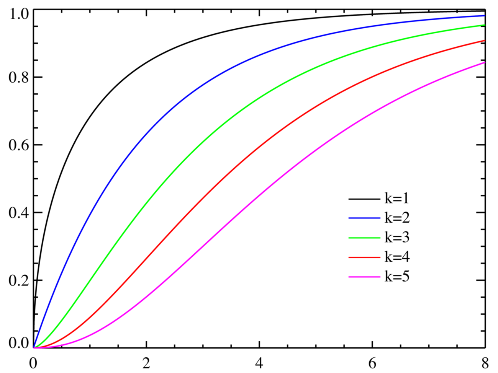
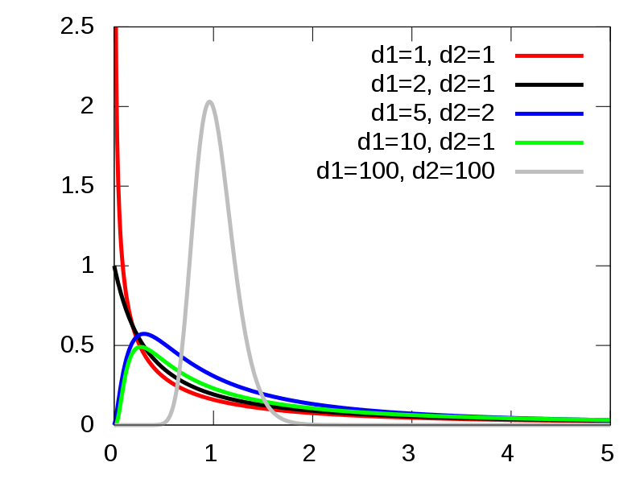

# 统计学三大分布

## Student's *t*-distribution*

### $t$ 分布的标记

若随机变量 $Z$ 服从自由度为 $\nu$ 的 $t$ 分布，记为：
$$
Z\sim t(\nu)
$$

### $t$ 分布的支撑集

$$
{\displaystyle x\in (-\infty ,\infty )}
$$

### $t$ 分布的概率密度函数

$$
f(t)={\frac {\Gamma ({\frac {\nu +1}{2}})}{{\sqrt {\nu \pi \,}}\,\Gamma ({\frac {\nu }{2}})}}(1+{\frac {t^{2}}{\nu }})^{\frac {-(\nu +1)}{2}}
$$

$\nu =n-1$ ：自由度

$\Gamma$ ：伽玛函数

> t 分布概率密度函数图

### $t$ 分布的累积分布函数

$$
{\displaystyle F(t)=\int _{-\infty }^{t}f(u)\,du=1-{\tfrac {1}{2}}I_{x(t)}\left({\tfrac {\nu }{2}},{\tfrac {1}{2}}\right)}\\
or\\
F(t)={\frac  {1}{2}}+{\frac  {x\Gamma \left((\nu +1)/2\right)\,_{2}F_{1}\left({\frac  {1}{2}},(\nu +1)/2;{\frac  {3}{2}};-{\frac  {x^{2}}{\nu }}\right)}{{\sqrt  {\pi \nu }}\,\Gamma (\nu /2)}}
$$

$\nu =n-1$ 为自由度

${\displaystyle x(t)={\frac {\nu }{t^{2}+\nu }}}$ 

$I$：不完全贝塔函数

$\Gamma$ ：伽玛函数

$\,_{2}F_{1}$：超几何函数

> t 分布的累积分布函数图

### $t$ 统计量

假设 $X$ 是呈正态分布的独立的随机变量（随机变量的期望值是 $\mu$，方差是 $\sigma^2$ ），令**样本均值**为：
$$
{\displaystyle {\overline {X}}_{n}={\frac {X_{1}+\cdots +X_{n}}{n}}}
$$
**样本方差**为：
$$
{S_{n}}^{2}={\frac  {1}{n-1}}\sum _{{i=1}}^{n}\left(X_{i}-\overline {X}_{n}\right)^{2}
$$
**$z$ 统计量**为：
$$
{\displaystyle Z={\frac {{\overline {X}}_{n}-\mu }{\frac {\sigma }{\sqrt {n}}}}}\sim \mathcal{N}(0,1)
$$
但总体方差 $\sigma^2$ 未知，于是有了 **$t$ 统计量**：
$$
{\displaystyle T={\frac {{\overline {X}}_{n}-\mu }{\frac {S_{n}}{\sqrt {n}}}}}\sim t(n-k-1)
$$
k：样本中已知变量个数

### $t$ 检验

> t 检验用于检验总体方差未知，且样本量较小（小于 30）的**统计量**是否有显著差异

##### 1. 单样本 t 检验

$$
{\displaystyle t={\frac {{\overline {X}}_{n}-\mu }{\frac {S_{n}}{\sqrt {n}}}}}\sim t(n-1)
$$

##### 2. 配对样本 t 检验

$$
t=\frac{(\bar{X}_{1}-\bar{X}_{2})-(\mu_1-\mu_2)}{\sqrt{\frac{S_{1}^{2}+S_{2}^{2}-2 \gamma S_{1} S_{2}}{n}}}\sim t(n-1)
$$

$\gamma$ ：两个样本间的相关系数

##### 3. 等方差独立样本 t 检验

$$
t=\frac{(\bar{X}_{1}-\bar{X}_{2})-(u_{1}-u_{2})}{\sqrt{\frac{(n_{1}-1)S_{1}^{2}+(n_{2}-1)S_{2}^{2}}{n_{1}+n_{2}-2}(\frac{1}{n_{1}}+\frac{1}{n_{2}})}}\sim t(n_1+n_2-2)
$$

##### 4. 异方差独立样本 t 检验

$$
t=\frac{\bar{X}_1-\bar{X}_2}{\sqrt{\frac{S_1^2}{n_1}+\frac{S_2^2}{n_2}}}\sim t(df\ from\ technology)
$$

> [t 分布维基百科](https://en.wikipedia.org/wiki/Student%27s_t-distribution)

## Chi-square distribution*

### 卡方分布的标记

若k个随机变量 $Z_{1},Z_2,\dots Z_{k}$ 是相互独立，符合标准正态分布的随机变量，则随机变量 $Z$ 的平方和 $X=\sum _{{i=1}}^{k}Z_{i}^{2}$ 被称为服从自由度为 $k$ 的卡方分布，记作：
$$
X\ \sim \ \chi ^{2}(k)\ \ or \ \ \ X\ \sim \ \chi _{k}^{2}
$$

### 卡方分布的支撑集

$$
x\in [0;+\infty )
$$

### 卡方分布的概率密度函数

$$
f_{k}(x)=
\begin{cases}
{\frac {{\frac {1}{2}}^{\frac {k}{2}}}{\Gamma ({\frac {k}{2}})}}x^{{\frac {k}{2}}-1}e^{\frac {-x}{2}}\ ,&\ \ \ x\ge0\\
0\ ,&\ \ \ x\lt0
\end{cases}
$$

$\Gamma$ ：伽玛函数

> 卡方分布的概率密度函数图

### 卡方分布的累积分布函数

$$
{\displaystyle F_{k}(x)={\frac {\gamma {\Bigl (}{\frac {k}{2}},{\frac {x}{2}}{\Bigr )}}{\Gamma ({\frac {k}{2}})}}}
$$

$\gamma(k,z)$ ：不完全伽玛函数

> 卡方分布的累积分布函数图

### 卡方分布的期望和方差

$$
E(X)=k\\
\ \\
Var(X)=2k
$$

### 卡方统计量

若 k 个随机变量 $Z_{1}\ Z_{1}\ \dots \ Z_{k}$是相互独立且符合标准正态分布的随机变量（数学期望为 0、方差为 1），则随机变量 $Z$ 的平方和服从自由度为 $k$ 的卡方分布
$$
X=\sum _{{i=1}}^{k}Z_{i}^{2}\sim \chi ^{2}(k)\ \ or\ \ \chi _{k}^{2}
$$
假设线性回归 $y=Xb+\epsilon$ 的误差 $\epsilon\sim \mathcal{N}(0,1)$ ，且 $Cov(X,\epsilon)=0$ ，则 $y\sim\mathcal{N}(\bar{y},1)$ ，以残差 $e_i$ 代替误差，于是：
$$
\sum_{i=1}^n(y_i-\bar{y})^2\sim\chi^2(n-1)
\tag{TSS 总波动}\\
$$

$$
\sum_{i=1}^n(y_i-\hat{y}_i)^2=\sum_{i=1}^ne_i^2\sim\chi^2(n-k)\\
\tag{RSS 源于残差}
$$

$$
\sum_{i=1}^n(\hat{y}_i-\bar{y})^2\sim\chi^2(k-1)
\tag{ESS 源于回归}\\
$$

$k$ ：解释变量/回归元（含常数项/截距项）

$y_i$ ：n 个自由变动的变量，自由度为 n

$\bar{y}$ ：1 个约束

$\hat{y}_i$ ：由 $k$ 个解释变量（含常数项）构成，求偏导为 0 时有 $k$ 个约束
$$
TSS=ESS+RSS
$$
证明方法：TSS 减一个加一个 $\hat{y}_i$ 后展开，利用 OLS 一阶条件（偏导等于 0）得到残差平方和等于 0，得证

### 卡方检验

> 卡方检验就是检验两个变量之间有没有关系，主要使用样本数据检验总体分布形态或比例

##### 1. Pearson 卡方检验（拟合度的卡方检验，卡方拟合优度检验，最佳拟合度卡方检验）

> 用于检验**单一变量**在多项分类中实际观察次数分布与某理论次数是否有显著差异

$$
\sum_{i=1}^k\frac{\left( f_{obs_i} -f_{exp_i}\right)^{2}}{f_{exp_i}}\sim \chi^{2}(k-1)
$$

$f_{obs}$ ：实际频数

$f_{exp}$ ：期望频数

$k$：分类变量的类别数目

> 除以 $f_{exp}$ 是因为 $f_{obs}$ 与 $f_{exp}$ 差距的**相对**大小取决于期望频数 $f_{exp}$ 的大小

##### 2. 卡方独立性检验

> 检验是用于**两个或两个以上因素多项分类**的**计数资料**分析

$$
\sum_{i=1}^k\frac{\left( f_{obs_i} -f_{exp_i}\right)^{2}}{f_{exp_i}}\sim \chi^{2}((R-1)\cdot(C-1))
$$

$f_{obs}$ ：实际频数

$f_{exp}$ ：期望频数

$R$：列联表 (Contingency table) 的行数

$R$：列联表 (Contingency table) 的列数数

##### 3. 连续性修正

- 当 $n\ge40$，且 $f_{exp}\ge5$ 时，看皮尔逊卡方值即可
- 当 $n\ge40$，且 $1\le f_{exp}\lt5$1 时，选择连续性修正值

$$
\sum_{i=1}^k\frac{\mid\left( f_{obs_i} -f_{exp_i}\mid-0.5\right)^{2}}{f_{exp_i}}\sim \chi^{2}((R-1)\cdot(C-1))
$$

> [卡方分布维基百科](https://en.wikipedia.org/wiki/Chi-squared_distribution)

## *F*-distribution*

### $F$ 分布的标记

如果随机变量 $X$ 有参数为 $d1$ 和 $d2$ 的 $F$-分布，记作：
$$
X \sim F(d1, d2)
$$

### $F$ 分布的支撑集

$$
x\in [0;+\infty )\!
$$

### $F$ 分布的概率密度

对于实数 $x \ge 0$，$X$ 的概率密度函数
$$
{\begin{aligned}f(x;d_{1},d_{2})&={\frac  {{\sqrt  {{\frac  {(d_{1}\,x)^{{d_{1}}}\,\,d_{2}^{{d_{2}}}}{(d_{1}\,x+d_{2})^{{d_{1}+d_{2}}}}}}}}{x\,{\mathrm  {B}}\!\left({\frac  {d_{1}}{2}},{\frac  {d_{2}}{2}}\right)}}\\&={\frac  {1}{{\mathrm  {B}}\!\left({\frac  {d_{1}}{2}},{\frac  {d_{2}}{2}}\right)}}\left({\frac  {d_{1}}{d_{2}}}\right)^{{{\frac  {d_{1}}{2}}}}x^{{{\frac  {d_{1}}{2}}-1}}\left(1+{\frac  {d_{1}}{d_{2}}}\,x\right)^{{-{\frac  {d_{1}+d_{2}}{2}}}}\end{aligned}}
$$
$B$ ：贝塔函数

> $F$ 分布的概率密度图

### $F$ 分布的累积分布函数

$$
F(x;d_{1},d_{2})=I_{{{\frac  {d_{1}x}{d_{1}x+d_{2}}}}}\left({\tfrac  {d_{1}}{2}},{\tfrac  {d_{2}}{2}}\right),
$$

$I$ ：正则不完全贝塔函数

> $F$ 分布的累积分布函数图

### $F$ 分布的期望和方差

$$
E(X)={\frac  {d_{2}}{d_{2}-2}}\!\ \ , \ for\ \ d_2\gt2
\ \\
Var(X)={\frac  {2\,d_{2}^{2}\,(d_{1}+d_{2}-2)}{d_{1}(d_{2}-2)^{2}(d_{2}-4)}}\! \ \ ,\  for \ \ d_2\gt4
$$

### $F$ 统计量

$$
F(d_1,d_2)\triangleq{\frac  {U_{1}/d_{1}}{U_{2}/d_{2}}}={\frac  {U_{1}/U_{2}}{d_{1}/d_{2}}}
$$

$U_1$ ：卡方分布，自由度是 $d_1$ 

$U_2$ ：卡方分布，自由度是 $d_2$ 

$U_1$ 和 $U_2$ 相互独立

### $F$ 检验

在线性回归中，模型能够解释的波动差异为 ESS，模型无法解释的波动差异为 RSS，而 $ESS\sim\chi^2(k-1)$ ，$RSS\sim\chi^2(n-k)$ ，于是有：
$$
\frac{ESS/(k-1)}{RSS/(n-k)}=\frac{\sum_{i=1}^n(\hat{y}_i-\bar{y})^2/(k-1)}{\sum_{i=1}^n(y_i-\hat{y}_i)^2/(n-k)}\sim F(k-1,n-k)
$$
$k$ ：解释变量/回归元（含常数项/截距项）

> F 检验比较了模型能够解释的波动与模型无法解释的波动的比率，F 值越大，说明模型越有解释力

#### $F$ 检验的变形

根据：
$$
TSS=ESS+RSS\\
R^2=\frac{ESS}{TSS}=1-\frac{RSS}{TSS}
$$
$F$ 检验可变形为：
$$
F(k-1,n-k)=\frac{ESS/(k-1)}{RSS/(n-k)}=\frac{n-k}{k-1}\cdot\frac{ESS}{TSS-ESS}=\frac{n-k}{k-1}\cdot \frac{ESS/TSS}{1-ESS/TSS}=\frac{n-k}{k-1}\cdot \frac{R^2}{1-R^2}
$$

> [F 分布维基百科](https://en.wikipedia.org/wiki/F-distribution)

