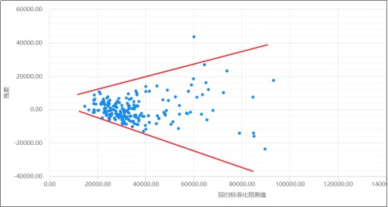

# 截面数据纯 Stata 操作

## 创建虚拟变量

```stata
gen d=(year>=1978)
	# ()：对 () 内的表达式进行判断，成立返回1；否则返回0
	
ta 变量, gen(prov)
	# ta全称：tabulate 将变量按其取值列表
	# gen(prov)：根据此变量的不同取值生成以“prov”开头的虚拟变量
```


## 交互项

```stata
gen 交互变量名 = 变量1 * 变量2
```

交互项结果的解释：

- 若交互项为正且显著，表明变量2越大，变量1对因变量的影响越大；
- 若交互项为负且显著，表明变量2越大，变量1对因变量的影响越小；


## 线性插值

如果数据有缺失，可能需要进行插值处理

```stata
ipolate y x, gen(新变量)
	# ipolate：interpolate，即将含有缺失值的变量 y 对变量 x 进行线性插值
	# 将插值的结果记为新变量
```

注意判断数据是否存在指数增长的趋势（如GDP、货币存量、资本存量），可通过画时间趋势图来观察


## 极端值查找

```stata
predict lev, lev
	# ,lev全称：leverage 杠杆作用
sum lev
dis r(max) / r(mean)
gsort -lev
	# 将观测值按照变量 lev 的降序排列
list lev in 1/3
```


## 变量个数的选择

使用逐步回归法确定需不需要添加变量

### 逐步回归法

1. 逐个剔除：全加入回归，剔除不显著的

   ```stata
   stepwise, pr(0.05): reg y x1 x2 x3 x4 x5 x6 x7
   	# pr(0.05)：指定显著性水平，系统自动剔除掉显著性水平不达标的项
   ```

2. 逐个加入：显著保留，不显著剔除

   ```stata
   stepwise, pe(.1): reg y x1 x2 x3 x4 x5 x6 x7
   ```

3. 逐个分层剔除：从后往前，如果首次遇到显著，则该项前面的均保留（即跟变量顺序有关，把不确定的往后放）

   ```stata
   stepwise, pr(0.1) hier: reg y x1 x2 x3 x4 x5 x6 x7
   ```

4. 逐个分层加入

   ```stata
   stepwise, pe(.2) hier: reg y x1 x2 x3 x4 x5 x6 x7
   ```

   


## 遗漏变量检验

若遗漏变量，会导致所有参数的估计都是有偏的

### 1. Link 检验

基本思想：如果模型的设定是正确的，那么 y 的拟合值的平方项将不应具有解释能力

```Stata
reg y x1 x3 x3 x4
linktest
```

**若 _hatsq 显著，则说明：（1）可能遗漏了变量；（2）被解释变量设置的不合理**（如：应该取倒数或对数形式）


### 2. Ramsey 检验

基本思想：如果模型设定无误，那么拟合值和解释变量的高阶项都不应再有解释能力

```stata
reg y x1 x3 x3 x4
estat ovtest
	# 只加入被解释变量的拟合值的高次项
estat ovtest, rhs
	# 把拟合值和解释变量的高阶项都加入
```

若 $prob>F$ 的值小于设定的显著性水平，则拒绝原假设，即认为模型设定有误


## 嵌套模型

一个模型包含另一个模型，检测多出来的项是否联合显著

```stata
reg y x1 x2 x3
reg y x1 x2 x3 x4 x5 x6
test x4 x5 x6
```

p 值越小，越拒绝原假设，即认为大模型好一些


## 非嵌套模型

即两个模型因变量相同，解释变量可能有相同的部分，但没有谁包含谁的关系

### 非嵌套模型的选择

基本思想：$H_0=模型1；H_1=模型2$，将模型2的拟合值代入模型1，若果显著，即拒绝模型1好，说明模型2好

```stata
reg y x1 x2 x3
reg y x1 x4 x5
local X "x1 x2 x3"
local Z "x1 x4 x5"
nnest y `X' (`Z')
```


### 若相互拒绝

相互拒绝说明两个模型内的解释变量都有助于解释因变量，稳妥的做法是把两个模型里的变量融合到一起，做一个更大的模型


## 一元回归

$$
y=\beta_0+\beta_1x+u
$$

> $u$ 为 Error Term（误差项）即无法由 x 来解释的 y 的变动部分


简单回归模型有两个重要的假设：

1. $E(u)=0$ ，即**误差** $u$ 造成的 $y$ 的变化的平均为 0
2. $E(u|x)=0$ ，条件期望为 0，也就是说给定 $x$ 时，$u$ 的期望和 $x$ 无关

```stata
reg 因变量 自变量
	# , noc: noconstent 无常数项
	# 默认有常数项
```


## 多元回归

```stata
reg 因变量 自变量1 自变量2

vce
	# 显示回归系数的协方差矩阵
	
predict 因变量_hat
	# 将拟合值记为 因变量_hat（可以自定义名称）
	
predict e, r
	# 计算残差并记为 e（可以自定义名称）
	# r: residual 计算残差（默认计算拟合值）
	
list 因变量 因变量_hat e
	# 将因变量实际值及其拟合值、残差同时列出
	
# if 条件
	reg 因变量 自变量1 自变量2 if 虚拟变量
		# 对虚拟变量为1的子集进行回归
		
	reg 因变量 自变量1 自变量2 if ~虚拟变量
		# 对虚拟变量为0的子集进行回归
		# ~：表示逻辑“否”（或者用"!"）
		
	reg 因变量 自变量1 自变量2 if 变量3>=10
		# 对条件子集进行回归
		
	reg 因变量 自变量1 自变量2 if 变量3>=10 & 虚拟变量
		# 对多个条件子集进行回归
		
qui reg 因变量 自变量1 自变量2
	# qui：quietly 不在窗口显示回归结果
	
单个系数的检验
	test 变量1=0.1
		# 检验变量1的系数等于 0.1
	test 变量1=变量2
		# 检验变量1的系数等于变量2的系数
	test 变量1+变量2=变量3
	
dis ttail(自由度, t统计量值) * 2
	# （双边检验）计算该t统计量下的 P值
```


## 部分回归

横轴：指定解释变量对所有其他解释变量回归得到的残差

纵轴：因变量对除指定解释变量以外的所有变量回归得到的残差

```stata
reg y x1 x2 x3 x4
avplot x1
	# 绘制指定解释变量的部分回归图

avplots
	# 绘制所有变量的部分回归图
```


## 二值选择模型

### 1. probit 模型

```stata
probit y x1 x2 x3, r
```


### 2. logit 模型

```stata
logit y x1 x2 x3, r or nolog
	# r：使用稳健标准误(默认为普通标准误)
	# or：显示几率比(odds ratio)，不显示回归系数
	# nolog：不显示 MLE 数值计算的迭代过程
```


### 预测

```stata
predict y1
	# 计算发生概率的预测值，记为 y1
estat clas
	# 计算准确预测的百分比
	# clas：classification
```


### 计算边际效应

```stata
margins, dydx(*)
	# 计算所有解释变量的平均边际效应
	# *：所有解释变量
margins, dydx(*) atmeans
	# 计算所有解释变量在样本均值处的边际效应
margins, dydx(*) at(x1=0)
	# 计算所有解释变量在 x1=0 处的平均边际效应
margins, dydx(x1)
	# 计算解释变量 x1 的平均边际效应
margins, eyex(*)
	# 计算平均弹性
	# e：elasticity 弹性
margins, eydx(*)
	# 计算平均半弹性，x 变化一单位引起 y 变化百分之几
margins, dyex(*)
	# 计算平均半弹性，x 变化 1% 引起 y 变化几个单位
```


## 异方差检验

### 1. 画残差图

残差图：将残差项 $e_i$ 分别与模型的某个解释变量 $x_i$ 或者拟合值 $\hat{y}_i$ 作散点图，查看散点是否有明显的规律性

通过残差图观察是否存在异方差

```stata
reg y x1 x2 x3
	# 回归
	
rvfplot
	# 画残差与拟合值的散点图
	
rvpplot 解释变量
	# 画残差与某个解释变量的散点图
```



> 残差图 来自：https://zhuanlan.zhihu.com/p/80357361

通常存在异方差时，散点图会呈现出自变量 X 值越大，残差项越大/越小的分布规律。如上图中散点图呈现出这样的规律性，说明模型具有异方差性


### 2. BP 检验（Breusch-Pagan Test）

1. 使用**拟合值**

   ```stata
   estat hettest, iid
   	# estat：完成估计后计算后续的统计量
   	# hettest：异方差检验
   	# iid：仅假定数据为 iid，而无须正态假定
   	# normal：假定数据为正态分布（不常用 normal，更常用 iid）
   ```

2. 使用**所有解释变量**

   ```stata
   estat hettest, iid rhs
   	# estat：完成估计后计算后续的统计量
   	# hettest：异方差检验
   	# iid：仅假定数据为 iid，而无须正态假定
   	# rhs：使用方程右边的全部解释变量进行辅助回归（默认使用拟合值进行辅助回归）
   ```

3. 使用**指定解释变量**

   ```stata
   estat hettest x1, iid
   	# 使用指定变量进行辅助回归
   ```

若 “Prob > chi2 =” 的结果小于 0.05，则可在 5% 的水平上拒绝“同方差”的原假设，即模型存在异方差问题

可以通过制定解释变量来逐个检查哪些组合可能引起异方差


### 3. 怀特检验（White Test）

```stata
estat imtest, white
	# estat：完成估计后计算后续的统计量
	# imtest：information matrix test 信息矩阵检验
```

若 “Prob > chi2 =” 的结果小于 0.05，则可在 5% 的水平上拒绝“同方差”的原假设，即模型存在异方差问题


### 4. Glesjer's Test *

**基本思想**：三种可能的异方差有 3 种形式：

1. $Var(e_i) = \sigma^2\cdot (\beta_0 + \beta_1\cdot x_1 +\dots \beta_k\cdot x_k)$
2. $Var(e_i) = \sigma^2\cdot (\beta_0 + \beta_1\cdot x_1 +\dots \beta_k\cdot x_k)^2$
3. $Var(e_i) = \sigma^2\cdot e^{\beta_0 + \beta_1\cdot x_1 +\dots \beta_k\cdot x_k}$

 $Var(e_i)=e_i^2$ ，$\sigma^2$ 用 $\frac{1}{n}\sum_{i=1}^ne_i^2$ 代替，还需要 $\sqrt{\frac{1}{n}\sum_{i=1}^ne_i^2}$ 和  $ln(\frac{1}{n}\sum_{i=1}^ne_i^2)$ 对于 2 和 3 进行计算

```stata
qui reg y x1 x2 x3 x4
predict ei, res
gen ei2 = ei^2
qui sum ei2
gen e2 = ei2/r(mean)
gen abs_ei = sqrt(e2)
gen ln_ei = ln(e2)
local Z "x1 x2 x3 x4"
	# 填入解释变量的名称
local k = 4 + 1
	# k：解释变量个数 + 1
local n = e(N)

* 针对第 1 种情况：
qui reg e2 `Z'
dis "F = " e(F)   " p_value = "  Ftail(`= `k'-1', `=`n'-`k'' , `e(F)')

* 针对第 2 种情况：
qui reg abs_ei `Z'
dis "F = " e(F)   " p_value = "  Ftail(`= `k'-1', `=`n'-`k'' , `e(F)')

* 针对第 3 种情况：
qui reg ln_ei `Z'
dis "F = " e(F)   " p_value = "  Ftail(`= `k'-1', `=`n'-`k'' , `e(F)')
```


### 5. 组间异方差检验

```stata
reg y x1 x2 x3 x4
predict e, res
robvar e, by(分组变量)
```

p 值越小，越拒绝没有异方差的原假设，即存在组间异方差


## 异方差处理

### 1. OLS + 稳健标准误

如果发现存在异方差，一种处理方法是，仍然进行 OLS 回归（OLS 仍然无偏、一致且渐近正态），但须使用在异方差情况下也一致的**稳健标准误**

```stata
reg 因变量 自变量1 自变量2 自变量3, r
	# r：robust 稳健标准误
```


### 2. 广义最小二乘法（GLS, WLS）/ 可行广义最小二乘法（FGLS, FWLS）

```stata
qui reg y x1 x2 x3
est sto OLS
	# 将此回归结果存储，并记为 OLS，方便以后调用
	
predict e1, r
	# 计算残差并记为 e1
	
gen e2=e1^2
	# 生成残差的平方
	
gen lne2=log(e2)
	# 将残差平方取对数
	
reg lne2 x1 x2 x3
	# 进行辅助回归
	
reg lne2 x1 x2 x3, noc
	# 进行辅助回归（不含截距项）
	
reg lne2 x2, noc
	# 根据回归结果的，保留解释力强的自变量，再次对这些自变量进行回归
	
predict lne2f
	# 计算辅助回归的拟合值，并记为 lne2f
	
gen e2f=exp(lne2f)
	# 去掉对数后即得到方差的估计值，并记为 e2f
	
reg y x1 x2 x3 [aw=1/e2f]
	使用方差估计值的倒数作为权重进行 WLS 回归
	# aw：analysis weight 扰动项方差
	# e2f：存储所有的残差平方

est sto WLS1
	# 将此回归结果存储，并记为 WLS1，方便以后调用

reg y x1 x2 x3 [aw=1/e2f], r
	使用稳健标准误进行 WLS 回归

est sto WLS2
	# 将此回归结果存储，并记为 WLS2，方便以后调用
	
est table OLS WLS1 WLS2, b se stats(N r2 r2_a)
	# est table：将估计结果列表
	# b：显示回归系数
	# se：显示标准误
	# stats(N r2 r2_a)：显示样本容量（N）、拟合优度（r2）、校正拟合优度（r2_a）等统计量
	# star(0.1 0.05 0.01)：以星号表示系数的显著性水平，但 star 与 se 不能共存
```

若想 se 与 star 同时显示，可下载非官方命令

```stata
ssc install estout
	# 下载 estout
	
esttab OLS WLS1 WLS2, se r2 mtitles star(* 0.1 ** 0.05 *** 0.01)
```


### 3. OLS + 稳健标准误 还是 FWLS

理论上，WLS 是 BLUE，但 FWLS 既非线性估计，也不是无偏估计，无资格参加 BLUE 的评选

FWLS 计算出的参数是 y 的非线性函数，一般来说是有偏的，FWLS 在大样本下比 OLS 有效

OLS + 稳健标准误的方法更为稳健；FWLS 的方法更有效。在大多数情况下，应该使用：“**OLS + 稳健标准误**”

>如果被解释变量取值为正，有时将被解释变量取对数，可以缓解异方差问题


### 4. 组间异方差的处理

```stata
reg y x1 x2 x3 x4
predict e, res
egen sd_e = sd(e), by(分组变量)
gen gw_wt = 1/sd_e^2
tabstat sd_e gw_wt, by(分组变量)
reg y x1 x2 x3 x4 [aw=gw_wt]
```


**大部分时候还是用稳健回归的方式处理异方差**


## 结构突变检验

### 观察

```stata
twoway connect 变量1 变量2 时间变量, msymbol(circle) msymbol(triangle) xlabel(1980(10)2010) xline(1992)
	# 根据时间变量画变量1和变量2的时间趋势图
	# connect：把点用线连接起来
	# msymbol：marksymbol
	# xlabel(1980(10)2010)：在横轴 1980-2010 年之间，每隔10 年做个标注(label)
	# xline(1992)：在横轴1992 年的位置画一条直线
```


### 传统邹检验（Chow Test）

#### 1. 做全样本的回归

```stata
reg 因变量 自变量
scalar ssr = e(rss)
	# scalar：标量
		# 区别 gen 是生成变量
	# 把回归的残差平方和(e(rss)) 记为标量 ssr
```


#### 2. 对子样本进行回归

```stata
reg 因变量 自变量 if year<1992
scalar ssr1 = e(rss)
reg 因变量 自变量 if year>=1992
scalar ssr2 = e(rss)
```


#### 3. 计算 F 统计量

```stata
di ((ssr-ssr1-ssr2)/解释变量个数)/((ssr1+ssr2)/(样本容量 - 2解释变量个数))
```


### 虚拟变量法

步骤：

1. 将分组标准生成虚拟变量
2. 将虚拟变量分别与其他解释变量生成交互项
3. 将虚拟变量和虚拟变量的交互项全部加入回归方程中做回归
4. 使用 F 统计量检验虚拟变量和虚拟变量的交互项系数是否显著异于 0

```stata
# 1. 生成虚拟变量
gen dum = 分组变量==1

# 2. 生成虚拟变量与解释变量的交互项
gen dum_x1 = dum * x1
gen dum_x2 = dum * x2

# 3. 进行全样本 OLS 回归
reg y x1 x2 dum dum_x1 dum_x2

# 4. 检验虚拟变量及其交互项的联合显著性
test dum dum_x1 dum_x2
	# 如果 p 值很小，拒绝原假设，即系数显著异于 0，有结构突变，不能混在一起

# 异方差检验
qui reg 因变量 自变量
	# qui：不用汇报回归结果
estat imtest, white
	# 异方差的怀特检验，若 Prob > chi2 = 的结果小于 0.05，则可在 5% 的水平上拒绝“同方差”的原假设
	
# 自相关的 BG 检验
tsset year
	# 设定变量 year 为时间变量
estat bgodfrey
	# 异方差的怀特检验，若 p 值为0.0000，则可在 1% 水平上强烈拒绝“无自相关”的原假设
	# 对时间序列来说，自相关是普遍现象
	
# 使用异方差自相关稳健的标准误检验结构变动
# 计算 HAC 标准误的截断参数
	dis 样本容量值^(1/4)
		# 样本容量的四分之一次方
		# 将结果向上取整为截断参数
# 进行 Newey-West 回归
	newey 因变量 自变量 虚拟变量 虚拟变量和自变量的交互项, lag(截断参数)
	
# 检验虚拟变量及其交互项的联合显著性
test d xd
	# 若 p 值为0.0000，则可在 1% 水平上拒绝“无结构变动”的原假设
```


### 工具变量法的结果汇报

```stata
qui reg lnw s expr tenure rns smsa, r
	# 未加入 iq 的 OLS 回归
est sto ols_no_iq
qui reg lnw iq s expr tenure rns smsa, r
	# 加入 iq 后的 OLS 回归
est sto ols_with_iq
qui ivregress 2sls lnw s expr tenure rns smsa (iq=med kww), r
	# 进行二阶段最小二乘法回归
est sto tsls
qui ivregress liml lnw s expr tenure rns smsa (iq=med kww), r
	# 进行有限信息最大似然估计
est sto liml
est table ols_no_iq ols_with_iq tsls liml,b se
	# 把所有回归结果以列表的形式呈现
	# b：显示回归系数
	# se：显示标准误
est table ols_no_iq ols_with_iq tsls liml,star(0.1 0.05 0.01)
	# 用一颗星表示10%的显著性，两颗星表示5%的显著性，三颗星表示1%的显著性
	
	
# 论文标准的显示输出
ssc install estout
	# 下载安装非官方命令 “estout”
esttab ols_no_iq ols_with_iq tsls liml, se r2 mtitle star(* 0.1 ** 0.05 *** 0.01)
	# se：在括弧中显示标准误
	# 默认显示t 统计量
	# 如果使用选择项 “p” 则显示 p 值
	# r2：显示 R²
	# mtitle：使用模型名称(model title)作为表中每列的标题(默认使用被解释变量作为标题)
	# star(* 0.1 ** 0.05 *** 0.01)：以星号表示显著性水平


# 结果输出到 Word
	esttab ols_no_iq ols_with_iq tsls liml using 文件名.rtf,se r2 mtitle star(* 0.1 ** 0.05 *** 0.01)
```


## 多重共线性检验*

### 完全共线性

Stata 会自动去掉完全共线性的变量


### 严重多重共线性

#### 1. VIF 膨胀因子*

基本思想：如果某个变量有严重多重共线性，用该变量对其他变量做回归，会有较大的 $R^2$ 
$$
VIF_j = \frac{1}{1-R^2_j}
$$

```stata
reg y x1 x2 x3 x4
estat vif
```

结果会呈现出所有变量的 VIF 值

存在严重多重共线性的经验准则：**(1) 所有 VIF 的均值 > 2； (2) 某个 VIF 的最大值 >10** 


#### 2. 条件指数 CN（或病态数，Condition Number）和病态指数 CI（Condition Index）

基本思想：CN=最大特征值/最小特征值，如特征值检验所说，当存在严重多重共线性时，会有特征值接近 0，则 CN 值就会非常大，通常 CN>20 时，共线性比较严重，$CI=\sqrt{CN}$

```stata
findit coldiag2
findit collin
coldiag2 x1 x2 x3 x4
collin x1 x2 x3 x4
```


#### 3. 相关系数矩阵

可以通过变量的相关系数矩阵来寻找高度相关的变量

```stata
pwcorr x1 x2 x3 x4, star(0.01)
```


#### 4. 绘图

绘制两两变量的散点图

```stata
graph matrix y x1 x2 x3 x4, half
	# half：只绘制下三角区域的图
```


### 多重共线性的征兆

1. 虽然模型的 $R^2$ 非常高，但多数解释变量都不显著，甚至系数符号都与预期相反
2. 观察值的微小变动都会导致估计结果的大幅变动


## 多重共线性的处理

1. 去掉其中一个变量
2. 生成一个跟相关变量有关的新变量（如：生成身高体重比，代替身高和体重 2 个变量）


## 内生性检验

### 豪斯曼检验（DWH 检验，Hausman Test）

```stata
reg y x1 x2
	# 进行 OLS 回归
	
est sto ols
	# est：estimates 
	# sto：store 
	# 存储 OLS 的结果，记为 ols
	
ivregress 2sls y x1 (x2=z1 z2)
	# 假设 x2 为内生变量，z1,z2 为工具变量（IV）进行二阶段最小二乘法
	
est sto iv
	# 存储 2SLS 的结果，记为 iv
	
hausman iv ols,constant sigmamore
	# 进行豪斯曼检验
	# hausman 后面先写 IV 的结果
	# sigmamore：统一使用更有效率的估计量(即 OLS)所对应的残差来计算扰动项方差 hat(σ²)
	# constant：IV 估计与 OLS 估计中都包括常数项 (默认不含常数项)
```

如果豪斯曼检验的结果越大（距离越大），越倾向于认为存在内生变量

传统豪斯曼检验不适用于异方差的情形

```stata
在完成 2SLS 后
estat endogenous
	# 适用于异方差的情形
```


## 内生性处理

### 1. 工具变量法


### 2. 两阶段最小二乘法 (2SLS)

```stata
ivregress 2sls y x1 x2 (x3 = z1 z2), robust first
	# ivregress：工具变量法总的命令
	# 2sls：子命令
	# y：被解释变量
	# x1 x2：外生解释变量
	# x3：内生解释变量
	# z1 z2：方程外的工具变量
	# robust：使用异方差稳健的标准误(默认为普通标准误)
	# first：显示第一阶段的回归结果
```


### 3. 广义矩估计 (GMM)

```stata
ivregress gmmy x1 x2 (x3 = z1 z2)
	# gmm：子命令
```


### 

## 弱工具变量的检验

```stata
在完成 2SLS 后
estat first
	# 若 F > 10：不存在弱工具变量
```

**结果解释**：

- $R^2$ 越高表明内生变量与工具变量之间的相关性越高，IV 估计的偏误就越小

- 只看 $R^2$ 和 $adj\_R^2$ 并不合理，因为第一阶段回归不仅包含我们设定的工具变量，还包含模型中的外生变量，此时应该看 $partial\_R^2$ 

  > $partial\_R^2$ ：在控制外生变量影响的前提下，看工具变量对内生变量的解释力
  >
  > $partial\_R^2$ 的计算方式：
  >
  > 1. 内生变量对外生变量做回归，得到残差 e，目的是从内生变量中剔除外生变量的影响
  > 2. 工具变量分别对外生变量做回归，得到残差 e_i，目的是从所有工具变量中剔除外生变量的影响
  > 3. 用 e 对所有 e_i 做回归，得到的 $R^2$ 就是 $partial\_R^2$


## 弱工具变量的处理

### 1. 寻找更好的工具变量


### 2. 有限信息最大似然估计法 (LIML)

```stata
ivregress liml y x1 x2 (x3 = z1 z2)
	# liml：子命令
```

LIML 对弱工具变量更不敏感


## 过度识别检测

```stata
在完成 2SLS 后
estat overid
	# R²越大，越能拒绝原假设，即工具变量与扰动项存在相关性
```


## GMM 的过度约束条件检验

```stata
ivregress gmm y x1 (x2 = x3 x4 x5), wmatrix(robust)
estat overid
```


## 部分工具变量的合理性检验

### C Test 或 Difference-in-Sargan Test

```stata
ivreg2 y x1 (x2= x3 x4 x5), gmm2s robust orthog(x3 x4)
```

**结果解释**：

- C 统计量及 Hansen J 统计量的 p 值越小，越拒绝原假设，即表明选择剔除的工具变量不是一个合理的 IV

- Underidentification test：原假设：模型存在识别不足问题，p 越小，越说明模型没有识别不足的问题
- Weak identification test：原假设：内生变量与工具变量之间的相关性较低(此时GMM估计量可能存在严重的偏误)


## 实证结果的呈现

### 1. 变量的基本统计量

```stata
sum y x1 x2 x3 x4 x5 x6
tabstat y x1 x2 x3 x4 x5 x6,                  ///
	stat(mean sd p5 p25 med p75 p95 min max)  ///
	format(%6.2f) c(s)
	# 显示 6 位数，小数点后保留 2 位，每列显示统计量名称
```

### 2. 变量的相关矩阵

```stata
pwcorr x1 x2 x3 x4 x5 x6, sig star(0.05)
	# 该命令只能对指定的显著性打 1 个 *

pwcorr_a x1 x2 x3 x4 x5 x6, sig star1(0.01) star5(0.05) star10(0.1)
	# 该命令可以打多个 *
```

### 3. 回归结果的呈现

```stata
reg y x1 x2 x3
est store m_1
reg y x1 x2 x3 x4 x5
est store m_2
reg y x1 x2 x3 x4 x5 x6 x7
est store m_3

# 方法 1：
est table m_1 m_2 m_3
est table m_1 m_2 m_3, stat(r2 r2_a N F) b(%6.3f) star(0.1 0.05 0.01)

# 方法 2（推荐）：
esttab m_1 m_2 m_3, scalar(r2 r2_a N F) compress  ///
                    star(* 0.1 ** 0.05 *** 0.01)  ///
                    b(%6.3f) t(%6.3f)             ///
                    mtitles(模型(1) 模型(2) 模型(3))
                    /* compress：精简显示 */
```

> eret list
>
> 该命令会列出所有的返回值，stat 选项可以从返回值里 scalars 里挑选


----


## 蒙特卡洛模拟

```stata
clear
	# 删除内存中已有数据
	
set obs 30
	# 设定随机抽样的样本容量为 30
	
set seed 10101
	# 设定随机抽样的种子为 10101
	# 用来重现随机抽样
	
gen x = rnormal(3, 4)
	# 得到均值3，方差4的正态分布随机样本
	
gen e = rnormal(0, 9)
gen y = 1 + 2 * x + e
reg y x
```


## 使用蒙特卡罗法模拟中心极限定理

```stata
program 程序名, rclass
	# program：定义程序，并以 r() 形式存储结果
	
drop _all
	# 删除内存中已有的数据
	
set obs 30
	# 确定随机抽样的样本容量
	
gen x = runiform()
	# 得到在（0,1）上均匀分布的随机样本
	
sum x
	# 计算 x 的统计特征
	
return scalar mean_sample=r(mean)
	# 将样本均值记为：mean_sample(自定义名称)
	# scalar：标量
	
end
	# 程序结束
	
set more off
	# 指定 stata 输出结果连续翻页
	
simulate xbar=r(mean_sample), seed(101) reps(10000) nodots: 程序名
	# simulate：重复程序，并生成 xbar（自定义名称）
	# reps：重复次数
	# nodots：不显示模拟过程的点（默认在窗口显示）
	
hist xbar, normal 
```


## 使用蒙特卡罗模拟大样本理论

```stata
program chi2data, rclass
	# 定义程序名为 chi2data，并以 r() 形式存储结果
	
drop _all
	# 删除内存中已有的数据
	
set obs 20
	# 确定随机抽样的样本容量
	
gen x = rchi2(1)
	# 生成服从 X2(1) 分布的解释变量
	
gen y = 1 + 2 * x + rchi2(10) - 10
	# 生成被解释变量
	
reg y x
	# 线性回归
	
return scalar b=_b[x]
	# 存储 β(hat) 的估计值
	
end
	# 程序结束
	
set more off
	# 指定 stata 输出结果连续翻页
	
simulate bhat=r(b), seed(10101) reps(10000) nodots: chi2data
	# simulate：重复程序
	# reps：重复次数
	# nodots：不显示模拟过程的点（默认在窗口显示）
	
hist bhat, normal 
```


