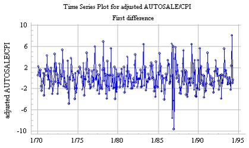
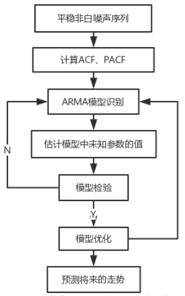
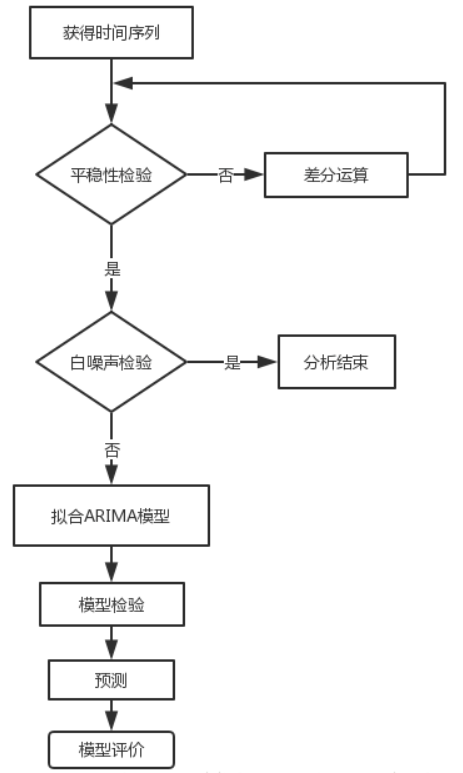
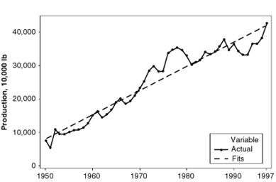
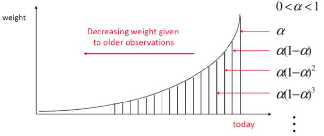

# 时间序列

时间序列（Time Series）是同一现象在不同时间上的相继观察值排列而成的序列

根据观察时间的不同，时间序列中的时间可以是年份、季度、月份或其他任何时间形式


## 序列相关

经典回归模型中假设 $u_i \sim i.i.d\ N(0, \sigma^2)$ ，在时间序列中，$i.i.d$ 往往不成立，经常有变量的滞后效应（下一期会受到上一期的影响）

一阶自相关 AR(1)：$u_t = \rho\cdot u_{t-1} + v_t$ ，其中 $v_t\sim i.i.d\ N(0,\sigma^2)$ 


## 序列相关产生的原因

1. 时间序列自身的特征
2. 数据本身的问题：取**对数**和**差分**能够从一定程度上降低序列相关
3. 遗漏变量


## 序列相关的检验

### 1. 图形法：自相关系数图和偏自相关系数图

#### 自相关函数（ACF）

**基本思想**：当期和滞后 $l$ 期之间的相关系数就能反映它们之间的序列相关程度
$$
\rho_l = \frac{Cov(r_t, r_{t-l})}{\sqrt{Var(r_t)Var(r_{t-l})}}= \frac{Cov(r_t, r_{t-l})}{Var(r_t)}
$$

> $\rho_l$ 为自相关系数（AC），若平稳时：$Var(r_t)=Var(y_{r-l})$ 即方差-协方差矩阵的对角线元素相同，参看“方差-协方差矩阵”的知识

当自相关函数中所有的值都为 0 时，该序列是完全不相关的；因此，经常需要检验多个自相关系数是否为 0

```stata
tsset 时间序列变量
reg y x
predict e, res
ac e
	# 默认所画的最高阶数为 min{floor(n / 2) - 2, 40}
```

灰色为置信区间，灰色内表示：相关系数与 0 无显著差别


#### 偏自相关函数（PACF）

基本思想：控制在当期和滞后 $l$ 期之间的期数，通过做回归，观察滞后期变量前的系数，通过该系数反映它与当期的相关程度
$$
r_t = \theta_{11}r_{t-1} + u_t \\
r_t = \theta_{21}r_{t-1} + \theta_{22}r_{t-2} + u_t \\
\dots \\
r_t = \theta_{k1}r_{t-1} + \theta_{k2}r_{t-2} + ... + \theta_{kk}r_{t-k} + u_t
$$

PACF 为 $\{\theta_{11}, \theta_{22}, ... , \theta_{kk}\}$ 

相当于控制其它滞后项的影响后，得到的“净”相关系数

```stata
pac e
```

其他命令

```stata
corrgram e,lags(8)
	# corrgram：画自相关图
	# lags(8)：最多计算滞后 8 阶
```


### 2. t 检验法（Wooldridge）

适用于**一阶自相关**的检验

**基本思想**：用残差对残差的滞后项（若解释变量非严格外生，还应加入解释变量，避免解释变量是内生性的从而导致残差相关）做回归，如果残差滞后项的系数显著，则存在序列相关问题

```stata
# 假设解释变量严格外生
reg e L.e

# 假设解释变量非严格外生
reg e L.e 变量1 变量2
```


### 3. F 检验

适用于**高阶自相关**的检验，假设**解释变量均为严格外生变量**

**基本思想**：对残差的各阶滞后项进行联合显著性检验，判断是否存在序列相关问题

```stata
reg e L(1/4).e
```

看各阶系数的显著性判断存在几阶自相关


### 4. D-W 检验（Durbin-Watson）*

**该方法仅能用于检验 AR(1) 形式的序列相关**，假设**解释变量均为严格外生变量**
$$
d=\frac{\sum_{t=2}^T(e_t-e_{t-1})^2}{\sum_{t=1}^Te_t^2}
$$
当样本量较大时，d 统计量与样本的自相关系数存在如下关系：
$$
d\simeq2(1-\hat{\rho})
$$
检验结果为 d 统计量，d 统计量的分布不依赖于 $\beta$ 和 $\sigma$，但却依赖于 $X$ （包括样本容量、解释变量的个数、是否包含常数项等），因此需要根据 d 统计量和 $X$ 查表得到对应的上限（$d_u$）和下限（$d_l$）

1. $d_u<d<4-d_u$ ：无法拒绝原假设，即**不存在一阶序列相关**（经验值为：1.8-2.2）
2. $0<d<d_l$ 或 $d_u<d<4$ ：拒绝原假设，即**存在一阶序列相关**

```stata
qui reg y x1 x2 x3
dwstat
```


### 5. Q 检验

假设**解释变量均为严格外生变量**

**基本思想**：构造统计量检验残差与残差的滞后项之间的相关系数是否显著

相关系数：
$$
r_j=\frac{\sum_{t=j+1}^Te_je_{t-j}}{\sum_{i=1}^Te_i^2}
$$

> 因为 $e_i$ 均值为 0，实际上分子相当于计算残差和残差滞后项之间的协方差，分母为计算残差的方差

Q 统计量：
$$
Q=T\sum_{j=1}^Pr_j^2\sim\chi^2(P)
$$
对于小样本，可以用 Ljung-Box 的修正统计量

```stata
# 到第 k 阶的所有阶数的联合显著性，p值越小越存在自相关
wntestq e1, lags(p)
	# wntestq：white noise test Q
	# p：滞后阶数，默认为 min{floor(n/2)-2, 40}
corrgram e1, lags(p)
	# corrgram：correlogram 自相关图
	# p：滞后阶数，默认为 min{floor(n/2)-2, 40}
```


### 6. Ljung-Box Test（LB）或称 Ljung-Box Q Test

假设**解释变量均为严格外生变量**

Ljung-Box Test 是一种判断序列的自相关函数是否为 0 的统计方法，是一种白噪声检验法
$$
Q=n(n+2)\sum_{k=1}^h\frac{\hat{p}_k^2}{n-k}
$$
$n$：样本数量；$\hat{p}_k^2$：k 阶滞后的自相关系数；$h$：要测试的滞后上限

Q 统计值服从卡方分布，自由度选取 h 作为参数
$$
H_0=自相关系数为\ 0（数据独立分布，是白噪声） \\
H_a=自相关系数不为\ 0（数据不独立分布，不是白噪声）
$$
**Ljung-Box Test 通常用在 ARIMA 模型的残差上，并不会用在原始数据上**

```stata
wntestq e1,lag(3)
	# lag(3)：默认滞后 9 阶
```


### 7. Bartlett's Periodogram

假设**解释变量均为严格外生变量**

```stata
wntestb e
```

如果所有的点都位于上下两条斜线之间，则为白噪声（序列不相关），否则有序列相关问题


### 8. D-W's h 检验

**该方法仅能用于检验 AR(1) 形式的序列相关**，假设**解释变量非严格外生**
$$
h=(1-0.5d)\sqrt{\frac{T}{1-T\cdot sc^2}}
$$

```stata
qui reg y x1 x2 x3
estat durbinalt
```


### 9. Breusch-Godfrey 检验（BG 检验）

该检验适合于**高阶自相关**的检验，假设**解释变量非严格外生**
$$
H_0:\ 不存在序列相关 \\
H_1:\ \epsilon_t=AR(q)\ 或\ \epsilon_t=MA(q)
$$
检验步骤：

1. 用 $y_t$ 对 $x_t$ 做 OLS 回归，得到残差 $e_t$，$i=1, 2, \dots,T$

2. 用 $e_t$ 对 $x_t,e_{t-1},e_{t-2},\dots e_{t-q}$ 做回归，$t=(q+1),\dots,T$ ，得到拟合优度 $R^2$

3. 计算 LM 统计量：
   $$
   LM=(T-q)R^2\sim\chi^2(q)
   $$
   LM 统计量要求满足同方差假设：
   $$
   Var(u_t|x_t,u_{t-1},\dots,u_{t-q})=\sigma^2
   $$

```stata
qui reg y x1 x2 x3
bgodfrey, lag(滞后阶数) small
	# small：检验统计量针对小样本进行调整
	# nom：nomiss0 不添加 0 的 BG 检验，默认以 0 代替缺失值
```


## 序列相关的处理

### 1. 取对数再差分*


### 2. HAC 稳健标准误（Newey 稳健型估计）

是对 White 稳健标准误的扩展，同样地，系数采用 OLS 估计，方差协方差矩阵考虑了序列相关性

公式比较复杂，不列出了

```stata
reg y x1
est sto ols

newey y x1, lag(1)
	# 使用 Newey-West 估计法
	# lag(p)：用来指定截断参数 p
est sto newey1

newey y x1, lag(2)
est sto newey2

esttab ols newey1 newey2, b(%6.3f) se(%6.3f) mtitle(ols newey1 newey2)
```


### 3. GLS / FGLS 估计（一阶准差分）

适用于明确是**一阶自相关**的情况

**基本思路**：首先估计方差-协方差矩阵中非对角线元素的 $\rho$，即相关系数（参考“方差-协方差矩阵”部分的知识），然后对模型进行变换得到满足 OLS 经典假设的模型

1. 假设不存在序列相关，先用普通 OLS 对模型进行回归（reg y x），得到**残差**
2. 用残差对残差的一阶滞后进行回归，得到一阶自相关系数 $\rho_1$
3. 将 $\rho_1$ 代入准差分处理过的模型中进行回归，得到新的自相关系数 $\rho_2$
4. 跌倒多次，直到自相关系数收敛，然后用收敛后的 $\rho$ 进行估计

$$
y_t=X_t^T\beta+\epsilon_t \\
\epsilon_t=\rho\epsilon_{t-1}+u_t\\
\rho y_{t-1}=\rho X_{t-1}^T\beta+\rho \epsilon_{t-1}\\
y_t-\rho y_{t-1}=(X_t-\rho X_{t-1})^T\beta+(\epsilon_t-\rho \epsilon_{t-1})
$$

记为：
$$
y_t^*=X_t^*\beta+\epsilon_t^*
$$
针对第一期的观察值有两种处理方法：

1. **Cochrane-Orcutt 估计**：直接舍弃

   ```stata
   prais y x , corc
   	# corc：使用 CO 估计法，默认为 PW 估计法
   	# nolog：不显示迭代过程
   	# rho(dw)：使用 D-W 检验的 d 统计量计算 ρ
   ```

2. **Prais-Winsten 估计**

   $\sqrt{1-\rho^2}y_1=\sqrt{1-\rho^2}x_1\beta+\sqrt{1-\rho^2}\epsilon_1$

   ```stata
   prais y x
   ```

   

### 4. 二阶准差分

适用于明确是**二阶自相关**的情况

思路与 GLS / FGLS 估计一阶自相关类似，只是相应地变成了二阶的情形

```stata
tsset 时间序列变量
qui reg y x
qui predict e, res
pac e
	/* 检验是否是二阶自相关 */
reg e L(1/2).e
	/* 观察一阶滞后项和二阶滞后项是否显著 */
	
* 获得一阶和二阶相关系数：rho1, rho2
qui reg e L1.e L2.e, nocons
local rho1 = _b[L1.e]
local rho2 = _b[L2.e]

* 对所有变量进行二阶准差分转换
gen const = 1
	/*常数项也要转换*/
foreach var of varlist const y x{
	gen `var'_2 = `var' - `rho1'*L.`var' - `rho2'*L2.`var' 
}

* 估计方法1：Corch （舍弃前两期观察值）
reg y_2 x_2 const_2, nocons     
dwstat
est store Corch2

* 估计方法2：Prais （对前两期观察值进行特殊处理）
* 转换前两期观察值
global indv "const y x"
local rr = sqrt(1-`rho2'^2)
foreach var of varlist $indv{  
    local tempz1 = (1+`rho2')*(`rr'^4-`rho1'^2)/(1-`rho2')
    replace `var'_2 = -sqrt(`tempz1')*`var' in 1/1
    local tempz2 = `rho1'*`rr'/(1-`rho2')*`var'[1]
    replace `var'_2 = `rr'*`var' - `tempz2' in 2/2
}
reg y_2 x_2 const_2, nocons 
dwstat  
est store Prais2

* 比较结果
esttab Corch2 Prais2, mtitles(Corch2 Prais2)
```


## 白噪声（White Noise，WN）

序列的各项之间没有任何相关关系，序列在进行完全无序的随机波动，白噪声序列是没有信息可提取的平稳序列，可以**终止分析**
$$
y_t = e_t\\
e_t \sim i.i.d\ \mathcal{N}(0,1)\\
E(y_t)   = 0\\
Var(y_t) = 1
$$
**平稳序列**的特征: **均值和自协方差均不随时间改变**

WN 序列是平稳的


## 白噪声的检验

### 1. Ljung-Box Test（LB）或称 Ljung-Box Q Test*

Ljung-Box Test 是一种判断序列的自相关函数是否为 0 的统计方法，是一种白噪声检验法
$$
Q=n(n+2)\sum_{k=1}^h\frac{\hat{p}_k^2}{n-k}
$$
$n$：样本数量；$\hat{p}_k^2$：k 阶滞后的自相关系数；$h$：要测试的滞后上限

Q 统计值服从卡方分布，自由度选取 h 作为参数
$$
H_0=自相关系数为 0（数据独立分布，是白噪声） \\
H_a=自相关系数不为0（数据不独立分布，不是白噪声）
$$
**Ljung-Box Test 通常用在 ARIMA 模型的残差上，并不会用在原始数据上**

```stata
wntestq y1
wntestq y1, lags(20)
	# lags(20)：指定滞后阶数，默认滞后 40 阶
	# p 值越小，越拒绝原假设，即认为不是白噪声

# 图示法展示
corrgram y1, lags(20)
```

统计量为 $\chi^2(m)$ ，m 为滞后阶数


### 2. Bartlett Test

没讲原理

```stata
wntestb y1
	# 绘图展示，所有点都位于上下两条斜线内时，表示是白噪声
wntestb y1, table
	# 列表展示
```


## 随机游走（Random Walk，RW）

随机游走的一阶滞后项系数非常接近 1

### 标准化随机游走过程（Standardized Random Walk Process）

标准化的意思是方差等于 1
$$
w_t = w_{t-1} + e_t\\
w_0 = 0\ , \ \ e_t\sim i.i.d\mathcal{N}(0,1)
$$
递推得到：
$$
\begin{aligned}
w_t &= w_{t-1} + e_t\\
w_t &= w_{t-2} +e_{t-1}+ e_t\\
w_t &= w_{t-3} +e_{t-2}+e_{t-1}+ e_t\\
&\dots\\
w_t &= w_{0} +(e_{1}+ e_2+\dots+e_t)\\
\end{aligned}
$$
即 $w_t$ 的当期观察值是以往所有干扰因素的累积

因为 $e_t\sim i.i.d\mathcal{N}(0,1)$ ，所以 $Var(w_t)=t$ ，非平稳，且当 t 趋于无穷大时，$Var(w_t)\to\infty$


### 随机游走过程（Random Walk Process）

$$
w_t = w_{t-1} + e_t\\
w_0 = 0\ , \ \ e_t\sim i.i.d\mathcal{N}(0,\sigma^2)\\
Var(w_t)=t\sigma^2
$$


### 带有飘移项的随机游走过程

$$
w_t = c_0+w_{t-1} + e_t\\
w_0 = 0\ , \ \ e_t\sim i.i.d\mathcal{N}(0,1)
$$

递推得到：
$$
\begin{aligned}
w_t &= c_0+w_{t-1} + e_t\\
w_t &= c_0+c_0+w_{t-2} +e_{t-1}+ e_t\\
w_t &= c_0+c_0+c_0+w_{t-3} +e_{t-2}+e_{t-1}+ e_t\\
&\dots\\
w_t &= mc_0+w_{t-m} +\sum_{s=1}^{m-1}e_{t-s}\\
\end{aligned}
$$
漂移项的存在具有累加效果


## 平稳序列与非平稳序列

**平稳序列**（Stationary Series）是基本上不存在趋势的序列，序列中的各观察值基本上在某个固定的水平上波动，在不同时间段波动程度不同，但不存在某种规律



**非平稳序列**（Non-Stationary Series）是包含**趋势**、**季节性**或**周期性**的序列，只含有其中一种成分，也可能是几种成分的组合。可分为：有趋势序列、有趋势和季节性序列、几种成分混合而成的复合型序列


## 平稳性的判断（单位根检验）

时间序列图，稳定的数据是没有趋势，没有周期性的，即它的均值在时间轴上拥有常量的振幅，并且它的方差在时间轴上是趋于同一个稳定的值

**基本思想**：单位根检验实际上就是检验是否是随机游走的过程（随机游走的一阶滞后项的系数接近 1）


### 一般性检验方法

即不存在离群值和结构突变

### 1. Dickey-Fuller Test，DF

**基本思想**：用时间序列变量与他的一阶滞后项做回归，观察系数是否接近 1，如果接近 1，就是单位根过程
$$
y_t = a_0 + \rho y_{t-1} + \delta t + u_t
$$
检验统计量：
$$
t=\frac{\hat{\rho}-1}{\hat{\sigma}_\rho}
$$
该方法只适用于一阶情况，且用 OLS 估计往往存在严重的序列相关，传统的 t 检验对 $\rho$ 的统计推断不适用，因为当 $\rho$ 接近 1 时，序列的方差随时间会改变


### 2.  Augmented Dickey-Fuller Test，ADF

**基本思想**：在 DF 的基础上，在式子两边同时减去 $y_{t-1}$ （一阶差分），同时加入滞后差分项来控制高阶序列相关
$$
\Delta y_t = a+ \gamma y_{t-1} + \delta t+\sum_{i=1}^p\beta_i\Delta X_{t-1}+\epsilon_t
$$
$\gamma=\rho-1$ ，检验 $\gamma$ 的系数是否接近于 0（即 DF 中的 $\rho$ 是否接近 1）
$$
H_0=存在单位根（非平稳）\\
H_a=平稳序列
$$

ADF 是一种常用的单位根检验方法，它的**原假设为序列具有单位根，即非平稳**

对于一个平稳的时序数据，就需要在给定的置信水平上显著（**P 值接近零**），拒**绝原假设**，即**序列平稳**

对于非平稳序列（P 值太大），通常进行一阶差分，然后再次检验差分后的单位根

```stata
dfuller 变量
	# 用一阶差分对一阶滞后项做回归，结果含一阶滞后和常数项
dfuller 变量, regress
	# 显示回归结果
dfuller 变量, regress nocon
	# 用一阶差分对一阶滞后项做回归，结果只含一阶滞后项（不常用，除非序列已经差分过）
dfuller 变量, regress drift
	# 用一阶差分对一阶滞后项和漂移项做回归，结果含一阶滞后项和常数项
dfuller 变量, regress lag(3)
	# 控制序列相关的滞后差分阶数
dfuller 变量, regress lag(3) trend
	# 加入时间趋势项
```

一般看 5% 水平上的值，**若 “Test Statistic”的绝对值小于 5% 水平上的绝对值，则无法拒绝原假设，认为序列不平稳**


### 3. DF-GLS（Modified Dickey-Fuller t-Test）

$$
H_0：y_t\ 是单位根过程\\
H_1：y_t\ 是一个平稳过程
$$

若 $y_t$ 是平稳过程，则包含两种形式：

1. 趋势平稳（即包含一个时间趋势项，stata 中的默认选项）
2. 一般平稳（不包含时间趋势项，stata 中加入 notrend 选项即可）

```stata
dfgls 变量
	# 包含时间趋势项
dfgls 变量, notrend
	# 不包含时间趋势项
```

结果解释：

根据”Opt Lag“推荐的阶数，查看该阶数的**“Test Statistic”的绝对值，若小于 5% 水平上的绝对值，则无法拒绝原假设，认为序列不平稳**


### 4. PP 检验（Phillips-Perron Unit-Root Test）

**基本思想**：模型与 DF 检验相同，只但是**采用 Newey-West 稳健型标准误来控制序列相关问题**（ADF 检验通过放入多个差分滞后项来控制序列相关问题）

模型：
$$
y_t = a + \rho y_{t-1} + \delta t + u_t
$$

```stata
pperron 变量
pperron 变量, lag(4) trend regress
	# 指定滞后阶数，包含时间趋势项，显示回归结果
```

**结果解释**：同 DF 检验，p 越小，越拒绝原假设，即认为平稳


### 5. Kwiatkowski-Phillips-Schmidt-Shin Test（KPSS）

$$
H_0=存在确定性趋势（可能是趋势平稳）\\
H_a=存在单位根（非平稳）
$$

文献使用不多，不作介绍


### 考虑离群值的单位根检验

### Vogelsang

**基本思想**：如果序列中有离群值，会导致传统的单根检定过度接受存在单位根的原假设，于是该方法做的是自动寻找离群值，然后加入离群值的虚拟变量，通过比对有无离群值情况下的统计量进行测试

```stata
dfao 变量
dfao 变量, notr
	# 不含时间趋势项
```

结果解释：p 越小，越拒绝原假设，即认为平稳，同时会给出哪些是离群值


### 允许一个结构突变的单位根检验

### 1. Zivot-Andrews 检验

**基本思想**：逐年把某个时间作为分断点，加入该时间的虚拟变量做回归，计算 t 统计量，t 统计量最小的点对应的就是结构突变的位置

模型：
$$
\Delta y_t = a + b y_{t-1} + \delta DTB_{1t} + u_t
$$
$b=\rho-1$ ， $DTB_{1t}$ 为虚拟变量
$$
H_0:\  y_t = y_{t-1}+\delta DTB_{1t} + u_t\\
H_1:\ y_t = c_0 + c_1t +\delta DTB_{1t} + u_t
$$

```stata
line 变量 时间序列变量
	# 绘图观察一下，是否存在一个结构突变点
zandrews 变量
zandrews 变量, graph
	# 绘制 t 统计量图
zandrews 变量, lagmethod(BIC)
	# 使用指定的方法计算滞后阶数
zandrews 变量, break(trend)
	# 认为趋势也存在结构突变
```

结果解释：若“Minimum t-statistic”值的绝对值小于“Critical values”的绝对值，则无法拒绝原假设，认为即便考虑了结构突变仍然是非平稳（存在单位根）


### 2. Clemente,Montanes,and Reyes 检验

模型：
$$
\Delta y_t = a + b y_{t-1} + \delta DTB_{1t} + u_t
$$
$b=\rho-1$ ， $DTB_{1t}$ 为虚拟变量
$$
H_0:\  y_t = y_{t-1}+\delta DTB_{1t} + u_t\\
H_1:\ y_t = c_0 +\delta DTB_{1t} + u_t
$$

```stata
clemao1 变量
clemao1 变量, graph
```

**结果解释**：第一列显示虚拟变量（结构突变）是否显著，第二列是显示是否有单位根（系数接近 0，t 统计量绝对值小于 5%水平置信值的的绝对值，则认为存在单位根）


### 允许两个结构突变的单位根检验

### Clemente,Montanes,and Reyes 检验

**基本思路**：先搜索出第一个结构突变点，然后继续搜索第二个结构突变点（计算速度可以的话，可以同时搜索两个结构突变点）

模型：
$$
\Delta y_t = a + b y_{t-1} + \delta_1 DTB_{1t} +\delta_2 DTB_{2t} +u_t
$$
$b=\rho-1$ 
$$
H_0:\  y_t = y_{t-1}+\delta_1 DTB_{1t}+\delta_2 DTB_{2t} + u_t\\
H_1:\ y_t = c_0 +\delta_1 DTB_{1t}+\delta_2 DTB_{2t} + u_t
$$

```stata
clemao2 变量, graph
```

**结果解释**：第一列和第二列显示虚拟变量（结构突变）是否显著，第三列是显示是否有单位根（系数接近 0，t 统计量绝对值小于 5%水平置信值的的绝对值，则认为存在单位根）


## 使数据平稳的方法

1. 如果序列**波动很大**，也就是方差比较大，可以对序列作**对数转换**以减缓其波动幅度
2. 如果序列存在**明显趋势**，且呈现近似一条直线的趋势，可以对序列作**一阶差分**，从而消除趋势性
3. 如果序列存在明显的 **S 期季节性**，则可对序列作 **S 阶差分**，从而消除季节性


## 平稳时间序列模型

### ARMA 模型

ARMA 模型的全称是**自回归移动平均模型**

可以细分为 **AR 模型**、**MA 模型**和 **ARMA 模型**三类，都可以看做是多元线性回归模型


### AR（自回归）模型

通过自身前面部分的数据与后面部分的数据之间的相关关系（**自相关**）来建立回归方程，从而进行预测或者分析

**AR(1)** 
$$
r_t = \phi_0+\phi_1r_{t-1} + a_t
$$
$a_t$ 表示白噪声序列，是时间序列中的数值的随机波动，但是这些波动会相互抵消，最终是 0

**AR(p)** 
$$
\begin{aligned}
r_t&= \phi_0+\phi_1 r_{t-1} + \phi_2 r_{t-2} + ... + \phi_p r_{t-p} + a_t\\
&=\phi_0+\sum_{i=1}^p\phi_ir_{t-i}+a_t
\end{aligned}
$$

$\phi_0$ ：常数项，$a_t$ ：白噪声序列


#### AP(p) 的阶数 p

1. **利用偏自相关函数（PACF）**
2. **利用信息准则函数**


### 绘制自相关系数（AC）图

```stata
ac 变量
```

灰色为置信区间，灰色内表示：相关系数与 0 无显著差别


### 绘制偏自相关系数（PAC）图

```stata
pac 变量
```

PAC 图截断处对应的阶数就是 AR 模型的滞后阶数 p


### 信息准则

1. AIC（Akaike Information Criterion 赤池信息准则）：寻找可以最好地解释数据但包含最少自由参数的模型
   $$
   AIC=-2ln(L)+2k
   $$

2. BIC（Bayesian Information Criterion 贝叶斯信息量）
   $$
   BIC = -2 ln(L) + ln(n)k
   $$

3. HQIC（Hannan-Quinn Information Criterion）
   $$
   HQ = -2 ln(L) +ln(ln(n))k
   $$

> L：似然函数；ln(L)：对数似然值；k：参数个数，n：样本数
>
> 对数似然函数（Log Likelihood）越大越好，AIC、BIC、HQIC 越小越好，选择值最小的模型
>
> BIC 更倾向于筛选出“精简的”模型

```stata
arima 变量, ar(1) ma(1)
estat ic
	# ic全称：information criterion 信息准则

arima 变量, ar(2) ma(1)
estat ic

# 比较不同阶数对应的 AIC 和 BIC，选择值最小的模型
```


### 遗漏高次项的 RESET 检验

```stata
estat ovtest, rhs
	# ovtest：omitted variable test 遗漏变量检测
	# rhs：使用解释变量的幂为非线性项（默认使用 y(hat)^2, y(hat)^3, y(hat)^4 为非线性项）
```


#### 一阶自回归模型（AR(1)）

```stata
reg y l.y , r
	# 一阶自回归
```


#### 高阶自回归模型（AR(p)）

```stata
# 进行一阶自回归
reg y l.y , r

# 计算信息准则
estat ic

# 进行二阶自回归
reg y l(1/2).y , r
	# l(1/2).y：变量 y 的 1-2 阶滞后

# 计算信息准则
estat ic

……

# 若信息准则结果上升，则应停止，选择上一个阶数 p
# 若回归系数显著，则应至少选择该阶数，然后继续做下一阶观察是否显著以及信息准则的值
```


### MA（移动平均）

**MA(1)**
$$
r_t = c_0 + a_t+\theta_1 a_{t-1}
$$
$c_0$ 为常数项，$a_t$ 表示不同时间点的白噪声

**MA(q)**
$$
\begin{aligned}
r_t &= c_0 + a_t+\theta_1a_{t-1} + \theta_2a_{t-2} + ... + \theta_qa_{t-q}\\
&=c_0+a_t+\sum_{i=1}^qa_{t-q}
\end{aligned}
$$


### ARMA（自回归移动平均）

**ARMA(1, 1)**
$$
r_t = \phi_0 + \phi_1 r_{t-1} + a_t+ \theta_1 a_{t-1}
$$
**ARMA(p, q)**
$$
r_t = \phi_0 + \sum_{i=1}^p\phi_i r_{t-i} + a_t+\sum_{i=1}^q \theta_i a_{t-i}
$$
$a_t$为白噪声序列，p 和 q 都是非负整数

AR 可以解决当前数据与后期数据之间的关系，MA 则可以解决随机变动也就是噪声的问题


#### 建模步骤

1. 计算自**相关系数（ACF）**和**偏自相关系数（PACF）**

2. ARMA 模型识别（模型定阶）由 AR(p) 模型、MA(q) 模型和 ARMA(p, q) 的自相关系数和偏自相关系数的性质，选择合适的模型

   | 模型       | 自相关系数（ACF）        | 偏自相关系数（PACF）         |
   | ---------- | ------------------------ | ---------------------------- |
   | AR(p)      | 拖尾（逐渐减小到阴影内） | p 阶截尾（突然减小到阴影内） |
   | MA(q)      | q 阶截尾                 | 拖尾（上下摆动拖尾）         |
   | ARMA(p, q) | 拖尾                     | 拖尾                         |

   

   > 图片来自：https://blog.csdn.net/zjlamp


### ARIMA（差分自回归移动平均）模型

ARIMA 模型是基于平稳的时间序列或者差分化后是稳定的，ARIMA 法也叫 **Box-Jenkins** 方法

ARIMA(p, d, q)：

- p 为自回归阶数（时序数据本身的滞后数）
- d 为时间成为平稳时所做的差分阶数
- q 为移动平均阶数（预测误差的滞后数）


#### 建模步骤

1. 检查序列图是否为平稳时间序列，对于非平稳时间序列要先进行 d 阶差分运算，化为平稳时间序列

2. 对平稳时间序列分别求得其自相关系数 ACF 和偏自相关系数 PACF，通过对自相关图和偏自相关图的分析，得到最佳的阶层 p 和阶数 q

   > Python 中 forecast包里面的 auto.arima 函数能实现最优 ARIMA 模型的自动选取

3. 由以上得到 d、q、p，进而得到 ARIMA 模型，然后对得到的模型进行模型检验



> 图片来自：https://blog.csdn.net/zjlamp


## VAR（Vector AutoRegressive）向量自回归

单个时间序列的 AR 模型扩展为多个时间序列的 AR 模型就是 VAR 模型

VAR 模型中一组向量里的每个时间序列被模型化为决定于**自己的滞后项**以及这组向量里**所有其他变量的滞后项**

2 阶 VAR 模型如下：
$$
\begin{aligned} y_{t} &=\alpha_{0}+\alpha_{1} y_{t-1}+\alpha_{2} x_{t-1}+\epsilon_{1 t} \\ x_{t} &=\beta_{0}+\beta_{1} y_{t-1}+\beta_{2} x_{t-1}+\epsilon_{2 t} \end{aligned}
$$

### 结构型 VAR（SVAR）

$$
S Y_t = C + \sum_{i=1}^p S_iY_{t-i} + RX_t + E_t
$$

$Y_t = [y_{1t} \ \  y_{2t} \ \  ... \ \  y_{Mt}]^T$ ，是一个 M 维列向量, M 个内生变量

$X_t = [x_{1t}\ \ x_{2t}\ \   ...\ \  x_{Kt}]$  ，是一个 MxK 维矩阵，表示 K 个外生变量

$E_t = [u_{1t}\ \ u_{2t} \ \  ... \ \ u_{Mt}]^T$ ，是一个 M 维列向量（干扰项）

$S$ 为系数矩阵


SVAR 重点关注变量之间的**同期相关性**


### 缩减性 VAR

若 S 可逆，则结构型 VAR 可表示为：
$$
Y_t = C + \sum_{i=1}^p A_iY_{t-i} + BX_t + U_t
$$
$A_i = S^{-1}S_i$，$B = S^{-1}R$

$Y_t = [y_{1t} \ \  y_{2t} \ \  ... \ \  y_{Mt}]^T$ ，是一个 M 维列向量, M 个内生变量

$X_t = [x_{1t}\ \ x_{2t}\ \   ...\ \  x_{Kt}]$  ，是一个 MxK 维矩阵，表示 K 个外生变量

$E_t = [u_{1t}\ \ u_{2t} \ \  ... \ \ u_{Mt}]^T$ ，是一个 M 维列向量（干扰项）

假设：

- $E(U_t) = 0$

*         $E(U_tU_t^T) = S$ ：各个干扰项之间**存在**同期相关性
*         $E(U_tU_s^T) = 0\ ,\  (t\ne s) $ ：各个干扰项之间以及自身**不存在**跨期相关性

VAR  重点关注变量之间的**跨期相关性**，注重因果关系的分析


VAR 公式展开为：
$$
\begin{aligned}
y_{1t} &= c_{10} + a_1Y_{t-1} + ... + a_pY_{t-p} + b_{11}x_{1t} + ... + b_{1k}x_{kt} + u_{1t}\\
y_{2t} &= c_{20} + a_1Y_{t-1} + ... + a_pY_{t-p} + b_{21}x_{1t} + ... + b_{2k}x_{kt} + u_{1t}\\
\dots &= \dots\\
y_{Mt} &= c_{M0} + a_1Y_{t-1} + ... + a_pY_{t-p} + b_{M1}x_{1t} + ... + b_{Mk}x_{kt} + u_{Mt}\\
\end{aligned}
$$
系数个数：c 有 **M** 个 + a 有 **M\*M\*P** 个（因为 Y 是 M 维列向量）+ b 有 **M\*K** 个，共 $n_1=M^2\times P+M\times (K+1)$ 个

干扰项的协方差矩阵 S 的参数个数：$n_2=\frac{M\times (M+1)}{2}$ 个

若 $T < n_1 + n_2$，模型将无法估计，因此要施加限制条件


### 格兰杰因果检验

若 x 是 y 的 Granger 因，则 x 的滞后项有助于解释 y 的变动，否则认为 x 不是 y 的 Granger 因


### 结构型 VAR （SVAR）

模型设定：
$$
AY_t =\sum_{i=1}^p A_iY_{t-i}+ e_t
$$
A 就反映了同期因果关系，对干扰项进行正交分解：
$$
Var(e_t) = \sigma^2 = BB^T
$$
设：
$$
e_t = Bu_t
$$
$u_t$ 是一个向量，称为“正交单位创元”，有：
$$
Var(u_t) = I_t(单位矩阵)
$$
于是原模型改写为：
$$
AY_t =\sum_{i=1}^p A_iY_{t-i}+ Bu_t
$$
设：
$$
v_t = A^{-1}e_t=A^{-1}Bu_t
$$
即原模型对应的缩减型 VAR 模型的干扰项，设：
$$
Var(v_t) =Var(A^{-1}Bu_t)= S\\
v_t\sim\mathcal{N}(0,S)
$$
由于 S 为正定矩阵，所以可进行裘氏分解如下：
$$
S = PP^T\\
P=A^{-1}B
$$
因此，根据 VAR 估计得到的残差的方差-协方差矩阵 S，我们可以进而得到 A 和 B

为了使模型能够确认：

1. A 是一个下三角矩阵，B 是一个对角矩阵
2. 通常将 A 矩阵的对角元素设定为 1（假设变量和自身的相关性为 1）
3. A 矩阵的非对角元素反映了变量间的“**同期**”因果关系

对 SVAR 的解释：

1. A 的系数反映了各个内生变量的同期关系，即因果关系
2. B 的系数反映了来自不同内生变量的随机干扰对系统的影响，我们事实上对干扰项 $e_t$ 进行了正交分解，得到了“单位正交创元” $u_t$，这使得我们可以分析 $u_t$ 变化一单位对系统的动态影响


### SVAR 中的短期与长期

“**短期**”，是指通过对 **A** 矩阵施加约束条件，来反映变量间的“**同期**”因果关系

“**长期**”，是指通过对 $C = A^{-1}B$ 施加约束，来反映变量间的“**长期**”交互影响


### 短期恰好识别 SVAR 模型

设模型为：
$$
y_t=f(x_1,x_2,x_3)
$$
设：
$$
A=\left[ \begin{matrix}1 & 0&0\\·&1&0\\
·&·&1\end{matrix}\right]\ \ \ B=\left[ \begin{matrix}· & 0&0\\0&·&0\\
0&0&·\end{matrix}\right]
$$
含义：

1. 第一行：x1 不受 x2 和 x3 的影响
2. 第二行：x2 受 x1 的影响，但不受 x3 的印象
3. 第三行：x3 受 x1 和 x2 的影响

```stata
mat A = (1,0,0 \ .,1,0 \ .,.,1)
mat B = (.,0,0 \ 0,.,0 \ 0,0,.)
mat list A
mat list B
svar x1 x2 x3, aeq(A) beq(B)
est store svar01
mat list e(A)
mat list e(B)
```

结果解释：

1. “Exactly identified model”：下三角矩阵 A 中恰好有 3 个未知参数

2. a_2_1 ：A  矩阵中第 2 行第 1 列上的元素

3. A_j 的系数可以通过 var 选项列印出来

   ```stata
   svar x1 x2 x3, aeq(A) beq(B) var
   ```


#### 冲击反应分析

```stata
irf create sv01, step(10) set(myirf01) replace
irf graph oirf, irf(sv01) impulse(冲击变量) response(反应变量)    
irf graph coirf, irf(sv01) impulse(冲击变量) response(反应变量)
```


### 短期过度确认 SVAR 模型

设模型为：
$$
y_t=f(x_1,x_2,x_3)
$$
设：
$$
A=\left[ \begin{matrix}1 & 0&0\\0&1&0\\·&·&1\end{matrix}\right]\ \ \ B=\left[ \begin{matrix}· & 0&0\\0&·&0\\0&0&·\end{matrix}\right]
$$
含义：

1. x1 不受 x2 和 x3 的影响
2. x2 不受 x1 和 x3 的影响
3. x3 受到 x1 和 x2 的影响

```stata
mat A = (1,0,0 \ 0,1,0 \ .,.,1)
mat B = (.,0,0 \ 0,.,0 \ 0,0,.)
mat list A
mat list B
svar x1 x2 x3, aeq(A) beq(B) 
est store svar02
mat list e(A)
mat list e(B)
```


### 带有约束条件的短期 SVAR 模型

```stata
var x1 x2 x3, lag(1/2)
# 根据结果，将不显著的系数设为 0
constraint define 1 [#1]L2.dx1 = 0
constraint define 2 [#1]L1.dx2 = 0
constraint define 3 [#1]L2.dx2 = 0   
constraint define 4 [#1]L1.dx3 = 0
constraint define 5 [#1]L2.dx3 = 0
constraint define 6 [#2]L1.dx2 = 0
constraint define 7 [#2]L2.dx2 = 0
constraint define 8 [#2]L2.dx1 = 0
constraint define 9 [#3]L2.dx1 = 0
svar x1 x2 x3, aeq(A) beq(B) varconstraints(1/9)
est store svar03
svar x1 x2 x3, aeq(A) beq(B) varconstraints(1/9) var

# 比较
local mm svar01 svar02 svar03
esttab `mm', mtitle(`mm')
```


### 长期 SVAR 模型

模型设定：
$$
AY_t =\sum_{i=1}^p A_iY_{t-i}+ e_t
$$
移项可表示为：
$$
A(I_k - A_1L - A_2L^2 - \dots- A_pL^p)Y_t = e_t
$$
设：
$$
e_t = Bu_t
$$
则有：
$$
(I_k - A_1L - A_2L^2 - \dots- A_pL^p)Y_t = A^{-1}e_t
=A^{-1}Bu_t=Cu_t
$$
C 称为长期约束

```stata
mat C = (.,0 \ 0,.)
svar d.x1 d.x2, lreq(C)  

mat C = (.,0 \ .,.)     /* 假设 x2 受 x1 的影响 */
svar d.x1 d.x2, lreq(C)  

mat C = (.,. \ 0,.)     /* 假设 x1 受 x2 的影响 */
svar d.x1 d.x2, lreq(C) 
```


## 趋势（Trend）

时间序列在长时期内呈现出来的某种持续上升或持续下降的变动，也称长期趋势。时间序列中的趋势可以是线性和非线性



趋势分为**确定性趋势**和**随机性趋势**两种：

#### 趋势平稳

**确定性趋势**是可以用一条趋势线来拟合的，当去除掉趋势的部分后，该序列就变成平稳的序列，因此称该序列为趋势平稳

#### 随机性趋势

趋势无法通过单一的趋势性描绘，在不同时间趋势是随机变化的，这种情况下单位根过程是一种有效的刻画工具

#### 处理方法

对于趋势平稳的序列，可以在模型中加入时间序列项


## 季节趋势

很多变量是有季节趋势或者月份趋势的

#### 处理方法

1. 可以加入季节或者月份的虚拟变量来进行处理
2. 可以让各个变量先对季节或者月份虚拟变量做回归，然后再用残差进行回归

```stata
# 设置时间变量
tsset 时间变量

# 从时间变量提取月度信息
gen 月度变量名=month((dofm(时间变量)))

# 生成月度虚拟变量
tab 月度变量名, gen(虚拟变量名前缀)
reg y 虚拟变量名前缀2-12

# 计算回归的残差项
predict 新变量名, r
	# 计算回归的残差项，并记为新变量名
	# r：残差

# sum y

# 计算季节调整后的数据
gen y_sa =计算残差项生成变量名 + r(mean)

# 将回归法的季节调整序列与原序列画图
tsline y_sa y, lpattern(dash)
```


## 趋势性的判断

### 1. 绘图观察*

### 2. Mann-Kendall Test（MK）

$$
H_0=没有单调趋势 \\
H_a=存在单调趋势
$$


## 伪回归问题

如果两个时间序列非平稳且都具有趋势，那么本来没有实际关系却因为都随着时间变化而产生了关系

#### 伪回归的征兆

若两个时序变量回归得到的 $R^2$ 较高，系数也显著，但 D-W 值接近于 0，则很可能是伪回归，此时，要检验时序变量的平稳性

#### 处理方法

1. 在回归模型中加入一个变量t，来捕捉时间变化

$$
   y_t=\beta_0+\beta_1 x_{t1}+\beta_2t+u_t
$$

2. 先让 $y_t$ 和 $x_{t1}$ 分别对 $t$ 做回归，得到残差 $\dot{y_t}$ 和 $\dot{x_{t1}}$ ，然后再用残差做回归，结果和上面的一样


## 协整

若 $y_t, x_t$ 均为单位根（ I(1)） 过程，若二者的线性组合（$z_t = y_t - a - bx_t$）是平稳过程，则称 $y_t$ 和 $x_t$ 存在协整关系，协整向量为 (1,-b)
$$
y_t = bx_t + u_t\\
x_t = x_{t-1} + v_t\\
u_t,\ v_t\ are\ White\ Noise,\ \  Cor(u_t,v_t) = 0
$$
显然，$x_t$ 和 $y_t$ 都是单位根过程，但 $z_t = y_t - bx_t = u_t$ 却是平稳过程（白噪声），因此，$y_t$ 和 $x_t$ 存在协整关系，协整向量为 (1,-b)

上式可进一步表示为**向量误差修正模型（VECM）**：
$$
y_t -y_{t-1}= bx_t-y_{t-1} + u_t\\
\Delta y_t=-(y_{t-1}-bx_t)+u_t\\
\Delta y_t=-(y_{t-1}-bx_{t-1}-bv_t)+u_t\\
\Delta y_t=-(y_{t-1}-bx_{t-1})+(bv_t+u_t)\\
\Delta y_t=-z_{t-1} + e_t\\
\Delta x_t=v_t
$$
其中，$z_{t-1} = y_{t-1}-bx_{t-1}$ 称为协整方程，用来描述两个单位根过程的长期均衡关系

##### VECM 的一般化形式：

$$
\Delta y_t = \alpha z_{t-1} + e_t\\
z_{t-1} = (y_{t-1}-bx_{t-1})+(c_0+\rho t)
$$

协整方程 = 长期均衡关系 + 时间趋势

##### VECM 的完整形式：

$$
\Delta y_t = \alpha((y_{t-1} - bx_{t-1}) + (c_1+r_1t))+\sum_{i=1}^{p-1}g_i\Delta y_{t-i} + (c_2+r_2t)
$$

协整方程 = 调整速度（长期均衡关系 + 时间趋势）+ 短期动态关系 + 时间趋势

含义解释：

1. 当 $z_t = 0$ 时，整个系统处于均衡态；$z_t\neq0$ 时，表示系统偏离均衡态的程度
2. $\alpha$ 表示 $y_t$ 和 $x_t$ 向均衡态调整的快慢和方向
3. $g_i$ 反映了 $y_t$ 和 $x_t$ 之间的短期调整行为


## 协整分析

### Johans 检验

**基本思路**：把待分析的 N 个序列构成一个 VAR(K) 模型
$$
x_t = \sum_{i=1}^k{ B_ix_{t-i}} + fD_t  + m_0  + m_1t  + e_t
$$
把该 VAR 模型表示成如下差分形式（VECM）：
$$
\Delta x_t = \sum_{i=1}^k{ G_i\Delta x_{t-i}} +Px_{t-1} +fD_t  + m_0  + m_1t  + e_t
$$
$Px_{t-1}$ 协整关系，$P=AB^T$ ，$B^T$ 表示 r 个协整向量构成的矩阵，$A$ 表示相应的权重矩阵

检验的依据：如果 $rank(AB^T)=r$ 表明存在 r 个协整关系，$rank(AB^T)=r$ 决定于矩阵 A*B' 中非零特征根的个数

```stata
* 0. 绘图，并确定是否都包含单位根
line y x 时间序列变量
dfuller y
dfuller x

* 1. 确定 VAR 模型的阶数
varsoc y x

* 2. 确定协整关系的个数（检验协整秩）
vecrank y x, lags(上一步得到的阶数)
    # vecrank：将列出 “h = 0, 1, ..., n-1” 的一系列检验，并以星号(*)标出所接受h值，即协整秩
    # lags(#)：对应的VAR 模型中滞后的阶数，默认为 “lags(2)”
    # max：也进行最大特征值检验，默认仅进行迹检验
    # trend()
        # trend(none)：不包括常数项或时间趋势
        # trend(trend)”：包括常数项与时间趋势
        # 不加该项：默认包括常数项，但不包括时间趋势

* 3. 估计 VEC 模型（长期关系和短期关系）
vec y x
    # 使用 MLE 估计 VECM 模型
    # lags(#)：对应的VAR 模型中滞后的阶数，默认为 “lags(2)”
    # rank(#)：协整秩的阶数，默认为 rank(1)
    # sindicators(varlist)：加入季节虚拟变量

* 4. 诊断性检验
veclmar
	# 对残差是否存在自相关进行LM 检验
vecstable, graph
	# 检验 VECM 系统是否为平稳过程
		# 如所有特征值都在单位圆内，则为平稳过程
	# graph：画出特征值的几何分布图
```

模型：
$$
\Delta y_t = \alpha(y_{t-1} + bx_{t-1} + c_1)+\sum_{i=1}^{p}(g_1\Delta y_{t-i} + g_2\Delta x_{t-i}+c_2)
$$
结果解释（对上上面的模型）：

结果汇报的上面是短期关系，下面是长期关系

- 短期关系中（以 D_y 方程为例）的 **_cel** 系数对 VEC 模型中的调整速度 **$\alpha$** ；**y 的一阶差分项**系数对应模型中的 **$g_1$**；**x 的一阶差分项**系数对应模型中的 **$g_2$**；**_cons** 的系数对应模型中的 $c_2$；D_x 方程同理

- 长期关系中的 **y** 系数强制为 **1**；**x** 的系数对应模型中的 **$b$** ；**_cons** 的系数对应模型中的 **$c_1$**；

若 D_y 方程中的 $\alpha$ 显著为负，且绝对值大于 D_x 方程中不显著为负的 $\alpha$ ，则说明：

- 当 y 的数值过高时（偏离长期均衡态），它会迅速朝着 x 的均值下调
- 当 x 的数值过高时，它会朝着 y 的均值下调，但调整速度很低，且不显著
- 由 x 和 y 构成的协整关系中，x 居主导地位

- 若 D_y 方程中的 $\alpha$ 显著为负，说明当 y 的数值过高时，它会朝着 x 的均值下调
- 若 D_x 方程中的 $\alpha$ 显著为正，说明当 y 的数值过高时，x 的数值会随之提升

```stata
* 5. 预测协整方程
predict ce, ce
	# ce：协整方程的拟合值
line ce t, yline(0,lcol(blue))
	# 绘制协整方程
wntestb ce
	# 白噪声检测
	# 如果两个单位根的序列存在协整关系，那么它们的协整方程的残差对应白噪声（平稳过程）
dfuller ce
	# 检验 ce 是否包含单位根
	
* 6. 冲击反应函数
# 一般主要关注长期均衡关系(协整关系)，不太关心短期调整过程
vec y x
irf create vec1, set(vec01, replace) step(20)
irf graph oirf, impulse(x) response(y) 
	# 正交化后的冲击反应
irf graph oirf, impulse(y) response(x)
```


### vec 命令中 trend() 选项的设定

模型：
$$
\Delta y_t = \alpha((y_{t-1} - bx_{t-1}) + (c_1+r_1t))+\sum_{i=1}^{p-1}g_i\Delta y_{t-i} + (c_2+r_2t)
$$

- trend：参数无限制
- rtrend：$r_2 = 0$
- constant：$r_1=r_2=0$ （Stata 默认选项）
- rconstant：$r_1=r_2=c_2=0$
- none：$r_1=r_2=c_1=c_2=0$

```stata
vec y x, trend(rtrend)
```


## 多变量协整分析

```stata
* 0. 检验平稳性
line x1 x2 x3 x4 t
dfuller x1
dfuller x2
dfuller x3
dfuller x4

* 1. 检验滞后阶数
varsoc x1 x2 x3 x4 

* 2. 检验协整关系的个数
vecrank x1 x2 x3 x4, lag(2)
vecrank x1 x2 x3 x4, lag(3)
	# 上一步得到的阶数如果有多个不同的结果，都检验一下
johans x1 x2 x3 x4, lag(3)
	# 结果解释：找到 Max-lambda 统计量和 Trace 统计量小于对应的 intercept in CE 中的值的秩数	

* 3. 检验哪些序列之间存在协整关系
lrjtest x1
lrjtest x2
lrjtest x3
lrjtest x4
	# LR 检验
wjtest x1
wjtest x2
wjtest x3
wjtest x4
	# Wald 检验
```

lrjtest 和 wjtest 的原假设：**被检验的变量无法进入协整关系**，p 越大越无法拒绝原假设，即将 p 值大的排除在外

假如排除了 x4

```stata
* 4. 建立 VECM（向量误差修正模型）
vec x1 x2 x3, rank(协整关系的个数) lag(3)
vec x1 x2 x3, rank(协整关系的个数) lag(3) noetable
	# noetable：不显示短期关系的结果
	# 模型的结果与填写变量的先后顺序有关，VAR 模型的特点

* 5. 冲击反应分析（脉冲响应分析）
irf create vec3, set(vec03, replace) step(24)
irf graph oirf, impulse(x1 x2) response(x3)
irf graph oirf, impulse(x1 x3) response(x2)
irf graph oirf, impulse(x2) response(x1 x3)

* 6.1 协整方程的稳定性检验
vec x1 x2 x3, rank(协整关系的个数) lag(5)
predict ce1, ce eq(#1)
	# 方程1 的拟合值
predict ce2, ce eq(#2)
	# 方程2 的拟合值
twoway line ce1 t
twoway line ce2 t
line ce1 ce2 t
wntestb ce1
	# 白噪声检验
wntestb ce2
dfuller ce1
	# 单位根检验
dfuller ce2

* 6.2 检验协整个数的设定是否正确
vec x1 x2 x3, rank(协整关系的个数) lag(5)
vecstable, graph
```

结果解释：假设 VECM 中有 K 个内生变量，r 个协整关系，如果剩余的 K-r 个特征根的模非常接近于 1，就表明协整方程不稳定，或其中还有另一个共同趋势，即 rank() 选项设定的数值过高

```stata
* 6.3 检验残差是否服从正态分布
vec x1 x2 x3, rank(协整关系的个数) lag(5)
vecnorm
```

**原假设：残差服从正态分布**

由于 VECM 采用 MLE 估计，假设干扰项为 i.i.d，且服从正态分布，虽然在大样本下，无须正态分布假设，但考虑到多数时间序列都较短，因此，多数学者还是会检验残差是否服从正态分布

```stata
* 6.4 检验残差序列是否存在序列相关
qui vec x1 x2 x3, rank(协整关系的个数) lag(5)
veclmar, mlag(5)
```

**原假设：残差不存在序列相关**

VECM 的估计，统计推断和预测都假设**干扰项不存在序列相关**


## 金融时序

金融时序的基本特征：尖峰厚尾（更像 t 分布）、波动丛聚性（大幅波动跟随着大幅波动，平静跟随着平静）

```stata
* 正态分布检验
qnorm 变量, grid
	/* Q-Q图，对尾部特征比较敏感 */
pnorm 变量, grid
	/* 对中间部位比较敏感 */
archqq 变量
```

结果解释：

1. 绘制 Q-Q 图，参考根据 Q-Q 图的解读
2. 汇报偏度、峰度等信息（正态分布偏度为 0，峰度为 3）
3. 对整体的正态性进行 Kolmogorov-Smirnov 检验（原假设：服从正态分布）
4. 对整体的正态性进行 Jarque-Bera 检验（原假设：服从正态分布）


## ARCH 模型

**基本思想**：采用自回归过程（AR(p)）来描述干扰项的**方差**序列

模型：
$$
y_t = x_tb + e_t\\ 
e_t \sim \mathcal{N}(0,\sigma^2_t)\\
Var(e_t) = \sigma^2_t\triangleq h_t=c + a_1e^2_{t-1} + a_2e^2_{t-2} +\dots+ a_pe^2_{t-p}
$$
估计方法：MLE


## ARCH 效应的检验

**基本思想**：

1. 利用 OLS 用 y 对 x 做回归，得到残差序列 $e_t$
2. 利用 OLS 用 $e_t^2$ 对 $e^2_{t-1}\ \ e^2_{t-2}\ \ \dots\ \ e^2_{t-p}$ 做回归，得到 $R^2$
3. 构造统计量 $LM = T\cdot R^2 \sim \chi^2(p)$

**原假设**：不存在 ARCH 效应

```stata
regress y
	# 模型只包含常数项
archlm, lag(1/20)

regress y L(1/3).y
	# 模型包含常数项和一阶滞后、二阶之后、三阶滞后
archlm, lag(1/20)
```


## ARCH 的估计

```stata
arch y, arch(1/滞后阶数)
archqq
```

ARCH 模型通常需要设定较多的滞后阶数（如 10 阶），通过加入常数项，基本上控制了偏度，但峰度问题仍然没有得到很好的控制


## 确定 ARCH 滞后的阶数

### 1. 信息准则 

$$
AIC = -2ln(Log\ Likelihood) + 2k\\
BIC = -2ln(Log\ Likelihood) + ln(N)k
$$

k：模型的自由度；N：有效样本数

```stata
forvalues i = 1(1)10{
	qui arch y, arch(1/`i')
	est store Lag_`i'
}
estimates stats Lag*
```


### 2. 自相关图（AC）

```stata
reg y
predict e, res
gen e2 = e^2
ac e2, lag(40)
```


## ARCH 进行预测

```stata
arch y, arch(1/上一步确定的滞后阶数)
predict ht, variance
	# 条件方差
predict et, residual
	# 均值方程的残差

```


## ARCH 模型的评估

**基本思想**：如果模型设定是合适的，那么标准化残差 $z_t = \frac{e_t}{\sqrt{h_t}}$ 应为一个 i.i.d 的随机序列，即不存在序列相关和 ARCH 效应

```stata
gen zt = et / sqrt(ht)
	/* 标准化残差 */
gen zt2 = zt^2
	/* 标准化残差的平方 */
	
* 序列相关检验
** 均值方程的序列相关检验
pac zt
corrgram zt    
	/* Ljung-Box 统计量，原假设：不存在序列相关*/
** 条件方差的序列相关检验（ARCH 部分）
pac zt2
corrgram zt2

* 正态分布检验
histogram zt, normal
wntestb zt
wntestb zt2
```


## ARCH 模型的扩展

### 1. 在均值方程中加入滞后项

```stata
arch y L(1/7).y, arch(1/5)
```


### 2. 在均值方程中加入 ARMA 过程构成 ARMA-ARCH 模型

```stata
arch y , ar(1) ma(1) arch(1/5)
```


### 3. 考虑“星期效应”，加入星期虚拟变量


## GARCH 模型

**基本思想**： 相当于把 AR(p) 模型扩展为 ARMA(p,q) 模型，只是研究的是干扰项的条件方差

GARCH(p, q) 模型：
$$
y_t = x_tb + e_t\\ 
e_t \sim \mathcal{N}(0,\sigma^2_t)\\
Var(e_t) = \sigma^2_t\triangleq h_t=c +\sum_{i=1}^p a_ie^2_{t-i} + \sum_{j=1}^qb_jh_{t-j}
$$
GARCH(1, 1)：
$$
Var(e_t) = h_t = c + c_1e^2_{t-1} + c_2h_{t-1}
$$
经验研究表明，最简单的 GARCH(1,1) 模型通常就可以达到很好的拟合效果

估计方法：MLE

检验：LM 检验

```stata
arch y , arch(1) garch(1)
```


## GARCH 模型的扩展 

### 1. ARMA(p, q)-GARCH(1, 1) 模型

```stata
* 以 ARMA(1,5)-GARCH(1,1) 为例
arch y, ar(1) ma(1/5) arch(1) garch(1)
```


### 2. GARCH(1,1)-t 分布模型

**基本思想**： t 分布比正态分布更接近金融时序的尖峰后尾特征

模型：
$$
y_t = x_tb + e_t\\ 
e_t \sim \mathcal{t}(k)\\
$$

```stata
arch y, arch(1) garch(1) distribution(t)
	/* Stata 自动模拟计算 t 分布的自由度 */
	
arch y, arch(1) garch(1) distribution(t 5)
	/* 自己指定自由度 */
```


### 3. GARCH(1,1)-GED 分布模型

基本思想：思想类似 GARCH-t 分布，但是换成了广义指数分布（GED），该分布对尖峰厚尾特征的表述更加灵活

```stata
arch y, arch(1) garch(1) distribution(ged)
```


### 4. GARCH-M 模型

**基本思想**：在 GARCH 模型的基础上，在均值方程中加入了条件方差项，因为多数金融资产都具有高风险高回报的特征，因此，资产回报也会受到其波动情况的影响

**ARCH-M 模型**：
$$
y_t = x_tb_1+h_tb_2 + e_t\\ 
e_t \sim \mathcal{N}(0,\sigma^2_t)\\
Var(e_t) = \sigma^2_t\triangleq h_t=c +\sum_{i=1}^p a_ie^2_{t-i}
$$


**GARCH-M 模型**：
$$
y_t = x_tb_1+h_tb_2 + e_t\\ 
e_t \sim \mathcal{N}(0,\sigma^2_t)\\
Var(e_t) = \sigma^2_t\triangleq h_t=c +\sum_{i=1}^p a_ie^2_{t-i} + \sum_{j=1}^qb_jh_{t-j}
$$
GARCH(1,1)-M 模型

```stata
arch y, arch(1) garch(1) archm
```

GARCH(1,1)-M 模型，但 $h_t$ 以平方根形式出现
$$
y_t = x_tb_1+\sqrt{h_t}b_2 + e_t\\ 
e_t \sim \mathcal{N}(0,\sigma^2_t)\\
$$

```stata
arch y, arch(1) garch(1) archm archmexp(sqrt(X))
```

GARCH(1,1)-M 模型，但 $h_t$ 以 $log(h_t)$ 形式出现

```stata
arch y, arch(1) garch(1) archm archmexp(log(X))
```


## 非对称 GARCH 模型

**基本思想**：股价的变化趋势往往与波动的变化趋势负相关，坏消息引起的波动明显大于好消息引起的波动，通常称之为“**非对称效应**” (asymmetric effect)或“**杠杆效应**”(leverage effect)

**ARCH 和 GARCH 的局限**：

二者条件方差的设定中，干扰项的滞后项都是以平方的形式出现的，使正干扰和负干扰对条件方差具有完全相同的影响，无法捕捉非对称效应


### 1. E-GARCH 模型

**基本思想**：对正干扰和负干扰区别对待，二者有不同的系数估计值

模型：
$$
\begin{aligned}
ln(h_t) &= a_0 + \sum_{i=1}^pa_i(|e_{t-i}| - E|e_{t-i}| + \delta e_{t-i})\\
&=\begin{cases}
c_0 + (1+\delta)\sum_{i=1}^pa_i|e_{t-i}| &, & e_{t-i}\ge0\\
c_0 + (1-\delta)\sum_{i=1}^pa_i|e_{t-i}| &, & e_{t-i}\lt0
\end{cases}
\end{aligned}
$$
参数 $\delta$ 的含义：

- $\delta>1$ ：正干扰会增加波动，而负干扰则会降低波动
- $0<\delta\le1$ ：正干扰引起的波动比负干扰要大
- $\delta=0$ ：正负干扰对波动的影响具有相同的效果
- $-1\le\delta<0$ ：正干扰引起的波动比负干扰要小（最常见）
- $\delta<-1$ ：正干扰会降低波动，而负干扰会增波动


E-GARCH(1,1) 模型：
$$
ln(h_t) = c_1 + \delta e_{t-1} + b_1|e_{t-1}| + b_2ln(h_{t-1})
$$
其中，$c_1 = a_0 - a_1E|e_{t-1}|$ 是一个常数项

```stata
arch y, earch(1) egarch(1)
```

**结果解释**：

- earch：$\delta$
- earch_a L1.：$b_1$
- egarch L1.：$b_2$
- _cons：$c_1$

#### 信息冲击曲线（News Impact Curve）

含义：标准化残差 $z_t$ 变动一个单位引起的条件方差 $h_t$ 的变动情况

```stata
newsimpact, range(4)
	/* range(4)：绘制 -4 个标准化残差到 +4 个标准化残差范围内的曲线
```

#### 假设干扰项 $e_t$ 服从 t 分布

```stata
arch y, earch(1) egarch(1) distribution(t)
newsimpact, range(4)
```

#### 假设干扰项 $e_t$ 服从 GED 分布

```stata
arch y, earch(1) egarch(1) distribution(ged)
newsimpact, range(4)
```


### 2. ARMA(p,q)-EGARCH(1,1) 模型

原版模型：
$$
\ln(h_t)=\omega+\sum_{i=1}^q\alpha_ig(z_{t-i})+\sum_{j=1}^p\beta_j\ln(h_{t-j})\\
\alpha_1=1\\ 
g(z_t)=\theta z_t+\gamma(|z_t|-E|z_t|),\\ 
z_t=\epsilon_t/\sqrt{h_t}
$$

#### ARMA(1,1)-EGARCH-t(1,1)

```stata
arch y, ar(1) ma(1) earch(1) egarch(1) distribution(t)
```

#### ARMA(p,q)-EGARCH(1,1)

```stata
arch y, ar(1) ma(1/3) earch(1) egarch(1)
newsimpact
```


### 3. T-GARCH 模型 （T-GARCH 模型）

**基本思想**：在传统的 GARCH 模型中进一步区分正干扰和负干扰，主要通过**虚拟变量**来实现

模型：
$$
\begin{aligned}
h_t &= a_0 +a_1|e_{t-1}|+b_1h_{t-1} +g_1 e^2_{t-1}I_{t-1}\\
&=\begin{cases}
I_{t-1}=1 &, & e_{t-1}\ge0\\
I_{t-1}=0 &, & e_{t-1}\lt0
\end{cases}
\end{aligned}
$$
含义：

- 若 $g_1 < 0$，表明坏消息引起的波动显著大于好消息引起的波动，即存在“杠杆效应”
- 若 $g_1 = 0$，则 T-GARCH 模型便转化为一般的 GARCH 模型
- 若 $g_1 > 0$，表明好消息引起的波动显著大于坏消息引起的波动

```stata
arch y, arch(1) garch(1) tarch(1)
newsimpact, range(4)
```


### 4. I-GARCH 模型

**基本思想**：多数情况下，GARCH 模型中 ARCH 部分和 GARCH 部分的系数之和非常接近于 1，因此，可附加约束条件 $a_1 + b_1 = 1$，该模型称为 I-GARCH 模型，具有长期记忆特征， 类似于时间序列中的单位根过程

```stata
arch y, arch(1) garch(1)

* 估计 IGARCH(1,1) 模型
constraint define 1 [ARCH]l1.arch + [ARCH]l1.garch = 1
arch y, arch(1) garch(1) constraint(1)

* 估计 IGARCH(2,2) 模型
arch y, arch(1/2) garch(1/2)
constraint define 2 [ARCH]l1.arch + [ARCH]l2.arch + [ARCH]l1.garch + [ARCH]l2.garch = 1
arch y, arch(1/2) garch(1/2) constraint(2)
```


## 其他知识点

## 增长率

1. 环比增长率：
   $$
   G_i=\frac{Y_i-Y_{i-1}}{Y_{i-1}}\quad,\quad i=1,2,\dots,n
   $$
   对数差分法（环比增长率的近似）：
   $$
   G_i=Diff(ln(Y_i))\quad,\quad i=1,2,\dots,n
   $$

2. 定基增长率：
   $$
   G_i=\frac{Y_i-Y_{0}}{Y_{0}}\quad,\quad i=1,2,\dots,n
   $$


## 其他时间序列模型

### Naïve 模型

单纯地把上期的真实值作为下期的预测值，主要是作为参照模型而存在的
$$
F_{t+1}=X_t
$$
F 为预测值，X 为真实值


### 简单平均模型

根据已有的 t 期观察值通过简单平均法来预测下一期的数值
$$
F_{t+1}=\frac{1}{t}\sum_{i=1}^tX_i
$$


### 移动平均模型（Moving Average）

$$
F_{t+1}=\frac{X_{t-k+1}+X_{t-k+2}+\dots+X_{t-1}+X_{t}}{k}
$$


### 指数平滑模型（Exponential Smoothing）

数据按时间顺序从新到旧排列，权重也会由大到小地分配，也就是说新的数据会被赋予相对较高的权重，旧的数据则会是相对较低的权重，并且权重值是指数型下降的



$$
\lim_{n\to \infty}(\sum_{i=0}^n\alpha(1-\alpha)^i)=\alpha\frac{1}{1-(1-\alpha)}=1
$$

##### $\alpha$ 的选择

1. **时间序列平稳**的时候，即过去的数据与当前数据对比模式基本一样，可以认为过去的数据也是重要的，有利于对未来的预测，因此 α 取值较小，一般在 0.05~0.2 之间

2. **时间序列有波动但幅度不大**的时候，可以认为过去数据有异常情况不适合对未来预测，但是因为幅度不大因此也有一定参考价值，α 可稍微取大一点的值，一般在 0.1~0.4 之间

3. **时间序列有较大波动**的时候，可以认为过去数据变化太大出现短暂不可预测的异常（有可能遇到了金融海啸等），这时一般 α 的取值可以较大，在 0.6~0.8 之间

4. **时间序列有明显的上升或者下降趋势**的时候，可以认为过去的数据有一定的参考价值，但是并不是十分重要的，此时 α 的取值范围比较大，需要根据实际情况确定，一般取值在 0.6~1 之间


指数模型有三种常用分类：**单指数模型，双指数模型和三指数模型**

单指数模型假设时间序列只包含 2 个部分：**水平项和误差项**

双指数模型在单指数模型基础上增加了**趋势项**，假设时序包含 3 个部分：**水平项，误差项和趋势因子**

三指数模型在双指数模型基础上增加了**季节性因子**，假设时序由 4 个部分构成：**水平项，误差项，趋势因子和季节因子**


指数模型假设时间序列可以分解为**不同类型的因子**，却没有规定明确的方程

通常来说因子以两种方式进入模型：**相加模式**和**相乘模式**

- **相加模式**假设水平项，误差项，趋势因子和季节因子是相加的

- **相乘模式**假设因子是相乘的

两种方式没有本质上的优劣之分，需要根据问题本身选择具体方法


#### 单指数平滑模型（Single Exponential Smoothing）

模型只有一个参数项 $\alpha$，分别用上一期赋予权重的真实值和预测值来计算下一期的预测值，适合没有趋势性和季节性的**平稳时间序列**，也称为平稳性预测

X：真实值，S：平滑点的数据值，α：平滑指数，F：预测值

平滑公式：
$$
S_t=\alpha X_{t-1}+(1-\alpha)S_{t-1}\quad,(0<\alpha\le1,t\ge3)
$$
初始化：
$$
S_2=X_1 \quad or \quad S_2=\frac{1}{n}\sum_{i=1}^{n}X_i,( n=4or 5)
$$
预测公式：
$$
F_{t+i}=S_{t+i}=\alpha X_{t+i-1}+(1-\alpha)S_{t+i-1}\quad,(0<\alpha\le1,t\ge3)\\
递归...\\
F_{t}=S_{t}=\alpha\sum_{i=1}^{t-2}(1-\alpha)^{i-1}X_{t-i}+(1-\alpha)^{t-2}S_2\quad,(t\ge2)
$$


#### 双指数平滑模型（Double Exponential Smoothing）

模型有两个参数，适合于具有趋势性特征时间序列的预测，也称为趋势性预测

双指数平滑有 2 大流派：**Brown 单参数线性指数平滑模型**和**Holt's (Holt-Winters) 双参数线性指数平滑模型**


##### Brown 双指数平滑模型(Brown Double Exponential Smoothing)

Brown 流派又分为：**自适应的 Brown 指数平滑模型**和**非自适应的 Brown 指数平滑模型**

-  自适应的 Brown 指数平滑模型：在每一期的预测都会更新参数

- 非自适应 Brown 指数平滑模型：只有一个参数 α (0<α<1)，**平滑项和趋势项**都由 α 控制
  $$
  S_0=X_0 \quad\quad T_0=X_0 \\
  S_t=\alpha X_t+(1-\alpha)S_{t-1}\quad\quad T_t=\alpha S_t+(1-\alpha)T_{t-1}\\
  a_t=2S_t-T_t \quad\quad\quad\quad\quad b_t=\frac{\alpha}{1-\alpha}(S_t-T_t)\\
  F_{t+m}=a_t+mb_t
  $$
  X：真实值，S：（一次指数）平滑项，T：趋势项（二次指数平滑项），F：预测值，m：预测的期数


##### Holt's 指数平滑模型(Holt's Exponential Smoothing)

Holt's 指数平滑模型有两个参数 α 和 β，α 负责平滑项，β 则负责趋势项
$$
S_0=X_0 \quad\quad\quad\quad\quad T_0=X_1-X_0 \\
S_t=\alpha X_t+(1-\alpha)(S_{t-1}+T_{t-1})\quad\quad T_t=\beta(S_t-S_{t-1})+(1-\beta)T_{t-1}\\
F_{t+m}=S_t+mT_t
$$
X：真实值，S：平滑项，T：趋势项，F：预测值，m：预测的期数

一般来讲 Holt's 模型的预测精度要比 Brown 高，Brown 的优势主要在于只需要一个参数，因此当参数需要频繁修改的时候，Brown 更方便也更好找最优参数

注：其他资料会用 $S_t^{(1)}=S_t,S_t^{(2)}=T_t$ 代替本部分的相应符号
$$
S_t^{(2)}=\alpha S_t^{(1)}+(1-\alpha)S_{t-1}^{(2)}
$$


#### 三指数平滑模型（Triple Exponential Smoothing）

模型具有三个参数，适合于具有趋势和季节性或周期性特征时间序列的预测，也称为季节性或周期性预测

Holt-Winters 三指数平滑模型分为**加法模型**和**乘法模型**


##### 加法模型（Holt-Winters Additive Triple Exponential Smoothing）

$$
S_0=X_0\\
S_t=\alpha(X_t-C_{t-l})+(1-\alpha)(S_{t-1}+T_{t-1})\\
T_t=\beta(S_t-S_{t-1})+(1-\beta)T_{t-1}\\
C_t=\gamma(X_t-S_{t})+(1-\gamma)C_{t-1}\\
F_{t+m}=S_t+mT_t+C_{t-l+1+((m-l)\ mod\ l)}
$$

$X$：真实值，$S$：平滑项，$T$：趋势项，$C$：季节项（周期项），$l$：周期期数，$F$：预测值，$m$：预测的期数


##### 乘法模型（Holt-Winters Multiplicative Triple Exponential Smoothing）

$$
S_0=X_0\\
S_t=\alpha\frac{X_t}{C_{t-l}}+(1-\alpha)(S_{t-1}+T_{t-1})\\
T_t=\beta(S_t-S_{t-1})+(1-\beta)T_{t-1}\\
C_t=\gamma\frac{X_t}{S_{t}}+(1-\gamma)C_{t-1}\\
F_{t+m}=(S_t+mT_t)C_{t-l+1+((m-l)\ mod\ l)}
$$

$X$：真实值，$S$：平滑项，$T$：趋势项，$C$：季节项（周期项），$l$：周期期数，$F$：预测值，$m$：预测的期数


加法模型中单个因子的效应被区分开来，人为地忽略了相互之间的作用；乘法模型则考虑了相互的作用，随着数据值增大，季节性的量也随之增长

当数据中季节性的量取决于数据值的时候 ，应该选择乘法模型；当季节性的量不取决于数据值的时候，应该选择加法模型


注：其他资料会用 $S_t^{(3)}$ 的公式，大同小异
$$
S_t^{(3)}=\alpha S_t^{(2)}+(1-\alpha)S_{t-1}^{(3)}
$$


____


> 参考资料：
>
> https://blog.csdn.net/mengjizhiyou/article/details/82683448
>
> https://blog.csdn.net/zjlamp/article/details/81606222
>
> https://blog.csdn.net/FrankieHello/article/details/80883147
>
> https://blog.csdn.net/livan1234/article/details/80863021
>
> https://blog.csdn.net/joeland209/article/details/55212688
>
> https://blog.csdn.net/SUSU0203/article/details/79981644


